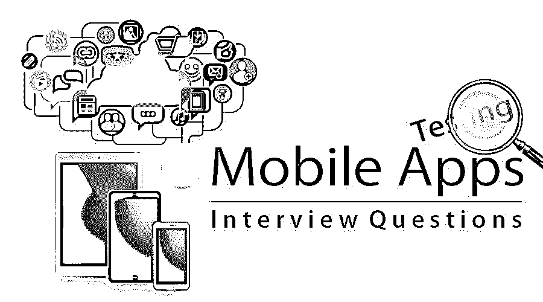

# 移动应用测试面试问题

> 原文：<https://www.educba.com/mobile-application-testing-interview-questions/>

## 移动应用测试简介面试问答

移动应用程序测试是测试为移动设备开发的软件的过程。该测试基于功能、性能、用户友好性、UI 等。这些可以在手工测试或自动化测试的帮助下进行测试。移动应用程序测试有时真的很有挑战性，因为它需要大量的基础工作，如何测试移动应用程序是一项很难决定的任务。测试移动应用有许多挑战。

现在，如果你正在寻找一份与移动应用测试相关的工作，那么你需要准备 2022 年移动应用测试面试问题。的确，每个面试都因不同的职位而不同。在这里，我们准备了重要的移动应用测试面试问题和答案，将帮助您在面试中取得成功。

<small>网页开发、编程语言、软件测试&其他</small>

这些顶级面试问题分为以下两部分:

### 第 1 部分-移动应用测试面试问题(基础)

第一部分包括基本的面试问题和答案。

#### Q1。移动应用程序有哪些不同类型的测试？

**回答:**
测试的类型有功能测试、实验室测试、性能测试、中断测试、[可用性测试](https://www.educba.com/what-is-usability-testing/)、内存泄漏测试、安装测试、认证测试、安全测试、位置测试、黑盒测试、众包测试、负载测试。

#### Q2。解释测试移动应用时的挑战？

**答案:**
这是面试中常见的移动应用测试面试问题。测试移动应用的几个挑战包括脚本编写、兼容性、设备可用性、通常必须从应用商店下载的应用、各种移动设备、选择呼叫的应用、移动网络运营商、测试方式。

#### Q3。解释移动应用的类型？

**答:**
有不同类型的应用程序，即 Web 应用程序、混合应用程序和本地应用程序。网络应用程序通常在 chrome、firefox、opera、safari 等移动浏览器上运行。这些应用程序以“m”开头。混合应用程序是本地应用程序和 web 应用程序的组合。这些应用程序可以在任何设备上运行。它也可以离线使用，这些都是使用 web 技术 HTML5 和 CSS 开发的。可以从 Android 的 play store 和 apple 的 app store 安装在设备上的原生应用程序示例 what's app。

#### Q4。仿真器和模拟器有什么区别？

**答:**
仿真器是一种软件，用来测试手机以外的移动应用。模拟器是指用于移动电话的电子网络模拟设备，它有助于在没有漫游服务的情况下连接网络，并可以进行语音呼叫、数据和短信。

#### Q5。解释一下移动测试中主要发现的 bug？

**答案:**
bug 有关键、重大、次要和阻塞。关键错误是在测试手机的特定功能时电话系统崩溃。一个主要的问题是当特定的特性不能按预期执行它的功能时。一个小问题是像界面不符合要求，或者像一些标签或按钮不在它的位置。阻塞错误意味着当执行任何功能时，电话挂断或不能在设备上做任何事情，只需要重新启动设备。

### 第 2 部分-移动应用测试面试问题(高级)

现在让我们来看看高级面试问题。

#### Q6。在什么基础上，测试自动化工具将被用来测试设备上的移动应用程序？

**答案:**
用自动化工具做移动测试，那个工具应该有以下东西:

*   **多平台支持:**自动化工具应该支持多平台。它意味着当前的平台以及未来的目标框架或平台。
*   操作系统版本:该工具应该能够支持不同的操作系统，如 IOS、Android 或任何其他版本。
*   脚本:它将支持什么类型的脚本，主要是基于对象的工具提供了高度的脚本可用性。
*   **越狱:**工具使用根设备，因此可能不支持最新版本的操作系统。
*   **源代码:**每当源代码发生变化时，共享源代码并不总是可能的。

#### Q7。自动化测试的优势是什么？

**答案:**
自动化测试在回归测试中的优势。这有助于节省时间，因为在[回归测试](https://www.educba.com/regression-testing/)中，大量的测试用例需要一次又一次地进行。因此，自动化测试将运行脚本来一次又一次地测试相同的功能。负载和性能测试可以通过或最好的方式来完成，因为它需要模拟成千上万的并发用户和设备，而这只能通过工具来实现。这些工具就像负载运行器。复杂的测试有多个需要一次测试的组件。另一个主要优势是可用性。测试用例可以根据需要随时运行。同样的东西可以被重用意味着测试或脚本也可以用于其他设备或应用程序。最重要的是可靠性，因为它是在工具或脚本的帮助下执行的。在手动测试中，可能会由于人为错误而出现问题，但是在自动化测试中是不可能的。测试自动化已经成为移动应用程序开发不可或缺的一部分。

让我们转到下一个移动应用测试面试问题。

#### Q8。通过黑盒技术测试移动 app 开发可以考虑什么？

**答案:**
要考虑以下事情:

*   应用程序应该在多种设备或不同的手机上进行测试。
*   应该在更改端口和 IP 地址的帮助下测试移动应用程序。以便可以测试它是否正确连接和断开。
*   测试功能并向其他设备发出呼叫或消息。
*   通过 chrome、firefox、opera 和 safari 等不同的浏览器测试移动应用程序。
*   在不同设备上进行测试，如下载移动应用程序，在特定设备上安装和卸载。
*   兼容性测试，例如附上照片或其他附件。
*   功能测试、中断测试、应用程序性能测试和其他输入无效凭证的负面测试以及应用程序的其他行为。

#### Q9。优先级和严重性的区别是什么？

**答案:**
这是流行的移动应用测试面试中问的问题。优先级是指功能有多重要，需要早一点还是晚一点修复。严重性是指应用程序中的错误或问题的后果，意味着该问题有多严重。优先顺序是 P1、P2、P3、P4 和五常。P1 被称为临界，P2 是中等，P3 是低，等等。严重性被称为 Sev5、Sev4、Sev3 等等。Sev5 是最高的一个。

#### Q10。用于移动应用测试的不同工具有哪些？

**答:**
这些不同的工具是 [Appium、selenium](https://www.educba.com/appium-vs-selenium/) 、Robotium、JMeter、Load runner 以及其他用于跟踪的工具，如 JIRA、Bugzilla、Rally 和 HP QC 等。

### 推荐文章

这是一个移动应用测试面试问题和答案列表的指南，以便候选人可以轻松地解决这些测试面试问题。在本帖中，我们研究了在面试中经常被问到的顶级移动应用测试面试问题。您也可以阅读以下文章，了解更多信息——

1.  [SDLC 面试问题](https://www.educba.com/sdlc-interview-questions/)
2.  [Appium 面试问题](https://www.educba.com/appium-interview-questions/)
3.  [10 基本渗透测试面试问题](https://www.educba.com/penetration-testing-interview-questions/)
4.  [棱角分明的 5 个面试问题](https://www.educba.com/angular-5-interview-questions/)

