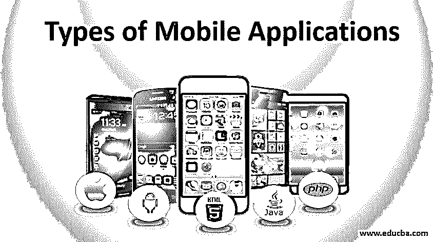
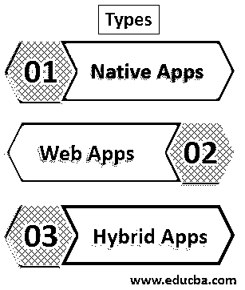

# 移动应用的类型

> 原文：<https://www.educba.com/types-of-mobile-applications/>

## 移动应用简介

在这篇文章中，我们将看到一个关于移动应用类型的概述。嘿，技术人员和非技术人员，我们已经在手机上使用了这么多应用程序，但是我们有没有想象过这个应用程序是如何构建的，它是什么类型的应用程序？.手机 app 的配方是什么？让我们敏锐地洞察一下我们身边的移动应用程序类型，它们让我们的生活变得更加轻松。

**移动应用可以根据多种因素进行分类，例如:**

<small>网页开发、编程语言、软件测试&其他</small>

*   它们所基于的技术。
*   它们的构建平台。
*   将要访问这个应用程序的用户。
*   将访问应用程序的用户类型。
*   应用程序的性能要求等等。

**根据所有这些因素，移动应用目前分为三类:**

*   本地人。
*   网络应用。
*   混合应用。

### 移动应用的类型

以下是移动应用程序的类型:

#### 1.原生应用

*   任何对我们的环境自然的东西都被称为原生的。移动应用程序也是类似的情况。如果一个应用程序对移动设备来说是自然的，那么它就被认为是原生应用程序，这意味着，针对特定移动设备构建的应用程序意味着特定的操作系统(如 Android、Windows、macOS 等)。)的手机。
*   这些应用程序只能在为其设计的设备上运行。
*   如果一个应用程序是为苹果手机开发的，即 macOS，那么该应用程序将不能在任何其他使用 macOS 以外的操作系统的设备上运行。
*   如果一个应用程序是为 Android 操作系统开发的，那么它只能在运行 Android 操作系统的设备上运行，而不能在任何其他设备上运行。
*   原生应用程序的好处在于它可以轻松地与运行它的设备进行通信，
*   它可以轻松地与设备硬件通信，如摄像头、扬声器、图形引擎、按钮、触摸、位置传感器和加速度计等。
*   页面渲染(即用户界面渲染)继续进行，没有任何挂起问题或堵塞。
*   布局的流程完美无瑕，易于使用。
*   这些应用程序更加用户友好，更容易操作，并且可以轻松地承受大量快速的用户活动。
*   这些应用程序可以以与用户操作它们相同的速度做出反应。
*   这些应用在交互性方面取代了所有其他类型的应用。

**原生应用中的问题:**

这些很难开发，因为非常难的编程语言被用来开发它们，如 Java、Kotlin、Swift、Python、C# (C sharp)等。由于这一点，它们的开发成本很高，因为使用这些语言的开发人员不容易雇佣，他们的成本很高。它们只能在为其构建的单个平台上工作。一个应用程序不能在多个平台上运行。对于每个平台，代码都必须复制。原生应用程序的维护也是一个大问题，因为它需要定期更新，因为像谷歌、苹果等跨国公司会连续更新操作系统。每次更新都需要在用户的设备上重新安装。

例如:Whatsapp、计算器和记事本等。

#### 2.网络应用

*   这些是使用网络技术构建的应用程序，它们使用设备上现有的网络浏览器提供网页。
*   这些都是使用 HTML、Javascript、jQuery、CSS 等构建的。
*   这些不完全是移动应用程序，而是一个网站，以移动应用程序的[形式出现，这意味着，一个基于网络的应用程序可以在任何移动设备或操作系统上工作，因为它是使用移动设备内的网络浏览器交付的。](https://www.educba.com/mobile-application-software/)
*   它们是网站的一种响应形式，因此它们会根据可用于呈现内容的设备和空间自动改变外观。
*   Web 应用程序的一个类别是渐进式 Web 应用程序(PWA ),它是在浏览器中运行的本地应用程序。
*   插件、第三方插件或 API 不能在这类应用中使用

**好处:**

*   这些 app 的开发成本低。
*   开发者容易获得。
*   更容易和更便宜的维护。
*   它们内部的数据或用户界面可以立即更新，因为它们在服务器上而不是在用户设备上。

**网络应用中的问题:**

没有互联网就不要工作。他们不能只在离线模式下工作。由于这些应用程序完全依赖于设备浏览器，设备中的一个浏览器可以显示功能，而另一个则不能。所以这给用户带来了问题。一些 web 应用不如本地应用安全，因为数据来自开发公司控制的互联网服务器，而不是来自本地设备。这些应用的用户界面不如本地应用的用户界面好，因为这些应用使用 HTML DOM 元素，而不是使用本地控件和工具。许多本地功能，如通知或手势，非常复杂，无法在这些应用程序中使用。

#### 3.混合应用

*   混合一词的意思是“混合物”。因此，混合应用指的是本地和基于网络的应用。混合应用是本地应用和 Web 应用的集成。这些应用程序使用 web 技术和本地 API，两者都有。
*   这些应用程序可以像原生应用程序一样使用大多数设备功能。与 web 应用程序类似，混合应用程序由 HTML、CSS、Javascript、jquery、AJAX、JSON 等 web 技术组成。
*   它们也使用 web 浏览器来显示内容和用户界面，但是它们使用本地元素和基于 web 的元素来进行开发。
*   这些应用程序的代码只需要调整一下，就可以兼容多种平台。

**好处:**

*   易于开发。
*   开发成本低。
*   一个 app 代码库兼容多个平台。
*   低维护。
*   更容易开发、更新、测试和调整。

**混合应用中的问题:**

速度慢和用户交互性问题。与原生应用相比的性能问题。

### 结论

虽然每种类型的应用程序都有优点和缺点，但可以得出结论，在所有类型的应用程序中，本机应用程序在性能、稳定性、行为和安全性等所有因素上都是最好的。其次，可以考虑混合应用程序，然后可以考虑快速、快速和轻量级移动应用程序的 web 应用程序。

### 推荐文章

这是一个移动应用类型的指南。在这里，我们将讨论基本概念、移动应用中的问题、最常用的移动应用类型以及优势。您也可以浏览我们推荐的其他文章，了解更多信息——

1.  [商业中的移动应用](https://www.educba.com/mobile-applications/)
2.  [移动应用软件开发商](https://www.educba.com/applications-software-developer/)
3.  [手机应用开发工具](https://www.educba.com/mobile-app-design-software/)
4.  [手机应用 vs 网站](https://www.educba.com/mobile-apps-vs-website/)

