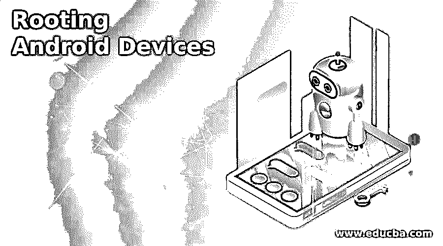

# 扎根 Android 设备

> 原文：<https://www.educba.com/rooting-android/>

**扎根安卓——**安卓[最大的独特卖点之一](https://www.educba.com/android-apps-development/)就是它非常灵活，可塑性很强。虽然[苹果的 iOS](https://www.educba.com/5-tips-of-ios-8-every-apple-fan-should-know/) 可以直接使用，但它也比安卓更封闭，这就是谷歌广受欢迎的操作系统在开发者中如此受欢迎的原因。然而，要真正理解你能用 Android 做多少事情，你必须扎根于它。

## 扎根安卓到底是什么意思？

在我们讨论支持 android 设备的利弊之前，我们先来看看支持 Android 涉及到什么。简而言之，root 意味着获得设备的 root 访问权限或管理权限。您可能已经为您的 Android 设备支付了费用，但值得注意的是，无论您支付多少费用，设备的内部仍然是锁着的。

<small>网页开发、编程语言、软件测试&其他</small>

把它想象成通过一个用户帐户在一台台式计算机上操作。你可以利用手机的大部分功能，但是没有管理权限你什么也做不了。支持 android 设备正是为你的设备提供了这一点。它让你成为手机的管理员，而不仅仅是用户。

然而，权力越大，责任越大。你手里的东西多了，你在非根设备上想当然的一些安全和保护，在根设备上就不起作用了。不过，你可以完全控制你的设备。你可以浏览 Android 根文件夹，并对系统文件进行更改，这意味着更改和安装或删除手机的一些关键元素。

根植 android 设备让你完全控制整个 Android 系统。您可以使用和下载所有被阻止的功能和工具，但这种能力也伴随着一些风险。例如，许多被屏蔽的功能和工具是为了保护你免受恶意软件的攻击。一旦根了，你就没有未根安卓版本的保护了。这就是这篇文章所要探讨的:支持 Android 设备的优点和缺点。在你开始使用你自己的设备之前，读一遍这篇文章，对你将要进入的东西有一个清晰的了解。让我们乐观一点，先说优势:

### 扎根 Android 设备的优势

下面是一些描述的主要优点。

#### # 1–安装定制 rom

你可以在根化你的设备后安装一个定制的 ROM 或内核，这实质上意味着你得到了一个新的设备软件。事实上，这往往是人们扎根设备的最大原因。定制的 rom 为你的系统提供了一些性能修正和调整，并且通常比普通的更加用户友好。它们针对电池和性能进行了优化，比 ROMS 股票更新更频繁。

内核是 Android 操作系统的一部分，帮助应用程序和其他程序控制设备的硬件方面。有几个好东西伴随着一个根 Android 设备的定制内核。首先，您可以添加以前没有的功能，并提高设备的电池寿命和性能。ROM 本质上是一个可以安装的修改过的 Android 版本，同样具有额外的功能和其他一些好处。自定义 rom 甚至可以在没有根目录的情况下安装，但是在有根目录的设备上使用比在没有根目录的设备上使用要好得多。它们可以极大地改变你的设备的外观和感觉。他们的伟大之处在于，他们也作为股票 Android 来，这给你在大多数设备上典型的基本 Android 安装。当您想要取消设备的根时，这非常方便。

#### # 2–删除预装的 OEM 应用

每部安卓手机都有一堆直接来自制造商的应用程序。有些是好的，但大多数是毫无用处的，如果不是更糟的话，你甚至不能删除它们。然而，一旦你将你的设备根化，所有这些应用程序都可以消失，你可以充分利用你的机器。

#### # 3–所有应用的广告拦截

广告屏蔽在网络浏览器上很简单，但在智能手机或设备上变得复杂得多。弹出窗口被认为是大多数游戏和应用程序中的常见问题，但 most 可以立即解决所有问题。

#### # 4–安装不兼容的应用程序

目前一些最好的应用程序甚至可能与你的手机不兼容。但是支持 Android 可以让你访问所有你能找到的应用程序。你甚至可以在你的手机制造商发布自己的安卓系统之前获得最新的安卓系统更新，以及额外的功能。您可以运行需要 root 访问权限的特殊应用程序，这些应用程序通常比其他应用程序更强大、功能更丰富。这些应用程序直接处理 Android 系统文件，比其他表层应用程序更广泛地调整你的 Android 操作系统。例如，您可以在下载 e Uninstall 后以 root 权限静默卸载几个应用程序。

#### # 5–更多显示选项和内部存储

大多数设备都有三到四个默认皮肤可供选择，但 rooting android 手机允许你安装新的 rom 来完全定制和调整你的设备皮肤，以实现真正独特的显示。另一个很大的好处是，支持 android 可以释放你设备的内部存储空间。内部存储空间不足的人可以在根设备后将他们想要的任何应用程序传输到 SD 卡。默认情况下，可以传输一些应用程序，但是非根设备通常会阻止您对所有设备执行此操作。一旦根，你可以强制移动一个带有符号链接的应用程序。

#### # 6–更长的电池寿命和更快的速度

虽然上述大部分好处主要是表面上的或方便的，但这是一个更实际的好处。支持 Android 有助于释放手机的全部潜力。你可以使用像 [Greenify](https://play.google.com/store/apps/details?id=com.oasisfeng.greenify&hl=en) 这样的应用程序来自动关闭无用的应用程序，有效地提高你的设备性能。但是它确实需要 root 访问权限来完成。

#### # 7–制作完整的设备备份

当你有一部没有根的 Android 手机时，你只能备份这么多东西，比如你的应用程序或一些设置。然而，一旦根了，你会发现很多像 [Titanium](https://play.google.com/store/apps/details?id=com.keramidas.TitaniumBackup&hl=en) 这样的应用会完全备份你的根设备。

#### # 8–访问根文件

当你使用 Android 设备时，你可以访问你的设备上的许多文件、部分和部件，而这些在其他情况下是不可用的。这就是给你这么多的访问和自由，做你想用你的设备。你可以使用现有的应用程序，或者利用一点知识，自己调整设备的文件和部分。

#### # 9–CPU 计时

非根设备通常不具备 CPU 时钟功能，这种功能使您能够提高和/或降低设备的 CPU 或处理器速度。提高处理器时钟速度有助于发挥最高性能，而降低处理器时钟速度有助于延长电池寿命。无虚饰 CPU 控制就是这样一种设备，可以轻松做到这一点，而且它是免费的。你可以找到其他这样的应用程序，让你快速控制你的 CPU 性能，而不用担心技术术语或设置，同时确保设备在安全范围内工作。

#### # 10-更多调整

使用根 Android 设备，您可以配置和优化您的设备，以获得定制的感觉和更好的性能。Android 可以在很大程度上进行调整，这也是它如此受欢迎的原因。根据您对设备的要求，您可以进行一些更改。

### 扎根安卓设备的弊端

下面是一些不利于 Android 设备的因素。

#### # 1–它可以构建您的设备

对于一个根深蒂固的 Android 设备来说，最常见的威胁之一是误操作，这可能会把你的设备变成一个昂贵的，不可用的砖块。为了避免这种情况，你应该总是从可靠的来源获得你的应用程序，如 Google Play，并且不要删除根应用程序建议不要删除的文件。如果你是新手的话，你的手机会有更大的损坏风险。你可以在互联网上找到一些非常详细的教程来根你的设备，但这仍然是一项艰巨的任务。如果您刷新了一个损坏的 zip 文件或错过了任何步骤，您很可能会得到一个砖状设备。如果发生这种情况，你将不得不在制造商的服务中心修理你的设备，或者，如果你是一个超级用户，自己修理它。如果你选择第一个选项，你将面临第二大不利因素。砌砖在生根的世界里是一个可怕的术语。虽然有很多方法可以修复它，但是构建一个设备可能会非常容易。

**推荐课程**

*   [R 编程在线认证培训](https://www.educba.com/data-science/courses/r-programming-course/)
*   [围棋编程培训](https://www.educba.com/software-development/courses/golang-course/)

#### # 2–不再保修

支持 Android 的另一个大缺点是你会失去设备保修。设备制造商将不涵盖在您对设备进行 root 后造成的损坏，或者如果您意识到手机在被 root 时被砖砌。在某些设备中，您仍然可以在根化后取消根化，这样设备制造商就不知道您是否根化了它。另一方面，设备制造商可以在很大程度上找出你的设备的真相。对于大多数用户来说，一旦你更换了你的手机，你的手机保修就会永久失效。

#### # 3–超级用户和超级用户访问

拥有 root 访问权限听起来很神奇，也确实如此，直到事情出错。错误的设置或者在错误的时间错误的地点移动错误的物品会导致巨大的问题。同样，CPU 时钟也可能成为一个缺点。超频或提高处理器速度可以最大限度地提高性能，但也会带来处理器过热的风险，而处理器是设备的心脏。这意味着你可能会让你的设备心脏病发作。

#### # 4–调整风险

调整你的设备也有风险。当你调整某些设置时会发生什么。最糟糕的情况是你将设备砌砖，但另一种可能的情况是什么都不会发生，这也令人沮丧！

还有获得错误内核或 ROM 的风险，这本身就有问题。你的设备可能会被砖砸或者更糟。修复这些灾难也需要花费大量的时间、金钱和精力。

#### # 5–广告拦截

广告屏蔽被列为优点，怎么会是生根的缺点呢？事实是，这些广告为开发者创造了收入，这些收入被用来进一步开发应用程序，并为您，即客户，提供更多功能。如果太多的人使用他们的设备并屏蔽这些广告，这将导致收入损失，从长远来看，这对开发者和你来说都是一个大问题。除此之外，手动更改或编辑应用程序以阻止广告可能会使应用程序变得无用。

#### # 6–更新问题

无根 Android 设备的一个好处是，系统更新无论来得多晚，都一定会安装好，并且运行良好。根设备的风险是这可能不会发生。您可能会发现自动固件更新可能不起作用。在某些情况下，更新将不会安装，因为软件修改了根过程本身。

### 结论

既然你已经知道了支持 Android 的利弊，你应该能够做出明智的决定，决定是否值得去冒这些麻烦和风险。这完全取决于你愿意冒多大的风险，你对手机的使用方式，以及你的期望。如果你选择根，根要谨慎。

你可能也注意到了一些优点和缺点彼此非常相似。那其实就是 Android 本身最大的好处和坏处。它给了你巨大的力量，但你也必须小心使用这种力量。你的决定应该基于你对这些问题的回答:

1.  你愿意冒险面对并尝试修复根植于你的设备的缺点吗？
2.  在尝试对您的设备进行根操作之前，您是否对其进行了备份？
3.  你在网上做了足够多的研究来找出如何为你的特定设备找根吗？

如果你对这三个问题的答案是肯定的，那么你应该准备好处理扎根你的 Android 设备，并面对后果和好处。如果你对其中两个或全部三个问题的回答都是“不”，那么在你采取行动之前，你可能应该多考虑几次。或者不要在更高的地方使用你的设备。

### 推荐文章

这是一个扎根 Android 设备的指南。这里我们已经讨论了基本概念，并以描述的方式讨论了优点和缺点。您可以阅读以下文章了解更多信息——

1.  [面向初学者的 Android 应用开发](https://www.educba.com/android-app-development-for-beginners/)
2.  [安卓事实](https://www.educba.com/android-facts/)
3.  [安卓操作系统](https://www.educba.com/android-operating-system/)
4.  [安卓生产力](https://www.educba.com/android-productivity/)

