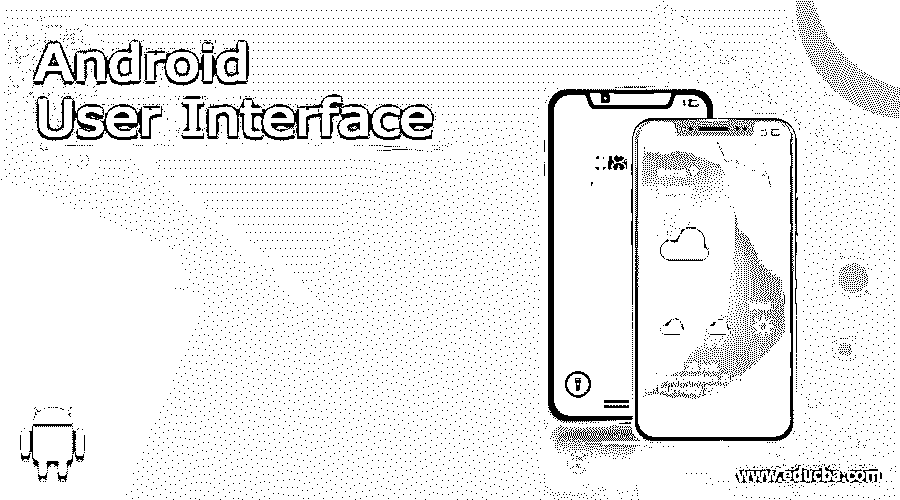

# Android 用户界面

> 原文：<https://www.educba.com/android-user-interface/>

## 什么是 Android 用户界面？

对于开发者和用户来说，最好的 Android 用户界面是一个经济有效的平台。谷歌发布了 Android 的源代码，并允许在开源许可下使用，使其成为开发者最喜爱的用户界面(UI)。适合开发者和用户的定制设备有多种。然而，对于消费者来说，最终选择 Android 而不是其他系统的决定因素是它的用户友好、流畅、高效和令人愉快的技术。

**让我们更详细地研究一下 Android 用户界面:**

<small>网页开发、编程语言、软件测试&其他</small>

市场上充斥着制造智能手机的公司，然而在选择界面时，所有公司的首选仍然是 Android。谷歌的 Android 操作系统已经占据了全球市场的四分之三，考虑到市场上可用的 Android 设备数量以及消费者数量的增加，这并不奇怪。随着互联网成为全球消费者的绑定因素，在线媒体获得巨大增长，移动互联网在保持消费者对产品的忠诚度方面发挥着至关重要的作用。因此，非常重要的一点是，要想在今天这个竞争激烈的市场中生存下来，你必须快速行动，适应新事物。记住新的东西，对用户界面的美学给予极大的关注是非常必要的。毕竟，最好的 Android 用户界面将带来优质的体验，并最终吸引消费者获得更多利润。

因此，俗话说，客户是国王，牢记国王的需求，我们的用户界面需要时尚。创新总是赢得好感，随着其易用性的特点，设计的简单性总是获得消费者的大量关注。然而，开发人员在记住这些因素的同时必须经历的挑战是，该应用程序需要定制为适合除 Android 之外的所有设备屏幕和操作系统版本。

### Android 用户界面面临的 4 大挑战

以下是挑战:

#### # 1–多屏幕挑战

构建的任何界面都需要能够在所有操作系统上运行，而不仅仅是 Android，记住这一点，我们需要构建一个支持不同屏幕尺寸和不同屏幕密度的用户界面。这可以通过使用层次结构查看器来完成。Hierarchy viewer 是一个允许您优化布局的工具，这在您的 SDK 中可用。它允许您检查布局设计错误，纠正它们，并最终计算导致运行延迟的时间。层次结构查看器可以在 SDK 的工具文件夹中找到。

“内容换行”选项应该用于确保屏幕适应不同的屏幕高度，而“匹配父项”选项应该用于高度和宽度组件。“内容换行”会最小化屏幕以适应屏幕尺寸，而“匹配父视图”会扩大父视图的屏幕尺寸。

就不同的屏幕密度而言，布局设计使用绝对像素来定义大小和距离。设计布局并用像素来定义是很困难的，因为不同手机的不同屏幕有不同的密度，绝对会造成混乱。因此，密度布局是在深度单元或 sp 中完成的。

复杂的布局是可能的，并且通过嵌套循环的实例来完成。复杂的布局虽然可以让你不断地玩弄重量，但它可能是昂贵的。根据在屏幕上平均划分两个组件，避免重量是可能的。应尽可能避免嵌套布局，因为它会降低布局性能。嵌套结构与线性布局一起用于动态可见性设置。顾名思义，在线性布局中，所有的 Android 用户界面组件都以线性方式排列，隐藏任何组件都不会影响其余组件的对齐。

相对布局以定义的方式将一个组件的位置与相对组件的位置相对应。例如，在“左对齐”下方。

#### # 2——用户友好，富有挑战性，使其更具美感

这两个挑战都是故意组合在一起的，因为客户体验是你在这个行业取得成功的决定性因素。因此，Android 用户界面应该尽可能地具有交互性，牢记用户的日常活动。因此，使用的图像需要正确设置，不应该移动位置或在错误的时间出现在这里和那里。此外，应该注意用户界面中的投掷运动，因为它应该像在用户的真实世界中一样描述运动。

最好用 XML 绘制基本形状，而不是使用图像，因为它使界面变得轻量级，并为用户提供更快的使用体验。基本形状可以用可绘制形状来绘制。它的向量在屏幕的显示密度上呈现出整洁的工作。对于您使用的多个小图标，您不需要复制图像；相同的图像可以与“更改属性颜色”选项一起使用。这可以按如下方式进行

Android:tint = " @ color/primary _ color "。这只会改变图像的颜色。

应用程序栏是你下一步需要关注的东西。作为应用程序设计中极其重要的元素，它可以决定你未来的成功与否，因为它将通过其交互特性和视觉结构来增强用户体验。

[应用程序栏基本上是位于屏幕顶部的识别标志](https://www.educba.com/app-development-tool/ "Choose Best Technology for App Development")或标签。它向用户提供应用程序的位置，也有助于搜索和导航等功能的实现。简而言之，动作栏通过对用户的动作进行优先排序，并将其放在上下文的顶部，来帮助用户完成动作。空间是应用程序栏的一个限制因素，然而，多余的动作通过转移到溢出菜单来适应。

动作栏或应用程序栏基本上是应用程序中的标题栏。动作栏中常用的动作有:

*   向前
*   退回/重做
*   搜查
*   新的
*   恢复精神
*   停止
*   背部

用户认为弹出消息极其重要。他们希望不间断地接收通知，而不中断正在进行的工作。在这种情况下，弹出消息变得至关重要。它们可能不是很重要，但是为了方便用户是必要的。

小吃店可用于向用户显示简短的弹出消息。大多数情况下，这些消息只是通过滑动阅读和忽略，但是，它们可以通过添加动作(如用户对消息的响应)来进行交互。这可以通过添加一个动作按钮来实现，该按钮允许用户在阅读简短消息后快速动作。

快速动作只不过是弹出栏中的功能，当屏幕上出现可视元素/按钮时，这些功能会被激活。它确保屏幕保持整洁，并且不占用用户的屏幕空间。这些在提供时使用起来很有趣，不需要时应该禁止使用

#### # 3–管理 Android 用户界面的挑战

今天的人们如此习惯于在第一个电话里就把事情做好，以至于他们渴望任何事情都应该相应地工作。因此，开发人员面临着一个巨大的挑战，即确保他们最好的 Android 用户界面实际上模仿真实世界的手势或工作方式。因此，一方面，他们希望享受在另一方面拍摄的照片的完整视觉氛围，另一方面，他们希望导航按钮能够快速移动到下一张照片。在这种情况下调光系统，酒吧有助于实现座右铭。

通过一个例子可以更好地解释这个特性。当用户用相机点击一张照片时，他希望看到完整的图片，周围没有图标和导航栏的干扰。然而，在共享同一张照片的情况下，用户会想要使用图标通过多个可用的共享平台来共享照片。

Android 没有提供内置的功能来调暗屏幕上的状态栏或导航区域。为了让它工作，用户通常触摸状态栏或导航栏，它们在屏幕上变得完全可见。所以横条是存在的，但是它们退到背景中，让你在前面欣赏清晰的图片。

#### # 4–让我们开始挑战

我们来弄清楚，我们是如何在 Android 上实现材质设计的。要使用 material 应用程序创建 android 用户界面设计:

1.  审查材料设计规范。
2.  将素材**主题**应用到你的应用中。
3.  遵循材料设计指南创建您的**布局**。
4.  指定视图的**高度**来投射阴影。
5.  使用系统部件或列表和卡片。
6.  在你的应用程序中定制**动画**。

在创建具有材料设计功能的新应用程序时，Android 用户界面设计指南为您提供了一个合适的设计框架来开发和设计您的应用程序。当 android 用户界面设计你的布局时，关注以下几点是很重要的

*   基线网格
*   关键词
*   间隔
*   触摸目标尺寸
*   布局结构

新的材质主题让你享受一整套最好的 Android 用户界面元素的新设计，并为你的应用程序添加更多的色彩和活力。它允许您根据自己选择的调色板定制应用程序的外观和视觉吸引力，还允许您根据自己选择的主题属性给主题和应用程序栏着色。系统小部件包含新的 android 用户界面设计和触摸反馈动画。

材料设计中的动画允许用户对他们的动作给出反馈，并在你与应用程序交互时提供视觉连续性。提供了一些默认动画，而最新版本的 Android 允许您自定义这些动画选项，并根据您的选择和需要创建新的动画。

Android 有很多很棒的功能，开发者可以在使用相同基本点的同时开发新版本。对于最好的 Android 用户界面来说，一个好的设计是极其复杂的，开发者必须在其应用程序中利用 Android 的[关键功能，因为用户界面在应用程序是否在 play store 中出现方面起着决定性的作用。](https://www.educba.com/free-android-apps-apk/ "Top 10 Free Android Apps of All Time")

根据移动设备密度，开发者创建的应用程序包含 android 用户界面元素是恰当的，因为移动设备带来了人们与软件的交互，这是未来在这一领域取得成功的关键。对于开发者来说，在决定应用程序的 Android 用户界面设计之前，决定其目标受众也很重要。此外，对应用程序和用户体验的持续调查允许应用程序和开发人员在工作中不断发展。

因此，今天的应用程序不再仅仅是关于开发者的功能和创造力，而是更多的是根据应用程序的用户体验来塑造开发者的创造力。因此，认识到用户体验是首要的关键，人们应该坐下来创建一个美妙的应用程序，增加用户的快乐体验，在他们需要的时候为他们提供他们需要的信息。

我认为你还在等什么，只要朝着创造最好的 android 用户界面前进一步，并在每一步都用你的情感和用户反馈来激励它。

### 推荐文章

这是一个 Android 用户界面的指南。这里我们讨论了 Android 用户界面面临的 4 个最大挑战。你也可以看看下面的文章

1.  [安卓电子邮件应用](https://www.educba.com/email-apps-for-android/)
2.  [安卓版 mob dro](https://www.educba.com/mobdro-for-android/)
3.  [安卓应用开发工具](https://www.educba.com/android-apps-development-tools/)
4.  [大学生最佳安卓应用](https://www.educba.com/best-educational-android-apps-for-college-students/)

