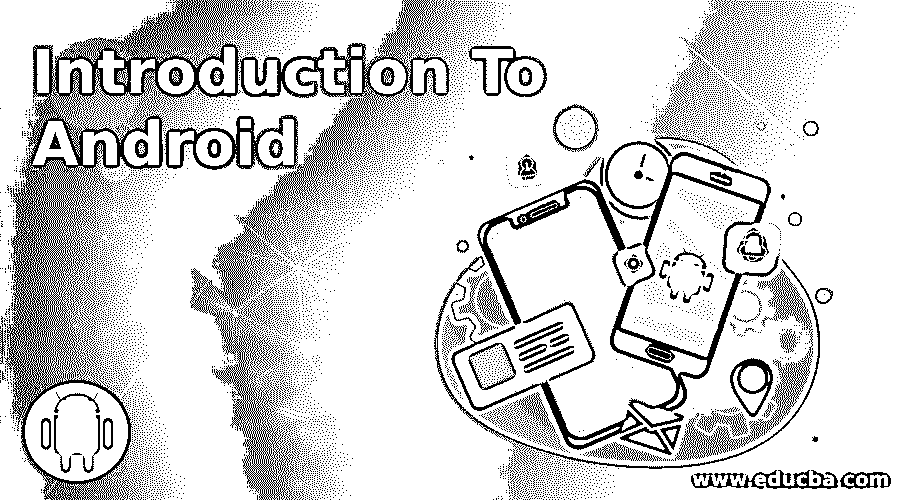
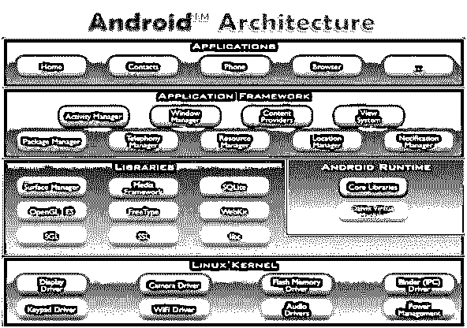
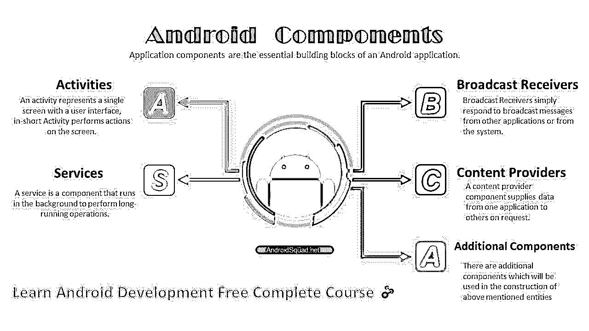
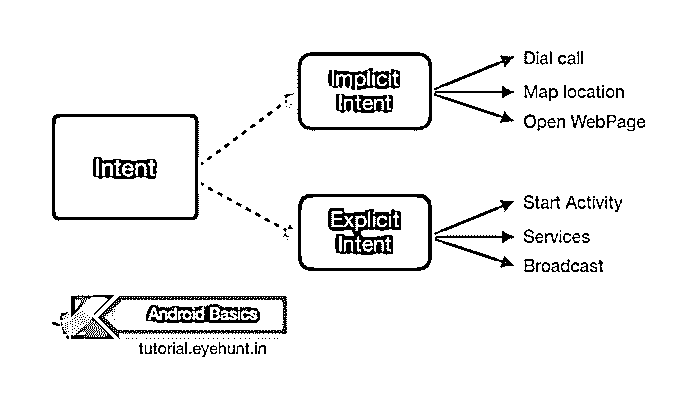

# Android 简介

> 原文：<https://www.educba.com/introduction-to-android/>

## Android 简介

[Android](https://www.educba.com/what-is-android/) 是谷歌开发的[基于 Linux 的手机操作系统。它旨在主要为智能手机和平板电脑等触摸屏设备设计。Android 的初始版本发布于 2008 年 9 月 23 日，而最新版本发布于 2018 年 8 月 6 日，而我写这篇 android post 的介绍。它被称为 Android“9 派”。](https://www.educba.com/career-in-google-adwords/)

<small>网页开发、编程语言、软件测试&其他</small>

**图片来源:**【https://www.elprocus.com/ T2】

### Android 的主要组件

**图片来源:**【https://www.google.co.in/imgres T2】

任何 android 应用程序的主要组件如下:

*   活动
*   服务
*   内容提供商
*   意图和广播接收器
*   小组件和通知

#### 1.活动

我们可以将活动称为 Android 应用程序的表示层。简单地说，一个活动代表了你的 Android 应用程序的屏幕，它有自己的用户界面。一个应用程序，例如，一个电子邮件应用程序可以有许多活动，如打开电子邮件，撰写电子邮件，回复电子邮件-这些都是不同的活动。所以每个 Android 应用都有不止一个活动。当我们开始一个新的活动(如回复邮件)时，前一个活动被推到后面的堆栈中，直到新的活动完成为止，但是，如果我们在正在进行的活动中按 back 按钮，当前的活动将被解散并弹出堆栈，前一个活动将继续。

#### 2.服务

Android 应用程序的另一个重要组成部分是服务。它在后台为您在屏幕上执行的活动执行运行操作(长时间或短时间)。例如，来自电子邮件的推送通知。当您终止应用程序或您当前没有使用它时，服务可能仍在运行。例如，当您收到一封电子邮件时，您会收到通知，但您当前并未使用该应用程序。

#### 3.内容提供商

内容提供者管理应用程序数据并封装它(面向对象的特性)。这将数据从应用程序的一个处理器提供给另一个处理器。数据可能存储在数据库、文件系统或任何其他存储管理系统中。Android 设备包括几个本地内容提供商，这些提供商提供有用的数据库，如媒体商店和联系人。

#### 4.意图和广播接收器

Android Intents 是一种通信方式，当同一个应用程序中的不同组件之间或者从一个应用程序到另一个应用程序之间发生消息交换时，它可以起到促进作用。为了启动任何服务，我们必须传递一个意图来执行这个任务。意图有两种:

**Image Source:** [https://bit.ly/2XKfzRX](https://tutorial.eyehunts.com/android/types-implicit-intent-explicit-intent-android/)

*   **隐含意图**:它不声明要启动的服务的名称，而是声明要执行的动作。
*   **明确意图**:它指定了应该给出意图的确切活动。

广播接收器使您的应用程序能够侦听与您指定的标准相匹配的意图。例如，应用程序可以开始广播，让其他应用程序知道只有很少的数据被下载到设备上，可供它们使用。有两种类型的广播:

*   **正常广播:**它们是完全异步的，广播的所有接收器都以不确定的顺序运行。
*   **有序广播:**它们是同步的，一次传送给一个接收者。

**T2】**

 ****图片来源:**【https://www.google.co.in/imgres T2】

#### 5.小组件和通知

小工具在手机或平板电脑的主屏幕上以整合的形式显示您的应用程序中有趣的或新的内容。用户可以做不同的活动，如移动和调整小部件的大小。基本上有四种类型的小部件:

*   **信息小部件**–这个小部件只向用户显示重要的信息。例如主屏幕上的时钟。
*   **收集小部件**–该小部件显示同一类型的多个信息，并允许您选择其中任何一个来打开。例如，当您打开电子邮件应用程序时，您会看到多封电子邮件。
*   **控件**–该控件显示经常使用的功能。例如，音乐应用程序小部件允许用户从应用程序之外播放音乐。
*   **混合小部件**–这个小部件结合了以上三个小部件的信息。

通知允许通知用户已经发生的任何事件。例如，我们使用 what's app 应用程序，当消息到来时，我们会收到通知。

### 安卓的特点

由于我们已经了解了 Android 的介绍，我们来看看 Android 的特点:

*   Android 可以同时运行多个应用程序。
*   Android widgets 可以让你在主屏幕上显示你选择的任何功能。
*   Android 支持多种键盘，安装起来超级简单。
*   Android 支持视频图形阵列、2D 和 3D 图形。
*   Android 还支持 [Java 应用](https://www.educba.com/applications-of-java/)。
*   当 Android 在手机上运行时，人们可以更快地更改设置
*   非常好的应用市场
*   大多数 Android 设备都支持 NFC，这使得电子设备可以轻松地进行短距离交互。

### Android 的应用

在上面的章节中，我们已经看到了 Android 的基本介绍。现在我们继续应用 Android:

Android 应用是运行在 Android 平台上的软件应用。我们之前已经看到 android 应用程序的组件由一个或多个应用程序组件组成，如活动、服务、内容提供者和广播接收器。Android 应用程序是用 Java 编程语言编写的，使用 Java 核心库。对于 [Android 应用开发](https://www.educba.com/android-app-development-for-beginners/)，开发者可以从 Android 网站下载软件开发工具包(SDK)。SDK 包括用于创建 Android 应用程序的工具、样本代码和相关文档。

### Android 的优势和劣势

以下是 android 的优点和缺点:

#### Android 的优势

*   Android 归谷歌所有，谷歌是全球最受信任和享有盛誉的组织之一，它也是一个开源软件，完全免费。
*   它可以在几乎所有设备上工作，并且非常灵活。
*   有些小工具可以让你快速完成工作。
*   我们可以同时运行多个任务，从而实现多任务处理。
*   有一个巨大的应用程序中心，叫做 Google play store，你可以在 Google Play store 上找到数百万个应用程序。它的应用程序比任何其他操作系统平台都多。
*   与其他操作系统相比，它们有多种功能。
*   Android 的可定制性更强。

#### 安卓的缺点

*   android 广告最经常出现在流行的免费 Android 应用程序上，这让用户感到有些厌烦。
*   Android 操作系统被认为是最耗电的操作系统之一。在 [Android 操作系统](https://www.educba.com/android-operating-system/)中，有大量进程在后台运行，这导致电池快速耗尽。
*   Android 应用程序通常安全性较低。
*   如果移动 RAM 较少，并且如果用户打开几个应用程序，那么它就会挂起。
*   它通常需要更多的代码来进行开发。
*   一个包含该病毒的应用程序也出现在安卓市场上。

### 推荐文章

这是一个介绍 Android 的指南。在这里，我们讨论了 Android 的主要组件、应用程序、特征以及优缺点。您也可以阅读以下文章，了解更多信息——

1.  [Android 开发者和 Web 开发者](https://www.educba.com/android-developer-vs-web-developer/)
2.  [安卓面试问题](https://www.educba.com/android-interview-questions/)
3.  [Android 开发职业](https://www.educba.com/careers-in-android-development/)
4.  [安卓广告拦截应用](https://www.educba.com/android-ad-blocker/)

**