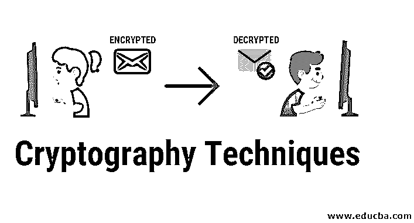
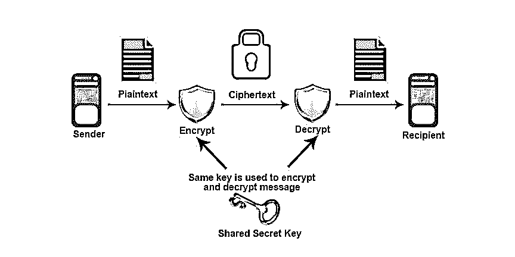
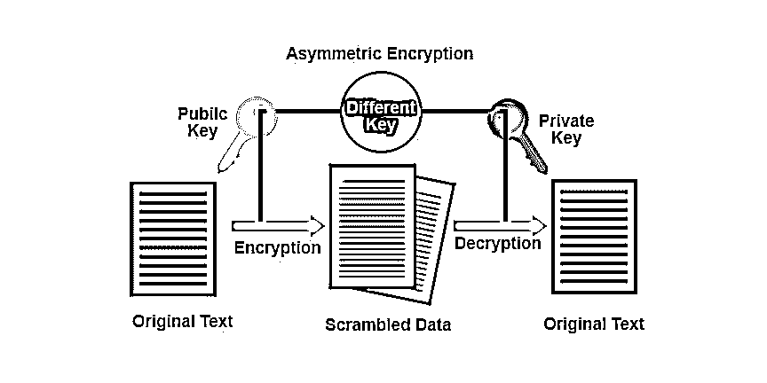

# 密码学技术

> 原文：<https://www.educba.com/cryptography-techniques/>

## 密码学技术概述

已经开发了各种加密技术来提供数据安全性，以确保通信方之间传输的数据是保密的，不会被未授权方修改，从而防止黑客访问和使用他们的信息。凯撒密码、单字母密码、同音替代密码、多字母密码、公平密码、围栏密码、一次性密码、希尔密码是密码技术的一些例子。

加密处理各种安全原则，如下所示:

<small>网页开发、编程语言、软件测试&其他</small>

1.  **机密性–**它指定只有发送者和接收者能够访问消息。如果被授权的人可以访问消息，保密性将会丧失。
2.  **认证–**它识别用户或计算机系统，使其可信。
3.  **完整性–**它检查消息的内容在从发送方传输到接收方的过程中不得被更改。
4.  **不可否认性–**它规定，在发生争议的情况下，不能拒绝消息发送者发送的消息。

### 五大加密技术

这里有一些非常简单的代码和当今互联网上使用的更复杂的现代加密技术。

#### 1)简单代码

*   这一类是任何方式写的信息旁边，这是很难让其他人阅读。这涉及到用另一种字母表写东西。在这里，我们可以看到冰岛的符文和国际音标以及另一个利基创造了字母，例如沙漠字母。

*   在这方面，我们可以用语言来编码。我们已经研究了造物语言的创造，比如精灵语和世界语。
*   切斯特·纳兹(Chester Naz)和朱迪斯·希伊斯·阿维拉(Judith Schiess Avila)的《代码说话者》(Code Talker)一书解释了纳瓦霍语如何在第二次世界大战中被用作代码，并且从未被破解成极端激烈的条件。
*   如果纳瓦霍人没有特定概念的词汇，代码使用者会选择一个术语来代替。例如，纳瓦霍语中“蜂鸟”的意思已经变成了战斗机，“铁帽子”就是德国。

#### 2)对称加密

*   对称加密是一种仅通过一个密钥(秘密密钥)用于电子数据的[加密和解密](https://www.educba.com/encryption-vs-decryption/)的加密类型。替代密码是对称加密技术，但现代对称加密可能要复杂得多。
*   数据被转换成一种方法，如果没有使用对称加密算法解密的密钥，任何人都无法理解。
*   对称加密是一种古老的算法，但它比非对称加密更快、更高效。因为与非对称加密相比，对称加密具有更好性能和更快的速度。
*   而对称密钥加密涉及使用相同的密钥进行加密和解密。同时，非对称密钥加密涉及使用一个密钥进行加密，使用另一个不同的密钥进行解密。
*   对称加密通常用于大量信息，例如批量加密中的数据库加密。在数据库的情况下，密钥只能由数据库自己加密或解密。

我们可以在下图中看到对称加密的工作原理:

**有两种对称加密算法:**

1.  块算法
2.  流算法

**A)块算法**

这组比特用电子数据块中的特定密钥编码。系统将数据保存在内存中，同时等待数据加密后获得完整的数据块。一些重要的分组密码算法有 DES、三重 DES、 [AES](https://www.educba.com/advanced-encryption-standard/) 等。

**B)流密码算法**

其中，明文数字或字符与伪随机密码数字流相结合。一些重要的流密码算法有 RC4、A5、BLOWFISH 等。在[对称密钥加密](https://www.educba.com/symmetric-key-encryption/)中，如果有人找出对称密钥，就可以破解加密代码。但是这个问题可以用 Diffie-Hellman 算法来克服。在 Diffie-Hellman 密钥交换或协议算法中，发送方和接收方必须使用这种技术就对称密钥达成一致。然后，该密钥可用于加密或解密目的。

#### 3)不对称加密

*   [非对称加密](https://www.educba.com/asymmetric-encryption/)也称为公钥加密。非对称密钥加密有助于解决对称密钥加密的密钥交换问题。在非对称加密中，两个密钥用于加密非对称加密中的纯文本。通过互联网或大网络，交换密钥。需要注意的是，任何有密钥的人都可以解密消息，所以非对称加密使用两个对应的密钥来增加安全性。
*   任何想给你发信息的人都会有一个可以自由获取的公钥，但是第二个私钥是为你保密的，只有你能理解。用公钥加密的消息可以用私钥解码。用私钥加密的消息也可以用公钥解密。

我们可以在下图中看到非对称加密的工作原理:

#### 4)隐写术

*   隐写术是一种技术，它有助于将一条消息隐藏在其他消息中。早些时候，人们用隐形墨水、微小变化等方法隐藏信息。
*   但是在这个技术时代，[隐写术](https://www.educba.com/steganography-techniques/)是一种隐藏数据的技术，这些数据可以是文件、消息、图像等。在其他文件、消息或图像中。

#### 5)散列

*   哈希是一种加密技术，可以将任何形式的数据转换为唯一的字符串。无论大小或类型如何，任何数据都可以使用哈希算法进行哈希处理。它接受随机长度的数据，并将其转换为固定的哈希值。
*   哈希不同于其他加密方法，因为在哈希中，加密是不可逆的；那是不能用密钥解密的。MD5、SHA1、SHA 256 是广泛使用的哈希算法。

### 结论

本文介绍了什么是加密技术以及加密和解密数据的各种加密技术。密码术用于所有领域以保护数据并防止其被黑客攻击。例如，用于保护密码、认证银行交易等。如今，各种新的密码技术被开发和破解；因此，始终意识到计算机威胁并采取预防措施尽可能避免它们是很重要的。

### 推荐文章

这是一本密码技术指南。这里我们分别详细讨论密码学的基本概念和几种技术。您也可以浏览我们推荐的其他文章，了解更多信息——

1.  [密码术 vs 加密](https://www.educba.com/cryptography-vs-encryption/)
2.  [什么是解密？](https://www.educba.com/what-is-decryption/)
3.  [什么是网络安全？](https://www.educba.com/what-is-network-security/)
4.  [加密工具](https://www.educba.com/cryptography-tools/)

