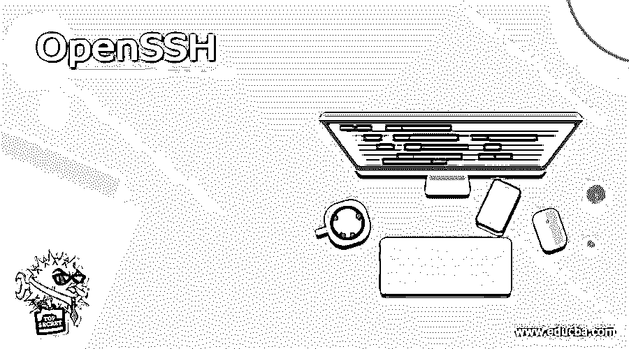

# OpenSSH

> 原文：<https://www.educba.com/openssh/>

## OpenSSH 简介

OpenSSH 是一套通过互联网在联网机器之间控制和传输数据的工具。在这篇文章中。我们将看到一些 OpenSSH 服务器应用程序配置选项，以及如何在 Ubuntu 系统上更改它们。OpenSSH 是安全外壳(SSH)协议工具套件的免费版本，用于通过互联网在计算机之间控制或传输文件。执行这些任务的传统技术，如 telnet 或 rcp，是不安全的，它们以明文传输用户的密码。

OpenSSH 是一个服务器软件和客户端软件，允许安全、加密的远程控制和文件传输，有效地取代了传统工具。

<small>网页开发、编程语言、软件测试&其他</small>

OpenSSH 服务器组件的 sshd 组件总是监听来自任何客户端工具的客户端连接。当接收到连接请求时，sshd 会根据所连接的客户端工具的类型建立适当的连接。OpenSSH 支持许多认证机制，包括简单密码、公钥和 Kerberos 票据。

### 如何安装 OpenSSH？

OpenSSH 客户端和服务器应用程序很容易设置。在终端提示符下使用以下命令在 Ubuntu 系统上安装 OpenSSH 客户端程序:

`sudo apt install openssh-client`

在终端提示符下使用以下命令安装 OpenSSH 服务器应用程序和必要的支持文件:

`sudo apt install openssh-server`

### 如何配置 OpenSSH？

通过更改/etc/ssh/sshd 配置文件，您可以更改 OpenSSH 服务器应用程序 sshd 的默认行为。您可以通过在终端提示符下使用以下命令来访问相应的手册页，以了解有关该文件中使用的配置指令的详细信息:

`man sshd_config`

sshd 配置文件包含许多管理通信设置和身份验证模式的指令。下面列出了可以通过修改/etc/ssh/sshd 配置文件来更改的配置指令的示例。
制作原始配置文件的副本，并在修改之前防止其被写入。这样，您就可以在需要时参考和重用原始设置。

将/etc/ssh/sshd 配置文件复制到终端提示符下，并使用以下命令保护它不被写入:
制作原始配置文件的副本，并在修改它之前保护它不被写入。这样，您就可以在需要时参考和重用原始设置。

将/etc/ssh/sshd 配置文件复制到终端提示符下，并使用以下命令保护它不被写入:

`sudo cp /etc/ssh/sshd_config /etc/ssh/sshd_config.original
sudo chmod a-w /etc/ssh/sshd_config.original`

此外，因为失去 ssh 服务器可能意味着失去对服务器的访问，所以在进行更改之后和重新启动服务器之前，请仔细检查设置:

`sudo sshd -t -f /etc/ssh/sshd_config`

以下是一些您可以修改的配置指令示例:

更改 OpenSSH 中的 Port 指令，使其监听 TCP 端口 2222，而不是默认的 TCP 端口 22:
2222 是端口号。

只需在/etc/ssh/sshd 配置文件中添加或修改这一行，让您的 OpenSSH 服务器将/etc/issue.net 文件的内容显示为一个预登录标题:Banner /etc/issue.net

`sudo systemctl restart sshd.service`

许多其他 sshd 配置指令可用于修改服务器应用程序的功能，以满足您的特定需求。但是，如果 ssh 是您访问服务器的唯一模式，并且您在通过/etc/ssh/sshd 配置文件配置 sshd 时犯了一个错误，那么在重新启动服务器后，您可能会发现自己被锁定。

SSH 密钥

SSH 允许两台主机在不使用密码的情况下进行通信。在 SSH 密钥认证中使用私钥和公钥。

要生成密钥，请在终端提示符下键入以下内容:

`ssh-keygen -t rsa`

RSA 算法将用于生成密钥。在写入时，生成的密钥将具有 3072 位。b 选项可以用来改变位数。例如，要生成 4096 位的密钥，请执行以下操作:

`ssh-keygen -t rsa -b 4096`

在此过程中，您会被要求输入密码。当提示创建密钥时，只需按 Enter 键。
公钥保存在/。默认情况下，ssh/id rsa.pub，而私钥保存在/中。ssh/id rsa。现在，将 id rsa.pub 文件复制到远程主机，并将其附加到/。使用以下命令的 ssh/authorized keys:

`ssh-copy-id username@remotehost`

再者，检查授权密钥文件的权限；只有经过身份验证的用户应该具有读写权限。如果权限无效，请通过以下方式更改权限:

`chmod 600 .ssh/authorized_keys`

现在，您应该能够连接到主机，而无需输入密码。

### 如何从公钥服务器导入密钥？

许多用户已经在 launchpad 或 github 等服务上注册了他们的 ssh 密钥。使用以下命令很容易导入这些内容:

`ssh-import-id <username-on-remote-service>`

前缀 lp:被推断并表示从 launchpad 获得；等价 gh:指从 Github 获取。

### 结论

在本文中，我们已经了解了什么是 OpenSSH，以及它的安装、配置和 SSH 密钥。我希望这篇文章对你有所帮助。

### 推荐文章

这是一个 OpenSSH 的指南。这里我们讨论入门，如何安装 OpenSSH，如何配置 OpenSSH？，例子分别用代码实现。您也可以看看以下文章，了解更多信息–

1.  [OpenSSH 版本](https://www.educba.com/openssh-version/)
2.  [Kali Linux SSH](https://www.educba.com/kali-linux-ssh/)
3.  [Kali Linux 软件包](https://www.educba.com/kali-linux-packages/)
4.  [网络安全工具](https://www.educba.com/cyber-security-tools/)

