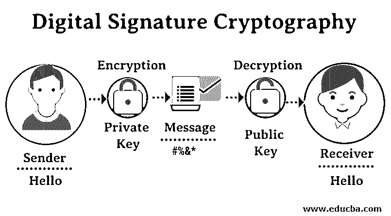

# 数字签名加密

> 原文：<https://www.educba.com/digital-signature-cryptography/>




## 数字签名密码术简介

数字签名加密技术只不过是使用各种加密算法(如消息摘要、消息摘要 5、安全散列算法、ElGamal 加密等)对数字证书进行加密的过程。加密数字证书以避免对数字证书的攻击并提供安全性。

数字签名的加密有两个关键术语:

<small>网页开发、编程语言、软件测试&其他</small>

1.  私人密钥
2.  公开密钥

**私钥**:账户持有人持有一个随机十六进制数的密钥。私钥对账户持有人来说是保密的，而不是暴露给真实世界。

**公钥**:公开共享的随机十六进制数。要创建公共加密数字签名，首先要对消息进行数字签名；然后，用发送方的私钥和接收方的公钥对其进行加密。要解密发送方和接收方之间共享的消息，接收方必须用发送方的公钥解密信息的内层，用接收方持有的私钥解密信息的外层。

### 数字签名加密体系结构


要使用加密技术执行数字签名，必须执行以下操作:

消息/信息应该使用散列函数在发送端用发送者的私钥加密[。该信息将与中间数字签名模型一起被转发到接收者端。接收者通过使用接收者端的散列函数](https://www.educba.com/hashing-function-in-java/)解密接收到的信息[来验证数字签名。解密将通过使用公钥和私钥的外层提取内层来执行。安全共享信息的一个主要挑战是以加密格式发送消息。在密码术中，由于数字签名具有与外部世界共享的公钥，所以有人可能会欺骗加密。](https://www.educba.com/hashing-function-in-php/)

数字签名的加密有两种主要形式:

#### 1.加密后的数字签名

在这种方法中，发送方的签名被接收方利用，并且信息在没有加密的情况下与外部方共享。由于这种形式不太安全，因此在行业中并不可取。

#### 2.加密后进行数字签名

业界最常用的方法是加密，然后是数字签名，发送方发送带有数字签名的加密数据。当接收方收到消息时，它将使用发送方的公钥和接收方的私钥对发送方共享的消息进行解密。

### RSA 加密数字签名

以下代码片段将解释如何在 python 中实时实现带有数字签名的[加密](https://www.educba.com/what-is-cryptography/),还将解释如何使用 RSA 对数字签名进行加密和解密。为了[用数字签名执行加密](https://www.educba.com/java-cryptography/)，我们需要安装 pycrypto 包，然后编写下面的代码片段。

```
importCrypto
fromPublicKey importRSA
fromCrypto import Random
```

为了使用数字签名执行加密，我们需要初始化私钥和公钥。我们创建一个函数来生成 RSA 密钥，该密钥将包含一个私钥和一个公钥:

```
defrsa_keys():
l=1024
private_key = RSA.generate(l, Random.new().read)
public_key = private_key.publickey()
return private_key, public_key
The above snippet returns the private key and public key.
```

#### 1.加密功能

```
defencrypt(public_key,text):
c_text=public_key.encrypt(text,32)[0]
val_cipher=base64.b64encode(c_text)
return val_cipher
```

我们使用上面的代码来加密消息，它将 rsa_publickey 和 text 作为加密函数的参数。加密函数将执行[公钥加密](https://www.educba.com/public-key-encryption/)并生成密码；当调用函数调用时，返回生成的密码。

#### 2.解密函数

```
defdecrypt(private_key,val_cipher):
d_cipher = base64.b64decode(val_cipher)
text = private_key.decrypt(d_cipher)
return text
```

具有使用公钥加密的[数字签名](https://www.educba.com/what-is-a-digital-signature/)和使用私钥执行的文本解密的密码术。为了理解作为密码共享的加密文本的含义，我们创建了一个解密函数。该函数采用 private_key 和加密函数生成的密码。使用 decode 方法创建解密的密码，并使用 decrypt 方法；它将返回解密的文本。

#### 3.履行

在此示例中，我们将了解如何对文本进行加密，以及如何使用私钥将其解密回原始文本。示例中将使用 encrypt 和 decrypt 函数来说明如何对 cipher 进行加密和解密。

**代码:**

```
importCrypto
fromPublicKey importRSA
fromCrypto import Random
importbase64
defrsa_keys():
l=1024
private_key = RSA.generate(l, Random.new().read)
public_key = private_key.publickey()
returnprivate_key, public_key
defencrypt(public_key,plain_text):
c_text=public_key.encrypt(plain_text,32)[0]
val_cipher=base64.b64encode(c_text)
returnval_cipher
defdecrypt(private_key,val_cipher):
d_cipher = base64.b64decode(val_cipher)
text = private_key.decrypt(d_cipher)
returntext
private_key,public_key=rsa_keys()
txt=b"Hello Peers!"
enc_cipher=encrypt(public_key,txt)
print('**'*10)
print("The ecncrypted text is {}".format(enc_cipher))
print('**'*10)
dec_cipher=decrypt(private_key,enc_cipher) #decryption
print("The decrypted cipher text is {}".format(dec_cipher))
print('**'*10)
```

**输出:**


我们可以看到，输入文本“Hello Peers！”传递给 encrypt 函数的是使用公钥加密的。作为参数传递给 decrypt 函数的加密密码解密使用接收方私钥共享的原始消息。使用加密技术执行数字签名将需要“签名”和“验证”方法，签名将由发送方使用私钥执行，当信息传输到接收方时，使用公钥执行验证功能。

### 优点和缺点

以下是优点和缺点解释。

#### 优点

1.  提高信息传输的安全性。
2.  提高工作流程的数字化程度。
3.  更好的客户体验。
4.  提高业务效率和法律效力。
5.  减少手动操作并节省时间。

#### 缺点

1.  这需要大量的时间来验证。
2.  它不能防范漏洞。
3.  加密的基础设施和设置并不划算。

### 结论

在现代数字世界中，具有加密功能的[数字签名算法](https://www.educba.com/digital-signature-algorithm/)在提供安全可靠的环境中发挥着至关重要的作用，是更好的身份验证工具之一。在不断发展的技术世界中，它将在抵御威胁和漏洞方面发挥至关重要的作用。

### 推荐文章

这是一个数字签名加密指南。这里我们讨论数字签名加密体系结构以及代码实现。您也可以浏览我们推荐的其他文章，了解更多信息——

1.  [数字签名软件](https://www.educba.com/digital-signature-softwares/)
2.  [密码术 vs 加密](https://www.educba.com/cryptography-vs-encryption/)
3.  [不对称加密](https://www.educba.com/asymmetric-encryption/)
4.  [数字签名类型](https://www.educba.com/digital-signature-types/)


