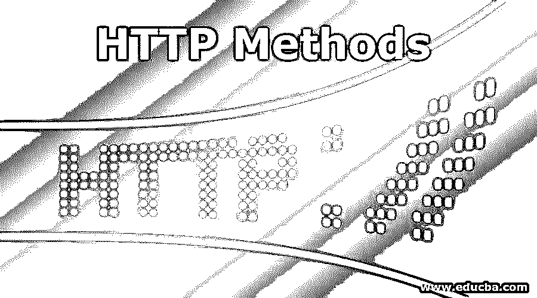
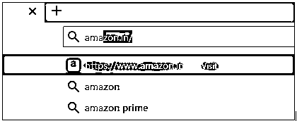
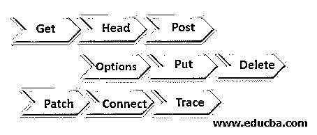

# HTTP 方法

> 原文：<https://www.educba.com/http-methods/>

## HTTP 方法简介

下面的文章概述了 HTTP 的方法。任何活动都是通过网络完成的，无论是网络浏览还是网上购物，基本上都是终端设备和网络服务器之间的数据交换。我们希望我们的设备和托管网站的 web 服务器之间有一个安全的连接，以保护交换数据的完整性和机密性。HTTP(超文本传输协议)是在网络上传输数据的普遍认可的格式，它控制着如何在用户设备和网站服务器之间交换数据，以及网络服务器和浏览器对每个“命令”采取什么动作。HTTPS 是对 HTTP 的高级和更安全的升级。

**例子**

<small>网页开发、编程语言、软件测试&其他</small>

*   浏览亚马逊。

当我们开始在地址栏或搜索栏中键入单词“Amazon”时，请注意，浏览器已经自动建议目标网址为“https://www.amazon.in/”。

当我们单击 enter 并加载网站时，我们还会在网址前面看到一个锁图标，表示遵循 HTTPS 协议的安全连接。通过 HTTPS 连接传输的任何数据在传输前都会使用[安全套接字层](https://www.educba.com/what-is-ssl/) (SSL)和传输层安全(TLS)方法进行加密。

所有这些共同确保了以下三层安全性

*   **加密:**所有交换的数据都被加密。
*   **数据完整性:**数据在传输过程中不会被破坏或修改。
*   **认证:**确保用户连接到预定的网站。

### HTTP 方法(也称为动词)

浏览时，最终用户(浏览器动作)向 web 服务器发送请求，服务器发送相关的响应。HTTP 定义了一组请求方法来指示要执行的选定操作。任何用户都可以使用任何方法，服务器可以设计为支持任何方法组合。

有 9 种预定义的方法用于 HTTP 和 HTTPS。

#### 1.得到

*   GET 方法用于使用指定的请求 URI(统一资源标识符)从 web 服务器检索信息(“实体”)。使用 GET 的请求只能检索数据，对数据没有其他影响。
*   条件 GET 方法要求实体仅在由条件报头字段描述的情况下被传输，旨在减少可避免的网络使用。类似地，部分 GET 请求只传输实体的一部分。

#### 2.头

*   Head 方法与 Get 方法相同，只是服务器只传输状态行和标头部分，而不传输响应正文。这对于检索写在响应头中的元信息很有用，而不必传输整个内容。
*   这种方法通常用于测试超文本链接的有效性、可访问性和最近的修改，或者在实际传递请求之前简单地检查 Get 请求将返回什么。

#### 3.邮政

*   该请求用于向服务器传输重要的结构化数据，例如客户数据、文件上传等。使用 HTML 表单创建或更新资源。它请求源服务器接受包含在请求体中的“实体”,作为由请求-URI 标识的资源的新从属。
*   一个简单的例子是网站上的“联系”表单。当您在表单中填写输入并点击“Send”时，数据被嵌入到请求体中，并以 JSON、XML 或任何其他格式发送到服务器。

#### 4.选择

*   虽然不像其他 HTTP 方法那样广泛使用，但请求应该返回描述服务器在给定 URL 支持哪些其他方法的数据，而不指示资源动作或请求资源检索。
*   这可用于通过请求“*”来检查 web 服务器的功能，这表示该请求不适用于特定资源。

#### 5.放

*   与 Post 类似，它用上传的内容替换目标资源的所有当前表示。Put 方法请求将包含的实体存储在指定的请求 URI 下。如果请求 URI 引用一个已经存在的资源，那么这个实体应该被认为是服务器上现有资源的修改版本。
*   多次调用相同的 Put 请求总是会产生相同的结果，而多次调用 Post 请求可能会创建相同的资源。

#### 6.删除

*   此方法用于删除指定 URL 处的资源。即使从 web 服务器返回的状态代码指定动作已经成功完成，终端客户端也不能确信动作已经被执行。
*   但是，服务器不会指示成功，除非在给出响应时，它会擦除资源或将资源移动到隔离位置。

#### 7.找到；查出

*   该方法允许客户端查看请求链的服务器端接收到了什么，并使用该数据进行测试，以便客户端可以查看中间服务器进行了哪些更改(如果有)。
*   请求的最终接收者将收到的消息复制回客户机，作为响应的实体主体。

#### 8.连接

*   这将请求连接转换为透明的 [TCP/IP](https://www.educba.com/what-is-tcp-ip/) 隧道，通常通过未加密的 HTTP 代理启用 SSL 加密的数据交换(HTTPS)。
*   这被称为 HTTP 隧道。该请求创建到目标资源所指示的服务器的隧道。

#### 9.修补

*   此方法将部分修改应用于资源。它以补丁文档的形式提供一个实体，该实体具有要应用于资源的变更列表，该补丁文档使用诸如 XML 或 JSON 等结构。
*   在对指定资源进行部分更改时，Patch 方法比 put 方法速度更快，消耗的资源更少。

### 结论

HTTP 请求是允许用户通过浏览器与网站交互的底层框架。该框架也用于[移动应用](https://www.educba.com/mobile-applications/)中，这些应用利用了固有地包含这些请求方法/动词的组合的 API，以便于开发和测试，并确保平滑和简化的用户体验。

### 推荐文章

这是 HTTP 方法的指南。这里我们详细讨论 HTTP 的介绍和不同的方法。您也可以看看以下文章，了解更多信息–

1.  [HTTP cookie](https://www.educba.com/http-cookies/)
2.  [HTTP 缓存](https://www.educba.com/http-caching/)
3.  [PHP 过滤器](https://www.educba.com/php-filters/)
4.  [HTML 中的 Alt 标签](https://www.educba.com/alt-tag-in-html/)

