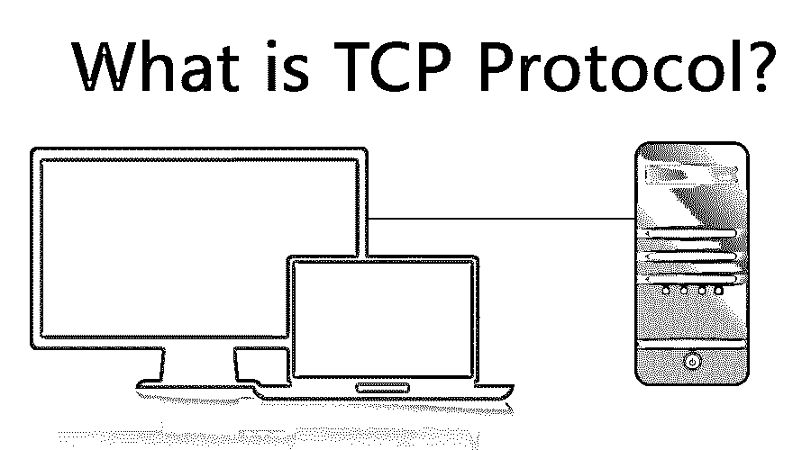

# 什么是 TCP 协议？

> 原文：<https://www.educba.com/what-is-tcp-protocol/>

## 什么是 TCP 协议？

TCP 协议是位于应用层和网络层之间的传输控制协议，用于提供可靠的流传递服务，即，以字节流的形式传递数据，以字节流的形式接收数据。TCP 使用确认机制来检查数据是否安全可靠地到达，在发送方执行多路复用，在接收方执行多路分解。TCP 使用三个阶段来实现连接定向功能，如连接建立、数据传输和连接终止。

### 了解 TCP 协议

它被认为是一种面向连接的协议，这意味着连接被建立和保持，直到每一端的应用程序完成交换消息。它还决定如何将应用程序数据分解为网络传送的数据包，然后发送数据包，最后从网络层接受这些数据包，并管理流量控制。在 [OSI 模型中，TCP 占据了第 4 层(传输层)的](https://www.educba.com/osi-model-vs-tcp-ip-model/)部分和第 5 层(会话层)的部分。

<small>网页开发、编程语言、软件测试&其他</small>

让我们举一个例子。当 web 服务器[向客户端发送 HTML 文件](https://www.educba.com/html-attributes/)时，它使用 HTTP 协议。然后，HTTP 程序层请求 TCP 层设置连接，然后发送文件。然后 TCP 栈将文件以包的形式分割，对其进行编号，最后转发到互联网协议层进行传递。尽管传输中的每个数据包都有相同的源 IP 地址和目的 IP 地址，但数据包仍然沿着不同的路由发送。客户计算机中的 TCP 程序层总是等待，直到并且除非所有的包已经到达，然后，它确认它已经接收的包，然后它请求重新传输。

### TCP 协议的优势

*   这是一个相当可靠的协议。
*   它还确保数据按照发送的顺序到达所需的目的地。
*   它还是面向连接的。
*   它提供了错误检查机制和恢复机制。
*   它还展示了端到端的通信。
*   此外，它还提供了流量控制。
*   最后，这个协议展示了服务器(全双工)，这意味着它可以执行接收者和发送者的角色。

### TCP 协议范围

TCP 报头的最小长度为 20 字节，最大长度为 60 字节。

*   **源端口**:16 位，标识发送设备时应用进程的源端口。
*   **目的端口**:也是 16 位，标识应用进程接收设备的目的端口。
*   **数据偏移量(4 位):**为 4 位，表示整个 TCP 报文段中当前报文的 TCP 头和数据偏移量的大小。
*   **保留(3 位):**默认情况下，一切都设置为零，并保留供将来使用。
*   ECE: 它有两种解释:
    *   在 SYN 位为 0 的情况下，这意味着 ECE 意味着 IP 分组已经得到其拥塞体验，即 CE 位被设置。
    *   在 SYN 位为 1 的情况下，这意味着 ECE 意味着设备能够进行 ECT。
*   URG: URG 表示紧急指针字段有重要数据，应该进行处理。
*   **ACK** : ACK 表示确认字段具有重要性。在 ACK 为 0 的情况下，这意味着分组没有任何确认。
*   **PSH:**PSH 置位时，要求接收站无论何时收到申请都要推送数据，但不缓冲。
*   **RST:** 重置标志已经得到了这些特性:

*   **SYN:** 需要 SYN 标志来设置主机之间的连接。

### 你能用 TCP 协议做什么？

TCP 协议工作在服务器或客户端模式。客户端总是启动连接，服务器要么接受，要么拒绝。这种三次握手是连接管理所必需的。

客户端启动连接，然后发送数据段和序列号。然后，服务器将连同它的 SN(序列号)和比客户机序列号多一个的客户机段 ACK 一起确认它。现在，客户机在得到数据段的 ACK 后，发送一个服务器响应的确认。

服务器或客户端都可以发送 TCP 数据段和设置为 1 的 FIN 标志。每当接收端通过确认 FIN 将其回复时，TCP 通信的特定方向就会关闭，然后连接被释放。

### 使用 TCP 协议

TCP 使用端口号来知道它需要哪个应用程序进程来移交数据段。此外，它使用序列号与远程主机同步。然后，每个数据段与 SN 一起发送和接收。无论何时收到确认，发送方都会确保接收方收到最后一个数据段。通过提及最近接收到的数据包的序列号(SN ),接收方知道发送方发送的最后一个数据段。

### 结论

最后，我们讨论了网络和 TCP/IP 的主要[组件；我们已经获得了研究非常关键的安全问题所需的背景知识。当我们知道网络是如何构建的时，它让我们了解当我们选择一种网络设计而不是任何其他设计时，哪些物理漏洞正在被引入，并且知道数据包是如何形成的让我们了解它们是如何被精心制作以达到目的的。此外，我们知道数据包是如何传输和交付的，这有助于我们更好地了解数据包可能发生的情况。](https://www.educba.com/network-security-interview-questions/)

### 推荐文章

这是一个什么是 TCP 协议的指南？.这里我们讨论了 TCP 协议的范围和工作优势。您也可以阅读以下文章，了解更多信息——

1.  什么是 VFX？
2.  [什么是命令行界面？](https://www.educba.com/what-is-cli/)
3.  [什么是 JVM 架构](https://www.educba.com/what-is-jvm/)
4.  [什么是 TCP/IP？](https://www.educba.com/what-is-tcp-ip/)

