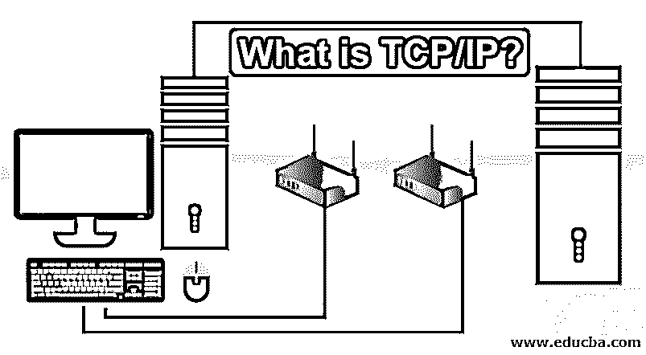

# 什么是 TCP/IP？

> 原文：<https://www.educba.com/what-is-tcp-ip/>

## TCP/IP 概述

TCP/IP 是传输控制协议/互联网协议的缩写，是一个通信[协议](https://www.techtarget.com/searchnetworking/definition/protocol)套件，这意味着一组规则和程序，通过定义数据在目的地应如何传输、路由、分组、寻址和接收，用于在互联网上互连各种[网络](https://www.techtarget.com/searchnetworking/definition/network)设备。TCP 定义了应用程序如何通过网络创建通信通道。IP 定义了每个数据包的寻址和路由方式，以确保它到达正确的目的地。

### TCP/IP 是如何工作的？

TCP/IP 的功能分为五层:1)物理层、数据链路层、网络层、传输层、应用层。

<small>网页开发、编程语言、软件测试&其他</small>

#### 1.物理层

*   物理层将二进制数据转换为信号，并通过本地介质传输。在这一层，通信单位是一位。当两个设备之间建立连接时，数据以字节流的形式流动。
*   物理层传送比特。

#### 2.数据链路层

*   [数据链路层定义了网络上数据的格式](https://www.educba.com/data-link-layer-osi-model/)。[物理寻址在数据链路层完成](https://www.educba.com/what-is-a-physical-address/)。源和目的地的 MAC 地址被分配给数据包以形成帧。
*   在[数据链路层](https://www.educba.com/data-link-layer/)中，通信的单位是帧。这一层将消息或文件分成帧。帧只是一个数据包，负责封装从网络层收到的数据。

#### 3.网路层

*   在网络层，通信的单位是数据包。这一层为每个数据段提供源和目的 IP 地址，形成一个数据包。此外，网络层提供诸如逻辑寻址(即 IP 寻址)、路径确定和路由之类的功能。[路由是一种将数据包从源移动到目的地的方法](https://www.educba.com/what-is-routing/)。
*   根据 IP 地址和掩码，在网络中做出路由决策。同时，路径确定是选择最佳路径将数据传送到接收方的过程。它使用 OSPF 协议(开放最短路径优先)、BGP(边界网关协议)等。

#### 4.传输层

*   传输层负责将数据从一个位置传输到另一个位置。它通过分段、流量控制和错误控制来控制通信的可靠性。
*   分段是将接收到的数据分成称为段的小单元的过程。
*   段是这一层的通信单位。
*   **流量控制:**流量控制是控制传输数据量的过程。
*   **错误控制:**传输层使用自动重复请求方案来重传丢失或损坏的数据。一组称为校验和的机器人被添加到每个数据段，以确定收到的有错误的数据段。

传输层使用 2 种协议:

*   **用户数据报协议:**用户数据报协议使用无连接服务。即 UDP 在没有设置预定义路径的情况下传递数据分组；因此，没有为连接建立会话。[在 UDP](https://www.educba.com/tcp-vs-udp/) 中，路径取决于可用路径的流量。
*   **传输控制协议:**传输控制协议使用面向连接的服务。在面向连接的服务中，TCP 决定一条路径，数据单元通过决定的路径传送。当 TCP 对话完成时，会话终止。

#### 5.应用层

应用层中的通信单位是消息。它允许用户访问互联网服务。它由使用互联网的网络应用程序使用。在这一层中定义了许多协议来提供服务，如用于文件传输的 FTP、用于访问 www(即万维网)的 HTTP 或 HTTPS、用于电子邮件的 SMTP、用于虚拟终端的 TELNET 等。

### TCP/IP 协议

下面是常用的 TCP/IP 协议列表:

#### 1.超文本传送协议

HTTP 代表超文本传输协议。HTTP 在客户端和服务器之间建立连接以进行数据传输。这是一个不安全的传输。客户端通过 web 浏览器向服务器发送请求，请求查看指定的信息。收到请求后，服务器向客户端发送指定的信息。

#### 2.HTTPS

HTTPS 代表超文本传输协议安全。HTTPS 在客户端和服务器之间建立连接以进行数据传输。这是一个安全的传输。客户端主要使用这个 HTTPS 发送私人信息，如信用卡详细信息、在线交易等。，通过互联网连接到服务器。

#### 3.文件传送协议

FTP 代表文件传输协议。它使用 TCP 服务将文件从一台主机传输到另一台主机。它在两台主机之间建立连接。连接建立后，主机可以发送和接收数据或文件。

#### 4.简单邮件传输协议

[SMTP 代表简单邮件传输协议](https://www.educba.com/simple-mail-transfer-protocol/)。这是一种广泛使用且最重要的协议，用于将电子邮件从发件人传输到收件人。正如我们之前所见，它是一种应用层协议。这是一种用于发送电子邮件的推送协议。之后，POP 邮局协议)或 IMAP(互联网消息访问协议)协议在接收端检索电子邮件。

#### 5.远程登录

TELNET 代表终端网络。它在本地计算机和远程计算机之间建立连接，这样本地终端就像是远程系统的终端。

#### 6.文件传送协议

FTP 代表文件传输协议。它是一种互联网协议，用于将数据、媒体文件从一台计算机传输到另一台计算机。

### TCP/IP 的优势

下面是解释的一些优点。

*   提供可伸缩性特征；该特征允许在不干扰当前服务的情况下添加 N 个网络。
*   它是可互操作的，这意味着它允许两个不同的系统通过异构网络进行通信。
*   它是开源的，即免费使用。任何人都可以用它来交流。
*   它是一种行业标准模型，旨在解决与网络通信相关的问题。
*   它为网络中的每台设备分配一个唯一的 IP 地址。因此每台设备在网络上都有唯一的标识。

### 结论

本文介绍了什么是 TCP/IP，详细解释了 TCP/IP 的各层以及在网络上使用它的优势。

### 推荐文章

这是一个什么是 TCP/IP 的指南？这里我们分别讨论 TCP/IP 的基本概念、工作原理、优点和层次。您也可以浏览我们推荐的其他文章，了解更多信息——

1.  [什么是网络协议](https://www.educba.com/what-is-networking-protocols/)
2.  [数据库管理系统架构](https://www.educba.com/dbms-architecture/)
3.  [CCNA 面试问题](https://www.educba.com/ccna-interview-questions/)
4.  [什么是 TCP 协议？](https://www.educba.com/what-is-tcp-protocol/)

