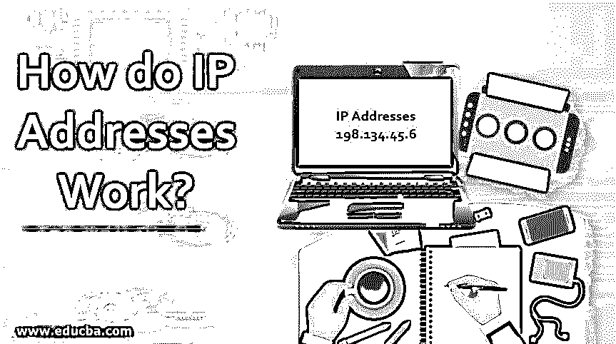
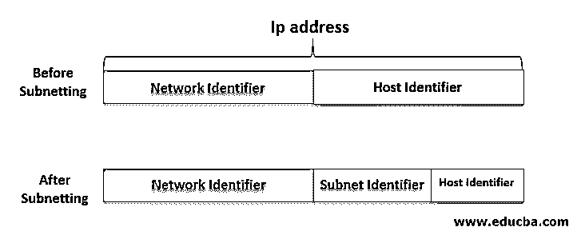
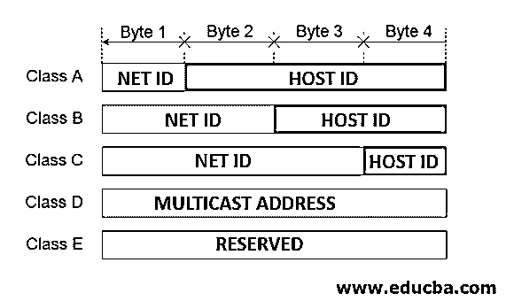

# IP 地址是如何工作的？

> 原文：<https://www.educba.com/how-do-ip-addresses-work/>

## IP 地址简介

在这篇文章中，IP 地址是如何工作的？IP 地址代表互联网协议地址。它被定义为在使用[TCP/互联网协议](https://www.educba.com/what-is-tcp-ip/)建立通信的网络中唯一标识设备的地址。IP 地址由四个 8 位的十六进制数字组成，用点号“.”分隔每个数字从一位数到三位数不等，这四个数的范围从 0 到 255 位。

**例如，**198.134.45.6

<small>网页开发、编程语言、软件测试&其他</small>

如果我们想给任何人寄信，我们需要他们的邮寄地址，同样地，计算机使用设备的 IP 地址与网络中的另一台计算机通信。互联网地址是由管理互联网的组织 InterNIC 分配的。

### IP 地址中的类型和命令

以下是 IP 地址版本的类型:

*   IPV4
*   IPV6

**1。IPV4:** [互联网协议版本 4](https://www.educba.com/what-is-ipv4/) 具有 32 位数的存储容量。由于安全问题和技术的发展，IPV4 耗尽了，所以 IPV6 出现了。

**2。IPV6:** [互联网协议第 6 版](https://www.educba.com/what-is-ipv6/)使用 128 位数字来存储地址。

下面是了解任何设备/网络的 IP 地址的命令:

*   **ifconfig -a:** 用于查看每个配置和设置。
*   **hostname -i:** 显示您机器的 IP 地址。
*   **ip 地址显示:**显示设备上的 IPv4 或 IPv6 地址。

### IP 地址中的部分

它由两部分组成:

*   **主机:**它唯一地标识网络中我们可以分配给每个主机的设备/机器。它占用 8 位地址。主机部分将保持不变，但 IP 地址的网络部分将会改变。
*   **网络:**唯一标识网络及其类别。它还占用 8 位地址。

### IP 地址的分类

它可以是下列类型:

#### 1.静态

静态 IP 地址通常不会改变，但它们可能会因网络管理而变化。它们是永久的互联网地址，提供了简单可靠的通信方式。从静态 IP 地址，我们可以得到任何重要的细节，如计算机所在的地理信息。互联网服务提供商(ISP)使用这些细节通过设备进行通信。静态 IP 地址的最好例子是 DNS 服务器(域名服务)。然而，与动态 IP 地址相比，统计 IP 地址由于其分配而不太安全。

#### 2.动态的

当我们将任何设备(如手机、电脑等)连接到互联网时，互联网服务提供商(ISP)会从可用的 IP 地址范围中为我们可以连接、发送和接收信息的设备提供一个 IP 地址。下次我们再次将同一台设备连接到互联网时，ISP 将提供不同的 IP 地址，但来自相同的可用 IP 地址范围。因为每次我们连接到互联网时，IP 地址都会不断变化，所以这种 IP 地址被称为动态 IP 地址。动态 IP 地址的一个例子是 DHCP 服务器([动态主机配置协议](https://www.educba.com/what-is-dhcp/)

### IP 地址的用途和分类

下面是它的不同类别:

*   A 类地址
*   B 类地址
*   丙类地址
*   D 类地址
*   E 类地址

在开始上课之前，我们必须对子网划分有个概念。子网划分是将一个较大的网络(主机部分)划分为较小的网络以便更好地管理和使用的过程。

**例如，**在一个法人公司里，有四个部门；销售、生产、开发和管理。在每个部门中，有 30 个用户。该公司使用专用的 C 类 IP 网络。没有任何转租的概念，所有的计算机都将在一个单一的大型网络中工作。

现在让我们了解这些类:

** 1 字节= 8 位

**Note:** Range 127.xxx.xxx.xx are reserved for the loopback/localhost, for example, 127.0.0.1 is the loopback address. Range 255.255.255.255 broadcasts address to all hosts on the local network.

*   **A 类:**该类中的 IP 地址范围为 0–126，子网掩码为 255.0.0.0。它在 127 个网络中的每个网络上支持大约 1600 万台主机。主要由互联网服务提供商(ISP)使用
*   **B 类:**B 类中的 IP 地址范围为 128–191，子网掩码为 255.255.0.0。16，000 个网络中的每个网络有 65，000 台主机。用于企业和组织中的中大型网络。
*   **C 类:** IP 地址范围为 192–223，子网掩码为 255.255.255.0。在 200 万个网络中，每个网络有 254 台主机。此类地址最常见，用于小型企业和家庭网络
*   **D 类:** IP 地址范围为 224 -239，没有子网掩码。它是为多播组保留的。
*   **E 类:** IP 地址范围为 240 -255，没有子网掩码。它是为将来使用或研发目的而保留的。

### IP 地址的使用

*   为网络中的新设备分配静态/动态 IP 地址，以便进行通信。
*   像 DNS、DHCP 等不同的协议都是基于 IP 地址的概念。
*   对网络中数百万台设备进行适当的跟踪、安全保护和监控。
*   源路由功能，允许数据包的发送方指定数据包到达目的地的路径。

**基于 IP 地址的网络**

让我们基于两种类型的网络来看看 IP 地址是如何工作的:

*   **公共:**公共 IP 地址是分配给计算设备的地址，以允许通过互联网直接访问。电子邮件服务器、电子邮件服务器和任何可从互联网直接访问的服务器设备都是全球唯一的公共 IP 地址，只能分配给唯一的设备。
*   **私有:**私有 IP 地址分配给你私有空间内的电脑，不让它们直接暴露在互联网上。例如，如果您家中有多台计算机和移动设备，您可能希望使用私有 IP 地址来寻址家中的每台计算机。专用 IP 地址以下列字符开头:

`Class A:10.0.0.0
Class B: 172.16.0.0
Class C: 198.168.0`

### 结论

IP 地址用于使用 TCP/IP 协议在网络内外的两个或多个不同设备之间进行通信，以便使用互联网服务提供商(ISP)来定位和管理设备。

### 推荐文章

这是一本关于 IP 地址如何工作的指南？.这里我们讨论的类型，阶级，分类，命令，IP 地址为基础的网络，s 和用途。您也可以浏览我们的其他相关文章，了解更多信息——

1.  [什么是 IPv6？](https://www.educba.com/what-is-ipv6/)
2.  [获取 PHP 中的 IP 地址](https://www.educba.com/get-ip-address-in-php/)
3.  [什么是开关？](https://www.educba.com/what-is-switch/)
4.  [什么是路由器？](https://www.educba.com/what-is-router/)

