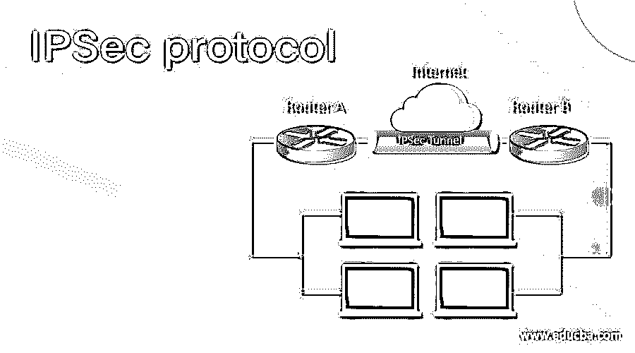

# IPSec 协议

> 原文：<https://www.educba.com/ipsec-protocol/>

## IPSec 协议简介

IP 数据包包含纯文本形式的数据，这意味着任何观看 IP 数据包的人都可以实际访问它们，并可以读取和写入它们的内容。1995 年，IETF(Internet Engineering task force)发布了与 IPSec 相关的基于安全的机制，以提供 IP 级别的安全。IPSec 的目标是在传输过程中加密和密封传输层和应用层数据。它为互联网层提供完整性保护。但是，internet 报头没有加密，因此中间路由器可以将加密的 IPSec 消息传递给预期的接收方。为了完成这项任务，IPSec 使用了我们将在本文中讨论各种协议。

### IPSec 协议

以下是 IPSec 在数据传输过程中使用的协议列表。

<small>网页开发、编程语言、软件测试&其他</small>

#### 1.认证标题

身份验证头协议提供身份验证、完整性和防重放等功能。IPSec 身份验证标头协议是 IP 数据包中的标头，包含数据包概念的加密校验和。它被简单地插入 IP 报头和任何后续分组内容之间。数据内容不变；因此，安全性完全取决于身份验证头的内容。数据完整性服务确保驻留在 IP 分组中的数据在分组传输期间不被改变。

它由 6 个字段组成，即下一个报头(8 位字段)、有效载荷长度(8 位字段)、预留(16 位字段)、安全参数索引(32 位字段)、序列号(32 位字段)和认证数据(32 位字段)。认证报头协议有两种操作模式，一种是传输模式，另一种是隧道模式。在传输模式下，身份验证报头位于原始 IP 报头和原始 TCP 报头之间。整个原始 IP 分组在隧道模式下被认证，然后认证报头被插入到原始 IP 报头和新 IP 报头之间。

#### 2.ESP 协议

ESP 封装了安全有效负载协议，提供了机密性功能。该协议定义了需要插入到 IP 分组中的新报头。它还包括将受保护的数据转换成不合理的加密格式。ESP 将位于身份验证头中，这意味着加密过程发生在身份验证过程之前。ESP 协议具有 7 个字段，即安全参数索引(32 位字段)、序列号(32 位字段)、有效载荷数据(大小取决于可变长度)、填充(具有 0-255 个字节)、填充长度(8 位字段)、下一个报头(8 位字段)和认证数据(可变大小)。它有两种模式:传输模式和隧道模式。

传输模式用于加密和验证 IP 数据包携带的数据。隧道模式用于加密整个 IP 数据包。当接收到由 IPSec 处理的 IP 数据包时，接收方首先尝试验证报头(如果存在)。基于该结果，接收器将决定该数据包的内容是否正确或者在传输过程中是否被改变。

#### 3.IKE 协议

IKE 协议代表互联网密钥交换，是用于密钥管理过程的协议。IKE 协议用于协商加密算法，这些算法稍后将由身份验证标头使用，并将安全有效负载封装在实际的加密操作中。IPSec 协议被设计为独立于实际的低级加密算法；因此，IKE 协议是 IPSec 的初始阶段，在这里决定算法和密钥。在 IKE 阶段之后，身份验证报头协议和封装安全有效负载协议接管。

#### 4.SA 协议

SA 代表安全关联协议，是 IKE 阶段的输出。它是通信方之间关于诸如 IPSec 协议版本、使用操作模式、加密算法、加密密钥等因素的协议。等等。IKE 协议的原则是在通信方之间建立 SA。一旦建立了这种连接，IPSec 的两种协议都将 SA 用于它们的实际操作。如果使用认证报头和封装安全有效载荷，则涉及的每个通信方都需要两组 SA。一个用于认证报头，一个用于封装安全有效载荷。安全关联是单向的；因此，在第二层，每个通信方需要两组 s a。一个用于输入传输，一个用于输出传输。

因此，如果两个通信方同时使用身份验证报头和封装的安全有效载荷，则它们中的每一方都需要四组 SA。安全关联协议由 9 个字段组成，分别是序列号计数器(32 位字段)、序列号溢出、防重放窗口(32 位字段)、AH 认证、ESP 认证、ESP 加密、IPSec 协议模式、PMTU(路径最大传输单元)、生存期。

### 推荐文章

这是 IPSec 协议的指南。在这里，我们讨论了 IPSec 的基本概念及其协议，以及它们的功能和各个领域。您也可以看看以下文章，了解更多信息–

1.  [IPSec](https://www.educba.com/ipsec/)
2.  [SSL 协议](https://www.educba.com/ssl-protocols/)
3.  [CIFS 协议](https://www.educba.com/cifs-protocol/)
4.  [协议测试](https://www.educba.com/protocol-testing/)

