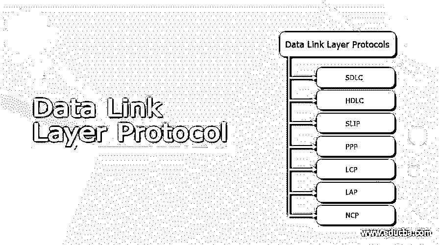

# 数据链路层协议

> 原文：<https://www.educba.com/data-link-layer-protocol/>

## 数据链路层简介

数据链路层是计算机网络 OSI 模型的第二层。这一层通过物理层在网段上的节点之间转换数据。它提供了在网络实体之间传输数据的功能性和程序性手段，并且还可以提供检测和可能纠正物理层中可能出现的错误的手段。数据链路层协议通常只负责确保和确认接收到的位和字节与传输的位和字节相同。SDLC、HDLC、SLIP、PPP、LCP、LAP 和 NCP 都是数据链路层协议。

### 数据链路层协议列表

下面是数据链路层协议的列表。

<small>网页开发、编程语言、软件测试&其他</small>

#### SDLC:

SDLC 代表同步数据链路控制协议，是计算机的通信协议。它通常用于承载系统网络架构流量。同步数据链路协议将所有远程设备连接到中央位置的大型计算机。这种连接以两种格式完成，点对点格式即一对一连接，点对多点格式即一对多连接。即使在错误检测或错误恢复情况下，SDLC 也支持一对多连接。SDLC 确保所有接收到的数据单元都是正确的，并且从一个网络点到下一个网络点的流量是正确的。

#### HDLC:

HDLC 代表高级数据链路控制协议，是由 ISO(国际标准化组织)于 1979 年开发的面向比特的代码透明同步协议。它提供面向连接和无连接的服务。HDLC 协议包含各种广域协议。它基于 SDLC 协议，支持点对点和多点通信。HDLC 帧通过同步或异步串行通信链路传输。HDLC 使用各种模式，例如正常响应模式、异步响应模式、异步平衡模式。正常响应模式用于无争用地共享从链路到主链路。异步响应模式用于全双工链路。异步平衡模式，支持组合终端，既可以作为主终端，也可以作为副终端。

#### 滑动:

SLIP 代表串行线路接口协议，用于在 IP 数据包的末尾添加成帧字节。SLIP 是一种数据链路层协议，它通过拨号链路在 ISP(互联网服务提供商)和家庭用户之间转换 IP 数据包。SLIp 设计用于端口和路由器连接。SLIP 不提供错误检测，依赖于上层协议。因此，在容易出错的拨号连接中，SLIP 本身并不令人满意。

#### 购买力平价:

PPP 代表点对点协议。PPP 是一种数据链路层协议，提供与串行线路接口协议相同的服务。这是一个健壮的协议，它也与 IP 数据包一起传输其他类型的数据包。它提供了两种协议——LCP 和 NCP，我们将在下一节讨论。点对点协议使用描述帧的成帧方法。点对点协议也称为面向字符的协议，用于检测错误。PPC 提供连接验证、数据压缩、加密和传输。它用于各种网络，如电话线、蜂窝电话、串行电缆、中继线、ISDNs、专用无线电链路等。

#### LCP:

LCP 代表链路控制协议，是点对点控制协议的一部分。LCP 数据包决定了数据传输的标准。LCP 协议用于确定所链接设备的身份，如果设备正确，则接受该设备，否则拒绝该设备。它还决定是否接受数据包的大小。如果需求超过参数，则链路控制协议终止该链路。

#### 圈:

LAP 代表链路接入过程，是一种数据链路层协议，用于在点对点链路上成帧和传输数据。有三种类型的链路接入过程-LAPB(链路接入过程平衡)、LAPF(链路接入过程帧模式承载业务)和 LAPD(链路接入过程 D 信道)。LAP 最初源自 HDLC(高级数据链路控制)，但后来被更新并重新命名为 LAPB (LAP 平衡)。

#### NCP:

NCP 代表网络控制协议，是点对点协议的一部分。网络控制协议用于为网络层协商参数和设施。对于 PPP 支持的每个更高层协议，都有一个 NCP。IPCP(互联网协议控制协议)、DNCP (DECnet 第四阶段控制协议)、OSI LCP(OSI 网络层控制协议)、IPXCP(互联网分组交换控制协议)、NBFCP (NetBIOS 帧控制协议)、IPV6CP (IPv6 控制协议)是 NCP 中的一些。

### 结论

在本文中，我们讨论了数据链路层协议 SDLC、HDLC、SLIP、PPP、LCP、LAP 和 NCP。我们希望你喜欢这篇文章。

### 推荐文章

这是数据链路层协议指南。这里我们讨论数据链路层协议的介绍、列表。您也可以看看以下文章，了解更多信息–

1.  [传输层协议](https://www.educba.com/transport-layer-protocols/)
2.  [RIP 协议](https://www.educba.com/rip-protocol/)
3.  [网络层](https://www.educba.com/network-layer/)
4.  [CAN 协议](https://www.educba.com/can-protocol/)

