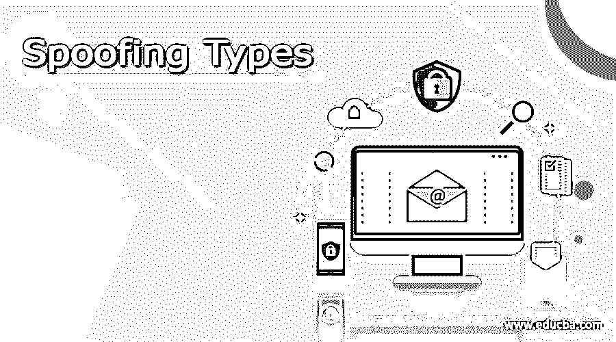

# 欺骗类型

> 原文：<https://www.educba.com/spoofing-types/>

## 欺骗简介

欺骗通常被用作更广泛的网络攻击的第一阶段，例如中间人攻击或 web 勒索软件攻击。欺骗可以通过各种通信渠道使用，需要不同水平的专业技术。网络钓鱼攻击是一种旨在从个人或组织获取敏感信息的骗局，可以通过欺骗来实施。关于不同欺骗攻击方法如何工作的更多信息可以在以下欺骗攻击方法的示例中找到。

### 不同类型的欺骗

让我们讨论各种类型的欺骗。

<small>网页开发、编程语言、软件测试&其他</small>

#### 电子邮件欺骗

当攻击者使用虚假的电子邮件地址执行网络攻击时，这被称为电子邮件欺骗。根据电子邮件欺骗技术，攻击者可能会冒充电子邮件地址、电子邮件发件人姓名或两者。此外，攻击者可以采用各种身份，包括发送者、公司或有时两者。

例如，发件人的名字是 jon.stark@abctextiles.com，尽管乔恩·史塔克不是 ABC 纺织公司的雇员。乔恩并不是一个真实的人，但是收信人在一家大型跨国公司 ABC 纺织公司工作。因为邮件有公司的 logo，并督促她履行正当的工作相关职责，所以收件人是信任的。欺骗电子邮件，作为网络钓鱼，使用紧急和令人信服的语言来诱使收件人立即采取行动。这种紧迫感实现了两个目标:它降低了不确定性和怀疑的风险，它说服接受者他们正在帮助和做正确的事情。

#### 来电显示欺骗

来电显示欺骗是一种常见的技术，其中使用的联系信息似乎来自您的区号。当我们注意到这是一个本地号码时，我们更有可能接到电话。因为打电话的人看起来是警察，目标被迫支付虚假的罚款，透露个人信息等等，所有这些都是在被逮捕的威胁下进行的。

如果目标不信任他们，一些攻击者会建议他们用这个号码回叫他们。当他们的电话被接听时，攻击者使用社会工程技术来保持目标在线，并说服他们采取行动。这种先进的社会工程策略验证了这种关系，并增加了通话的可信度。

#### 网站欺骗

网站欺骗包括创建一个看似合法的虚假网站。假冒网站上的徽标、图形、域名、品牌、布局和联系方式都与真实网站上的完全相同。如果不仔细查看域名或寻找文本中的细微错误，很难识别出欺骗性网站。
假冒网站被攻击者用于各种目的，包括收集登录凭证、获取信用卡详细信息、安装恶意软件和其他犯罪行为。通常，目标最初会收到一封恶意电子邮件，将他们定向到网络钓鱼网站。

#### GPS 欺骗

当 GPS 欺骗发生时，虚假的 GPS 信号被发送到 GPS 接收器，导致该区域的所有 GPS 设备显示错误的位置。网络攻击者利用 GPS 欺骗来控制车辆、无人机、船只和任何其他依赖导航的设备。GPS 欺骗是一种高级的

#### IP 地址欺骗

IP 地址欺骗隐藏了攻击者计算机或手机的真实身份和位置。假冒使用 IP 地址身份验证的网络的 IP 地址，使得攻击者很容易访问网络。黑客技术，可用于劫持潜艇或无人机，以及扰乱军事导航系统。IP 地址欺骗通常用于执行拒绝服务攻击，使网络流量泛滥，最终导致网络关闭。在其他情况下，网络罪犯只是希望对接收者隐瞒他们的位置；这种策略可能与电子邮件或网站欺骗结合使用，使攻击更加有效。

#### 短信欺骗

使用假电话号码发送有害的文本消息被称为文本消息欺骗。攻击者隐藏在发件人姓名或电话号码后面。这种欺骗依靠广泛的研究来确定收件人最有可能接收和回复哪种类型的文本消息。短信可能包含收件人联系的电话或手机号码，或者指向可用于实施更多网络犯罪的有害网站的链接。为了让收件人及时回复，短信使用了社会工程技术。

#### 地址解析协议或 ARP 欺骗

这是一种技术性的高级网络攻击，攻击者的媒体访问控制(MAC)地址链接到一个合法的 IP 地址。这使得攻击者能够拦截和窃取针对 IP 地址所有者的信息。ARP 欺骗通常用于窃取信息、实施中间人攻击、发起会话劫持或拒绝服务攻击。

#### DNS 欺骗

域名服务器欺骗，通常称为 DNS 欺骗，允许攻击者将流量从真实的 IP 地址转移到虚假的 IP 地址。攻击者可以利用这种欺骗技术将人们发送到恶意网站。

#### 扩展欺骗

文件类型通过扩展名欺骗进行伪装，这使得攻击者能够诱使目标安装附件。攻击者已经知道人们被建议不要下载可执行文件。受感染的可执行文件可能被攻击者伪装成虚假的扩展名，如 doc.exe。邮件中的文件命名为 newfile.doc，收件人毫不犹豫地打开它。文件在邮件中以 newfile.doc 的形式出现，收件人毫不犹豫地下载安装。

#### 面部欺骗

面部欺骗是一种新类型的欺骗，它使用面部识别软件来解锁或访问安全结构。这种欺骗方法非常罕见，但是随着面部识别技术的进步以及更多的公司将其作为安全系统的一部分，面部欺骗的可能性将会增加。

### 结论

欺骗有时很容易被注意到，但并非总是如此，恶意攻击者越来越多地执行复杂的欺骗攻击，这需要用户保持警惕。了解不同类型的欺骗以及如何识别它们可以帮助您避免成为受害者。

### 推荐文章

这是一个欺骗类型的指南。在这里，我们讨论的介绍，不同类型的欺骗。您也可以看看以下文章，了解更多信息–

1.  [拒绝服务攻击的类型](https://www.educba.com/types-of-dos-attacks/)
2.  [服务器类型](https://www.educba.com/server-types/)
3.  [DNS 类型](https://www.educba.com/dns-types/)
4.  [OSPF 路由器类型](https://www.educba.com/ospf-router-types/)

