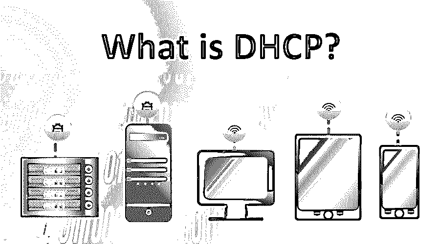

# 什么是 DHCP？

> 原文：<https://www.educba.com/what-is-dhcp/>

## 了解 DHCP(动态主机配置协议)

DHCP 代表动态主机配置协议。它是应用层中的网络管理协议。在它的帮助下，互联网协议 IP 地址可以动态地分配给网络上的任何设备或节点，以便它们可以使用该 IP 进行通信。网络管理员的任务是将大量的 IP 地址手动分配给网络中的所有设备。但是，在这种情况下，任务是自动化的，并且是集中管理的，而不是手动管理的。小型本地网络和大型企业网络都采用这种方式。它的基本目标是给主机分配一个唯一的 IP 地址。

它还提供其他网络地址，例如–

<small>网页开发、编程语言、软件测试&其他</small>

*   子网掩码
*   路由器地址
*   DNS 地址
*   供应商类别标识符

它有两种不同的方式，即作为客户端和服务器。

### DHCP 的历史

它是 BOOTP 的扩展版本，通常被称为 Bootstrap 协议，是 1985 年的一种网络 IP 管理协议。如果 BOOTP 客户端出现在网络中， [DHCP 服务器](https://www.educba.com/dhcp-server-in-linux/)有足够的能力处理来自这些客户端的请求。不仅如此，与 BOOTP 相比，DHCP 更加先进。

### 它是如何工作的？

当充当服务器时，DHCP 服务器会自动分配唯一的 IP 地址，并配置网络的其他信息。在小型企业或家庭中，DHCP 服务器就是路由器。但是，在大型网络中，DHCP 服务器可以是单台计算机。

该过程中发生的事情的一个非常简短的总结是——

*   客户端向主机发送 IP 地址请求。客户端可以是发送请求的任何设备，主机可以是路由器。
*   主机将寻找可用的 IP 地址，并将其分配给客户端。
*   使用此 IP 地址，客户端将能够在网络上通信。

现在让我们更详细地看看这个过程。下面提到的步骤深入介绍了这一点——

*   通过 DHCP 服务器连接到网络的设备发送的请求称为 DHCPDISCOVER 请求。
*   这个请求以名为 DISCOVER 的数据包的形式发送到 DHCP 服务器。DHCP 服务器一收到这个数据包，就会寻找设备使用的 IP 地址。一旦找到，服务器通过向客户机发送一个名为 DHCPOFFER 的数据包来做出响应。
*   设备或客户端现在必须用一个名为 DHCPREQUEST 的数据包来响应服务器，以接受所选的 IP 地址。对于此数据包，服务器会发送一个确认消息(ACK ),确认设备现在可以使用该特定的 IP 地址。它还声明特定 IP 地址的有效性，以便设备确切地知道何时必须获得新的 IP 地址。
*   如果服务器不希望设备拥有给定的 IP 地址，它不会通过发送 NAC 来确认设备的请求。

虽然提到的步骤似乎非常耗时，但实际上发生得如此之快，以至于人们甚至不会意识到。当然，这个过程不需要任何技术细节，您仍然可以通过读取从 DHCP 服务器获得 IP 地址。

### 它是如何让工作变得如此简单的？

DHCP 服务器有一个地址池，供设备获取有效的网络连接。它基本上给出了 IP 地址的作用域或范围，在这个范围内设备接收它们的地址。

DHCP 有用的第二个原因是，许多设备可以在指定的时间内连接到网络，甚至不需要任何可用地址池。例如，考虑由 DHCP 服务器定义的 20 个地址；只要不超过 20 台设备同时使用一个可用的 IP 地址，就可以有 40、80、100(甚至更多)台设备连接到网络。

像 ipconfig 这样的命令会在一段时间内返回您的计算机的不同 IP 地址，因为这些地址会在一段指定的时间内提供给您的[计算机网络](https://www.educba.com/introduction-to-computer-network/)，这段时间也称为租期。具有手动分配的 IP 地址的设备不一定不能与动态接收其 IP 地址的设备共存于同一网络中。手动分配的 IP 地址也称为静态 IP 地址。

### DHCP 的优点和缺点

下面给出了一些优点和缺点:

#### 优势:

它有许多好处，因此很受欢迎。

*   人们可以非常容易地向网络添加新的客户端。
*   IP 地址由 DHCP 集中管理。
*   IP 地址可以重复使用，从而最大限度地减少对 IP 地址总数的需求。
*   DHCP 服务器上的 IP 地址空间易于重新配置，无需单独重新配置客户端。
*   网络管理员可以使用 DHCP 协议方法从集中区域配置网络。

#### 缺点:

*   将 IP 地址分配给不同的主机时，有时可能会发生 IP 地址冲突。

### 结论

[动态主机配置协议](https://www.educba.com/dynamic-host-configuration-protocol/)是一项必不可少的重要网络服务，因为使用它将帮助您作为系统管理员或网络管理员通过分配跟踪和重新分配 IP 来处理客户端。此外，如果出现任何问题，您只需要保持与服务器的连接并验证设置，而不是在客户端之间运行。

### 推荐文章

这是一个什么是 DHCP 的指南？.在这里，我们讨论了对 DHCP 的理解、它的工作原理以及它的优缺点。您也可以看看以下文章，了解更多信息–

1.  什么是 Groovy？
2.  什么是 JDK？
3.  [什么是 JVM？](https://www.educba.com/what-is-jvm/)
4.  [配置 DHCP 服务器](https://www.educba.com/configuring-dhcp-server/)

