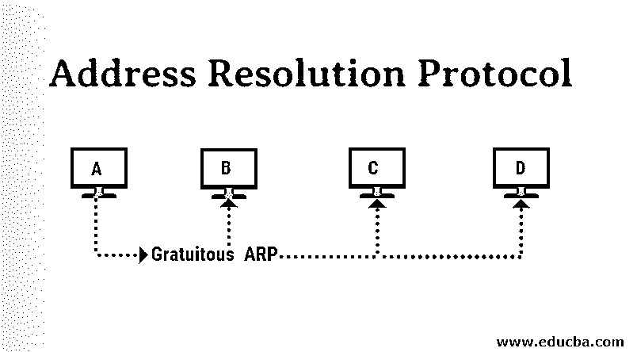
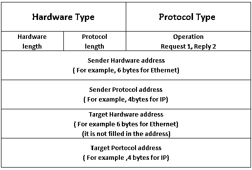
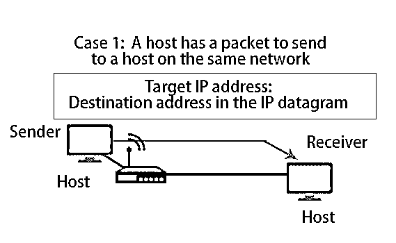
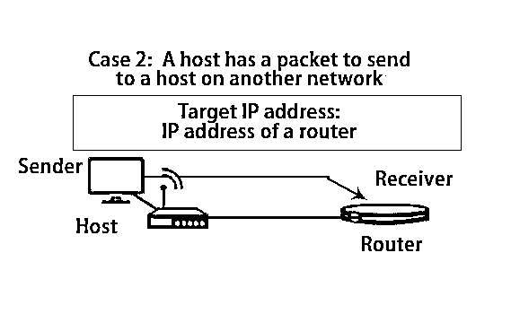
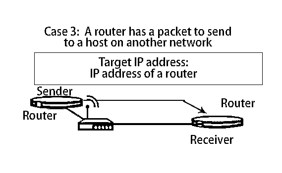
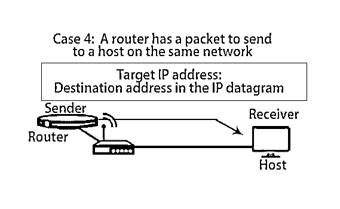
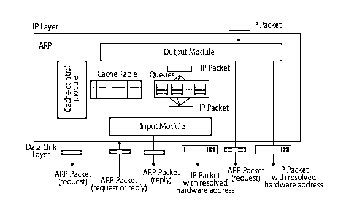

# 地址解析协议

> 原文：<https://www.educba.com/address-resolution-protocol/>

## 地址解析协议简介

地址解析协议是一种地址映射技术，用于将逻辑地址动态映射到物理地址，即将网络层使用的逻辑地址(IP 地址)转换为数据链路层使用的物理地址(MAC 地址)。地址解析协议包由缓存表、队列、输出模块、输入模块和缓存控制模块组成。此外，地址解析协议包括硬件类型、协议类型、硬件长度、协议长度、请求和回复等操作、发送方的硬件地址、发送方的协议地址、目标方的硬件地址和目标方的协议地址。

### 地址解析协议数据包格式

下表是[ARP 数据包格式](https://www.educba.com/arp-packet-format/):

<small>网页开发、编程语言、软件测试&其他</small>

#### ARP 数据包格式:

*   **硬件类型:**16 位字段，定义运行地址解析协议的网络类型。
*   **协议类型:**定义协议类型的 16 位字段。例如，对于 IPv4 协议，该字段包含 0800 个基数 16。
*   **硬件长度:**是一个 8 位字段，以字节为单位定义物理地址长度。
*   **协议长度:**8 位字段，以字节为单位定义逻辑地址长度。
*   **操作:**16 位字段，定义数据包的类型。有两种类型的数据包 ARP 请求(1)和 ARP 回复(2)。
*   **发送方硬件地址:**定义发送方物理地址的变长字段。
*   **发送方协议地址:**定义发送方逻辑地址的变长字段。
*   **目标硬件地址:**定义接收方物理地址的变长字段。
*   **目标协议地址:**定义接收方逻辑地址的变长字段。

### 地址解析协议操作

本节将介绍 ARP 过程以及主机或路由器需要使用地址解析协议的四种不同情况。

#### ARP 过程:

以下是 ARP 过程中涉及的步骤列表:

**第一步:**发送方知道接收方的 IP 地址。

**步骤 2:** 互联网协议要求 ARP 创建一个 ARP 请求消息，其中包含发送方物理地址、接收方物理地址字段用 0 填充、发送方 IP 地址和接收方 IP 地址等信息。

**步骤 3:** ARP 请求消息被[发送到数据链路层](https://www.educba.com/data-link-layer/)，在那里消息被封装在帧中，使用发送方的物理地址作为源地址，广播地址作为目的地址。

**步骤 4:** 每台主机都会收到该帧，因为该帧包含广播目的地址。所有主机都用自己的地址检查地址。如果找到匹配，数据包将被丢弃到该主机；否则，它将传递给地址解析协议。

**步骤 5:** 接收到数据包后，目标主机回复一条 ARP 回复消息，其中包含目标物理地址。该步骤中的消息是单播的。

**第六步:**当发送方收到目标的回复消息时，就知道了目标的物理地址。

**第 7 步:**现在，IP 数据报将目标机器的数据进行封装，并以单播形式发送到目的地。

#### **四个**不同的**案例:**

下面列出了可以使用地址解析协议服务的四种情况。

**案例 1:**

从上图中，我们可以看到，发送方是一台主机，想要向位于同一网络的另一台主机发送数据包。在这种情况下，将逻辑地址映射到物理地址是一个目的 IP 地址，应该在数据报报头中。

**案例二:**

正如我们在上图中看到的，发送方是一台主机，他想向位于另一个网络中的另一台主机发送数据包。在这种情况下，发送方主机会查看路由表，查找目的主机的下一个 IP 地址。因此，主机的 IP 地址成为必须映射到物理地址的逻辑地址。如果发送方主机没有路由表，它会查看默认主机的 IP 地址。

**案例三:**

正如我们在上图中看到的，发送方是一台路由器，它接收到了位于另一个网络上的另一台主机的数据报。在这种情况下，路由器[查看路由表](https://www.educba.com/what-is-routing/)并找到下一个路由器的 IP 地址。因此，路由器的 IP 地址成为必须映射到物理地址的逻辑地址。

**案例四:**

正如我们在上图中看到的，发送方是一台路由器，它接收到了位于同一网络中的另一台主机的数据报。在这种情况下，数据报的 IP 地址成为必须映射到物理地址的逻辑地址。

### 地址解析协议包

地址解析协议包有五个组件:

*   缓存表
*   行列
*   输出模块
*   输入模块
*   高速缓存控制模块

下面是地址解析协议包的示意图:

#### 1.ARP 中的缓存表

当主机收到 IP 数据报对应的物理地址时，缓存表会将该物理地址保存在其表中。将物理地址存储在高速缓存表中是有时间限制的，而不是无限制的。高速缓存表由条目数组组成。每个条目都有下面提到的字段。

*   **状态:**显示每个条目的状态。状态可以是自由、已解决或待定。自由状态意味着进入的生存时间已经到期。该空间被分配给新条目。已解决状态表示条目已完成。一个条目有目的物理地址。等待发送到此目的地的包裹可以使用条目中的信息。未决状态意味着对条目的请求已经被声明并且正在等待答复。
*   **硬件类型:**定义 ARP 包运行的网络类型。
*   **协议类型:**定义 ARP 包运行的协议类型。
*   **硬件长度:**定义物理地址的长度。
*   **协议长度:**定义逻辑地址的长度。
*   **硬件地址**:显示目的物理地址。
*   **协议地址:**显示目的逻辑地址。
*   **接口号:**路由器用来连接不同网络的接口号。
*   **队列号:**使用队列号将等待地址解析的数据包入队。
*   **超时:**显示每个条目在一秒钟内的生命周期。
*   **尝试次数:**显示每个条目发送 ARP 请求的次数。

#### 2.行列

*   它包含一组目的地队列，即每个目的地一个队列，用于保存 IP 包，同时解析物理地址。
*   最后，输出模块将未解析的数据包发送到它们对应的队列中。

#### 3.输出模块

*   输出模型等待 IP 数据包。IP 数据包一收到，它就检查缓存表，以找到数据包中存在的目的地的相应 IP 地址。数据包的目的 IP 地址必须与条目的协议地址匹配。
*   如果找到匹配的条目，并且条目的状态得到解析，则带有目的硬件地址的数据包将被传递到数据链路层进行传输。
*   如果找到了匹配的条目，并且条目的状态是未决的，则数据包会一直等待，直到找到目的地的硬件地址。
*   如果没有找到匹配的条目，输出模块将创建一个队列，并将数据包排入队列。然后，它创建一个新条目，并将状态设置为 PENDING，并将尝试次数设置为 1。最后，它广播目的地址的 ARP 请求数据包。

#### 4.输入模块

*   输入模块等待地址解析协议包。一旦地址解析包到达，它就检查对应于现金表的地址解析包的条目。目标的协议地址必须与条目的协议地址匹配。
*   如果找到匹配的条目，并且条目的状态被解析，则输入模块更新条目和时间外场。条目被更新，因为硬件地址有可能改变。
*   如果找到匹配的条目，并且条目的状态为未决，则输入模块通过将目标的硬件地址复制到条目的硬件地址字段并将状态字段更新为已解决来更新条目。它还更新条目的超时字段。
*   如果没有找到匹配的条目，输入模块将创建一个新条目，并将其添加到表中。它将状态字段更新为条目的已解决和时间外场。
*   然后，输入模块检查收到的 ARP 数据包是回复还是请求。如果是 ARP 请求，输入模块会立即创建一个 ARP 回复并发送给发送方。ARP 回复数据包是通过将数据包的值从请求更改为回复来创建的。

#### 5.高速缓存控制模块

*   高速缓存控制模块维护高速缓存表。它周期性地，即 5 秒钟，逐个条目地检查高速缓存表。
*   如果条目的 state 字段是空闲的，它检查另一个条目。
*   如果条目的状态字段是未决的，则高速缓存控制模块将尝试字段的值增加 1。然后，它检查尝试字段的值。如果尝试字段的值大于允许的最大限制，它将状态字段更新为 FREE 并销毁相应的队列。
*   如果条目的状态字段被解析，则高速缓存控制模块将外场时间值减 1。然后检查外场时间的值。如果 time outfield 值小于或等于零，它将条目的 state 字段更新为 FREE，并销毁相应的队列。

### 结论

本文已经看到了什么是地址解析协议，ARP 中的数据包格式，是一种操作，为了更好地理解，在子主题中有图像和解释。

### 推荐文章

这是地址解析协议的指南。这里我们已经讨论了数据包格式、操作以及 ARP 包的组成部分。您也可以浏览我们推荐的其他文章，了解更多信息——

1.  [什么是网络协议](https://www.educba.com/what-is-networking-protocols/)
2.  [什么是 ARP？](https://www.educba.com/what-is-arp/)
3.  [TCP/IP 模型](https://www.educba.com/tcp-ip-model/)
4.  [网络的基本原理](https://www.educba.com/basic-fundamental-of-networking/)

