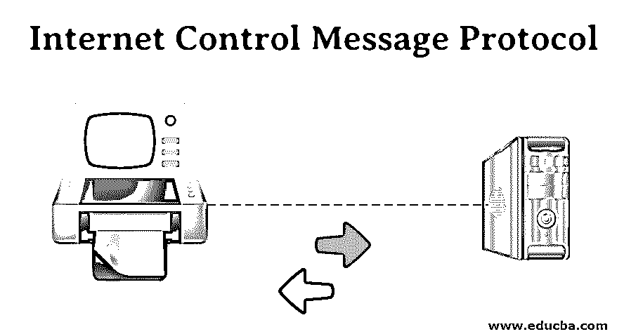
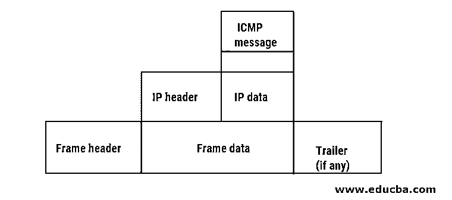
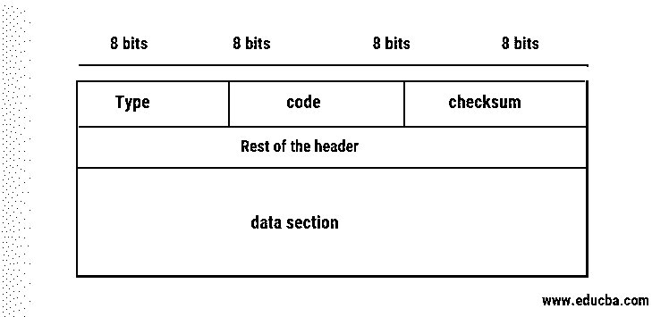

# 互联网控制消息协议

> 原文：<https://www.educba.com/internet-control-message-protocol/>

## 互联网控制消息协议介绍

ICMP(互联网控制消息协议)是一种网络层协议，用于解决跨网络设备的网络通信问题。它不是在机器之间发送数据的传输协议。路由器中使用了最常见的互联网控制消息协议。互联网控制消息协议已被用于发送大于 IP 协议允许的字节数的 IP 数据包，以执行 dos 攻击。

下图显示了互联网控制消息协议中的封装过程。

<small>网页开发、编程语言、软件测试&其他</small>

### 我们为什么需要它？

网际协议提供数据报的无连接传送。这背后的目标是有效地利用网络资源。换句话说，它被设计成将数据报从一台主机传送到另一台主机。但是它有两个不足，即缺乏辅助和错误机制。为了解决这两个问题，互联网控制消息协议应运而生。
**互联网控制消息协议消息**
互联网控制消息协议消息有两种类型——1)错误报告消息和 2)查询消息。错误报告消息用于在转换 IP 数据包时检测路由器或主机的问题。查询消息有助于网络管理员从任何路由器或主机获取特定信息。

### 互联网控制消息协议消息格式

下图显示了互联网控制消息协议消息的格式。

*   **类型**:该字段为 8 位，定义了报文的类型。
*   **代码:**该字段为 8 位，定义了具体报文类型的原因。
*   **校验和:**该字段为 16 位，用于在转换数据报时检测错误。
*   **报头的其余部分:**该字段用于每种类型的消息。
*   **数据段:**该字段为错误信息。它携带有错误的原始数据包的信息。在查询消息的情况下，该字段携带基于查询类型的额外信息。

### 互联网控制消息协议消息的类型

以下是互联网控制消息协议消息的类型

#### 1.错误报告消息

错误报告消息用于报告路由器或主机在转换数据报时可能遇到的问题。请记住，错误报告消息不会纠正路由器的错误；它只是总结了错误报告。错误消息总是被发送到源，即发送方站点，因为数据报只包含源和目的 IP 地址。互联网控制消息协议使用源的 IP 地址来发送错误消息。
**有五种类型的错误报告消息—**

1.  目的地不可达消息
2.  源抑制消息
3.  超时消息
4.  参数问题消息
5.  重定向消息

*   **目的地不可达消息:**当主机或路由器无法路由数据报时，主机或路由器向发起数据报的源发送目的地不可达消息。换句话说，当路由器无法向接收方发送数据报时，它会向源发送目的地不可达消息。
*   **源抑制消息:**当主机或路由器由于缺乏流量控制和拥塞控制而丢弃数据报时，路由器向数据报源发送源抑制消息。
*   **超时消息:**超时消息有两种情况。让我们讨论一下那些案例。
    **情况一:**当主机或路由器将数据报的生存时间值递减为零时，互联网控制报文协议向源地址发送超时报文，丢弃该数据报。
    **情况二:**当目的地址在规定的时间间隔内没有收到所有的数据报片段时，互联网控制报文协议向源地址发送超时报文，丢弃该数据报。
    在超时报文中，路由器用代码 0 表示生存时间字段的值为 0，目的主机用代码 1 表示在指定时间收到的所有数据片段。
*   **参数问题消息:目的主机或路由器创建此消息**。如果路由器或目的主机在数据报的任何字段中发现不明确的活动或缺失值，它会向源地址发送参数问题消息，并丢弃该数据报。
*   **重定向消息:路由器或主机在同一本地网络上发送此消息**。
    路由表在动态更新表时会产生流量。大多数主机[使用静态路由](https://www.educba.com/what-is-static-routing/)。当主机启动时，其路由表中的条目数量有限。它只知道一台路由器和默认路由器的 IP 地址。因此，主机可能会将一个网络的数据报发送到另一个网络，即错误的路由器。在这种情况下，接收数据报的错误路由器会转发到正确的路由器。但是为了更新主机路由表，它向主机发送重定向消息。

#### 2.查询消息

查询消息有助于网络管理员从任何路由器或主机获取特定信息。换句话说，它可以通过查询消息来诊断一些网络问题。
**有四种类型的查询消息—**

1.  回应请求和回复消息
2.  时间戳请求和回复消息
3.  地址掩码请求和回复消息
4.  路由器请求和广告消息

*   **回应-请求和回复消息:**该消息用于诊断目的。这些消息用于识别两个系统是否可以相互通信。
    主机或路由器发送回应请求消息，而回应回复消息由接收回应请求消息的主机或路由器发送。
    网络管理人员使用这些消息来检查 IP 协议的运行情况。
    使用 ping 命令，每个请求和回复消息都可以测试主机或路由器的可达性。
*   **时间戳请求和回复消息:**时间戳请求和回复消息用于确定每个 ip 数据报从一台主机到另一台主机的往返时间。它还可以同步主机之间的时钟。
*   **地址掩码请求和回复消息:**这些消息用于识别主机的掩码。
    例如，假设主机知道其 IP 地址 192.168.1.25，但不知道对应主机的掩码；在这种情况下，为了知道主机的掩码，它向 LAN 网络上的路由器发送地址掩码请求消息。如果主机知道路由器的 IP 地址，它会直接向该路由器发送请求，如果不知道，它会广播请求消息。收到地址掩码请求的路由器会回复一个地址掩码，并将掩码提供给主机。
*   **路由器请求和广告消息:**假设一台主机想要在位于另一个网络的另一台主机上发送数据，并且需要知道连接到其自己网络的路由器的 IP 地址。它还想知道自己网络的路由器是否在工作。在这种情况下，路由器请求和广告消息会有所帮助。主机广播路由器请求消息，收到该消息的路由器使用路由器广告消息广播路由信息。

### 推荐文章

这是互联网控制信息协议指南。在这里，我们讨论互联网控制消息协议消息的基本概念、类型以及我们为什么需要它们。您也可以阅读以下文章，了解更多信息——

1.  [网络营销工具](https://www.educba.com/internet-marketing-tool/)
2.  [基于互联网的商业理念](https://www.educba.com/internet-based-business-ideas/)
3.  [网络开发职业](https://www.educba.com/career-in-web-development/)
4.  [软件测试原则](https://www.educba.com/software-testing-principles/)

