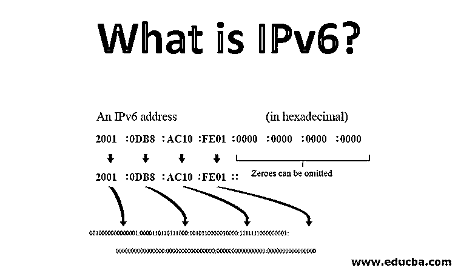

# 什么是 IPv6？

> 原文：<https://www.educba.com/what-is-ipv6/>

## 什么是 IPv6？

IPV6 是互联网协议版本 6，用于 TCP/IP 协议簇的 IP 层，以识别连接到互联网的每个设备，旨在提供比 IPV4 更多的功能。IPV6 地址是唯一且通用的，128 位或 16 字节长，具有地址空间 2^128，使用四种表示法来表示地址，点分十进制表示法、冒号十六进制表示法、混合表示法和 CIDR 表示法。IPV6 地址可以是单播、任播或组播。

### 需要 IPv6

技术的爆炸性增长和移动设备、计算机、平板电脑、无线手持设备中各种配置的升级增加了对地址分配的需求。IPv6 旨在取代广泛使用的 IPv4，后者被认为是现代互联网的主干。开发 IPv6 是为了克服 IPv4 的地址耗尽问题。在详细解释 IPv6 的必要性之前，让我们先了解一下 IPv4 及其缺点。

<small>网页开发、编程语言、软件测试&其他</small>

#### IPv4 的构建及其缺点

IPv4 是互联网协议发展的第四个版本，它是互联网和分组交换网络中基于标准的互联方法的核心协议之一。它拥有 32 位地址，仍然处理互联网流量。

它将寻址空间限制为 2^32，并为私有网络和组播地址保留地址块。大多数情况下，地址都是由句点分隔的十进制数的四个八位字节组成。它也用带点的十六进制格式表示。分配分为两部分:网络标识符和主机标识符。网络标识符保存地址的最高二进制八位数，主机保存地址的其余部分。创建网络类是为了克服这一限制，并使用五个类来修改系统。

特殊用途地址包含不同范围的地址数量的地址范围，并且它将被限制用于一般用途。它主要用于私有网络提供寻址空间和组播流量。

#### IPv4 地址耗尽有四个主要原因。

*   互联网用户的快速增长。
*   总是在像有线调制解调器这样的设备上。
*   在移动设备、笔记本电脑、计算机中的高使用率。
*   低效的地址使用。

由于地址耗尽，它发展成为一种威胁，并有助于识别和克服一些方法，如有类网络、无类域间路由、网络地址转换以及为严格分配创建的策略。这些技术通过改变互联网的地址分配和路由基础设施，帮助缓解了一段时间的问题。IPv4 的主要损耗导致互联网基础设施的原始设计容量不足。每个问题都增加了对有限地址供应的需求，如下所示:

**1。互联网区域:**自 1990 年以来的 15 年间，互联网连接的发展带来了宽带连接的高使用率。像印度和中国这样的发展中国家正面临地址枯竭。

**2。地址使用效率低下:**20 世纪 80 年代初获得 IP 地址的组织分配的地址远远超过了需求。由于最初的有类网络分配方法不足以反映合理的使用情况，因此对于不能从本地网络外部访问的设备，这种方法在 IP 编址方面存在限制。这种低效率也存在于全局地址分配的各种情况中。子网划分是效率低下的原因，它不允许我们使用一个地址块中的地址。

**3。宽带连接:**电话调制解调器拨号是互联网接入的主要方式。因为调制解调器池共享一个公共 IP 地址，并且该池被分配了 IP 地址，并且它是基于消费者基础来共享的。拨号网络的快速增长增加了地址消耗率。随着时间的推移，宽带连接已经开始超过 50%的接入普及率，因为网关很少关闭，连接总是保持活跃。

**4。移动设备:**当新技术在移动电话时代出现时，互联网接入需求增加。数字通信和在手持设备中嵌入大量计算能力的成本下降了。随着它变得可行，4G/5G 的新规范需要 IPv6 寻址来实现高速通信。这些是地址耗尽的主要原因。主要原因是地区疲劳。RIR 的(地区互联网注册管理机构)在 1024 个地址耗尽。随着互联网基础设施需求的变化，IPv6 的过渡开始了。

### IPv6 数据包及其用途

为了克服 IPv4 的网络互联基础设施，IPv6 采用扩展的二进制八位数到 40 个二进制八位数来构建，为将来扩展协议提供了机会，而不会影响核心数据包结构。它引入了“Jumbograms ”,这意味着数据包可以处理超过 2^32.的限制 Jumbograms 提高了高 MTU 链路的性能，并处理了有效载荷。

IPv6 拥有 128 位地址，其地址空间设计足够大，可供未来使用。该标识符在子网内对于连接到网络的主机是唯一的。它被分成 8 组，每组 16 位。冒号以十六进制格式分隔各组。

### IPv6 的使用

以下几点解释了 IPv6 的用法:

*   康卡斯特和美国电话电报公司在其网络中占有 63%和 65%的份额
*   T-Mobile 美国公司通过 IPv6 处理了超过 85%的流量。
*   Alexa 使用超过 30%的访问他们的网站。
*   IBM，第一个通过其 AIX 4.3 操作系统支持 IPv6 的商业供应商
*   默认情况下，最新版本的 Windows 操作系统启用了 IPv6 支持。

### IPv6 的优势

以下几点解释了 IPv6 的优势:

*   IPv6 利用大地址空间更有效地处理数据包。
*   提高性能和安全性
*   路由表中的分层排列使得通过互联网服务提供商的空间更少。
*   IPv6 使具有私有 IP 地址的公司机器能够发送和接收来自位于具有公共 IP 地址的私有网络之外的机器的数据包。
*   DHCP 服务器存在或不存在时的无状态和有状态地址配置
*   流标签字段为优先交付提供了更好的支持。

### IPv6 的发展

以下几点解释了 IPv6 是由谁开发的:

*   IPv6 是由互联网工程任务组(IETF)开发的
*   运行 IPv6 基础设施、服务和应用的 R&D 网络有 AARNET(澳大利亚)、Abeline(美国)、Gigabit European Academic Network(欧洲)和许多其他网络。

### 结论–什么是 IPv6？

这些发现和在 IPv4 上的整合表明，IPv6 核心得到了很好的支持，其[互操作性](https://www.educba.com/interoperability-testing/)得到了验证，并被部署在最新一代的路由器&操作系统中。因此，基础设施对其进行了扩展，以支持完整的企业过渡。

### 推荐文章

这是一个什么是 IPv6 的指南？在这里，我们详细讨论了 IPv6 的需求、IPv4 的缺点、用途、优点以及 IPv6 的开发者。您也可以浏览我们的其他相关文章，了解更多信息——

1.  [网站类型](https://www.educba.com/types-of-websites/)
2.  什么是 LINQ？
3.  [什么是路由器？](https://www.educba.com/what-is-router/)
4.  [什么是 IPv4？](https://www.educba.com/what-is-ipv4/)

