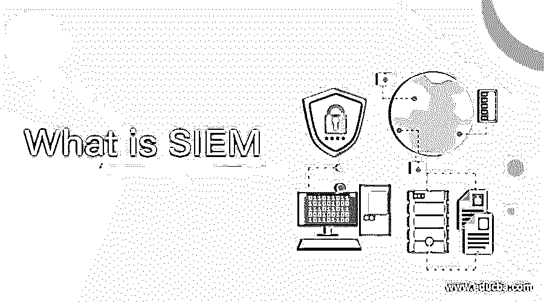

# 什么是 SIEM

> 原文：<https://www.educba.com/what-is-siem/>

## SIEM 简介

SIEM 是一种安全管理方法，它将安全信息管理与安全事件管理(SIM)相集成。SIEM 首字母缩写被声明为不发音。它是一个软件解决方案，用于从 It 基础架构中的多个工具聚合和查看事件。SIEM 从网络计算机、域控制器、服务器和其他设备获取保护数据。它收集、汇总、规范和分析数据，以识别模式和风险，并帮助组织调查警告。每个 SIEM 系统的基本概念是来自各种来源的适用数据的汇编、识别和有效步骤。例如，SIEM 设备可以在检测到潜在问题时记录附加信息，发出警报，并建议其他安全检查停止进行。

### SIEM 是如何工作的？

SIEM 软件从主机系统和应用程序到网络和安全设备(如防火墙和防病毒过滤器)收集和聚合日志数据，这些设备在组织的整个技术基础架构中创建。该应用程序然后将分类，归类，并解释事故和事件。例如，它提供了两个关键特性:

<small>网页开发、编程语言、软件测试&其他</small>

与安全相关的事故和事件报告包括活动和错过的登录、勒索软件活动和其他潜在的恶意行为。并且如果调查表明某项操作根据预先确定的规则运行并显示可能存在安全问题，则提交警告。SIEM 的核心是一个数据聚合、搜索和报告系统。SIEM 从整个网络世界获取、整合知识，并使其可供人们使用。

### SIEM 工具

以下是提到的 SIEM 工具

#### 1.IBMQRadar

在组织信息系统中，IBM QRadar 从包括网络计算机、操作系统、软件和用户行为在内的来源捕获日志数据。QRadar 还可以从基于云的应用程序中捕获数据，以记录事件和网络流量。这个 SIEM 也提倡对风险的智力反馈。QRadar 是另一种常见的工具，可以根据公司的需求和能力部署为硬件、虚拟系统或软件设备。QRadar 可以集成到 Varonis 中，以增加高级威胁识别功能。

#### 2.ArcSight

ArcSight 的开放式架构为其提供了一些出色的功能。与许多 SIEM 产品相比，该平台可以使用来自更广泛来源的数据，并且其组织的数据可能对 ArcSight 以外的更多 IT 团队有用。它收集和分析来自组织的安全技术、操作系统和应用程序的日志数据。该设备会向安全人员发出警报，直到识别出恶意攻击。

#### 3.网络安全管理软件产品威胁监测

网络安全管理软件产品威胁监视器是一种高效、安全驱动的 SIEM 解决方案，它分析来自多个来源的安全日志详细信息，并检查持续的全球威胁数据库中的异常情况。该工具为安全事件提供自动、智能的响应和详细的警告。

#### 4.相扑逻辑

这个工具是一个现代的基于云的应用程序，适用于中小型企业和价格。由于该软件是最新的，没有太多的社区关注，但 Sumo Logic 认为，IT 保护产品解决了其他产品跳过的漏洞，特别是在云部署方面。

#### 5.Securonix

Securonix 是开发人员和专业安全团队可以快速使用的罕见 SIEM 平台。Securonix 是一款功能齐全的仪器，具有强大的分析和数据跟踪功能。Securonix 将 LogRhythm 和 IBM 与托管价值、部署、易用性和身份识别以及正确的响应和管理环境联系起来。云基础设施侧重于工作人员的数量，对于一个拥有流行细节和大量事件的行业而言，它也是最简单的支付系统之一。

#### 6.Fortinet

对于那些希望获得强大保护的人，尤其是当前的 Fortinet 客户，Fortinet 工具是一个很好的选择。Fortinet tool 比该列表中的任何第三方都更受欢迎。NSS 实验室都测试了他们的违规和入侵检测，网关和 EDR 的能力。Fortinet 工具在识别、反应和管理方面得分最高。

### SIEM 工具的优势

它通过过滤大量安全数据并对应用程序创建的安全警报进行优先级排序，简化了保护管理。

SIEM 系统还可以自动创建包含所有记录的安全活动的报告，从而帮助公司遵守法规标准。组织将不得不在没有 SIEM 工具的情况下手动捕获和编译日志数据。

企业将它用于各种用例，包括监控、审计、合规性、支持台和网络故障排除，这些都与数据或日志有关。

### 结论

在本文中，我们看到了各种 SIEM 工具及其特性。这些工具易于理解，是直观而有吸引力的仪表板，可以帮助您集中和发展您的公司，而不会失去深刻的见解。您可以根据自己的需求选择任何一种。

### 推荐文章

这是什么是 SIEM 的指南。在这里，我们讨论 SIEM 的工作原理和各种 SIEM 工具及其功能。您也可以看看以下文章，了解更多信息–

1.  [带 R 的统计分析](https://www.educba.com/statistical-analysis-with-r/)
2.  [姜戈会议](https://www.educba.com/django-session/)
3.  [软件可靠性](https://www.educba.com/software-reliability/)
4.  [软件开发模型](https://www.educba.com/software-development-models/)

