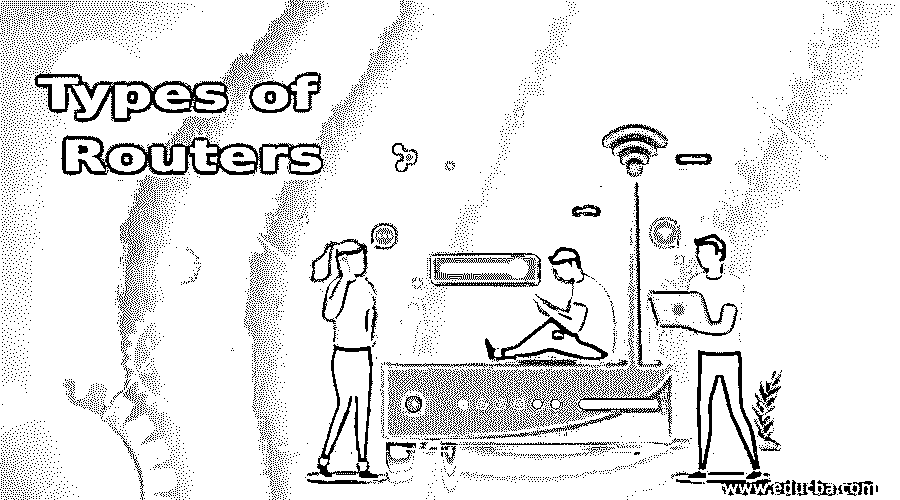
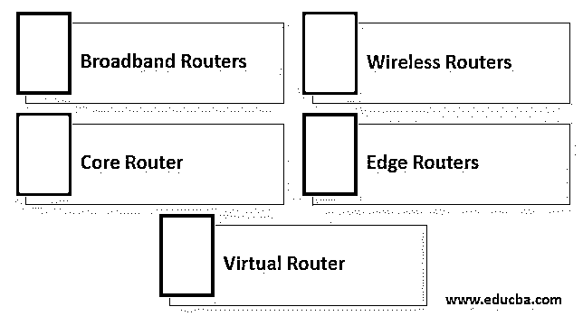

# 路由器的类型

> 原文：<https://www.educba.com/types-of-routers/>

## 路由器类型介绍

路由器是一种网络设备，用于从一个连接的网络接收数据包，并将这些数据包发送到另一个连接的网络。路由器连接到相似和不相似的 WAN 或 LAN 设备。它在 OSI 模型的网络层上运行，由网络层、物理层和数据链路层提供寻址、连接和交换。路由器也像网桥一样允许封装和包过滤。路由器传输的数据包包括目的地址、最低成本路由、数据包优先级以及最小路由距离。路由器监控网络的这些方面，并不断改变网络的状况。

### 不同类型的路由器

路由器有多种类型，如下所示:

<small>网页开发、编程语言、软件测试&其他</small>

#### 1.宽带路由器

宽带路由器是为了便于安装家庭网络而构建的，尤其是对于拥有高速互联网服务的家庭。除了允许所有消费电器设备共享互联网连接之外，宽带路由器通常还允许在家用计算机和其他设备之间共享数据、打印机以及其他电子设备。
使用 IP 语音技术(VOIP)的宽带路由器也提供了互联网连接。有一种特殊类型的调制解调器，如 ADSL，可以连接到以太网和电话插孔。该路由器使用状态数据包检测(SPI)防火墙和动态主机配置协议(DHCP)。为了安全起见，并提供网络内计算机之间的通信。

#### 2.无线路由器

无线路由器也称为 WLAN(无线局域网)设备。这种建立的无线网络被称为 Wi-Fi 网络。无线路由器用于家庭。互联网服务提供商(ISP)使用路由器连接到 xDSL 或网络互联网电缆。Wi-Fi 路由器将无线接入点的网络功能与路由器集成在一起。路由器将本地网络连接到其他互联网或本地网络。它将由一系列 1 和 0 组成的二进制代码组成的数据包转换成无线电信号，然后由天线广播信号。无线的。无线接入点使用无线电频率将计算机无线连接到网络，产生 900 MHz 和 2、4、3、6、5 和 60 GHz 频段的无线信号。无线路由器基于标准 IEEE 802.11ac Wave 2，也简称为 Wave 2。无线路由器必须使用登录 ID 和密码进行保护。此外，为了提高网络安全性，必须隐藏 IP 地址。无线媒体访问控制(MAC)地址过滤和保护无线电脑网络安全系统(WPA)安全也用于保护无线路由器。

#### 3.核心路由器

核心路由器是计算机通信设备，也是网络的主干，这意味着它链接所有网络设备。它允许快速数据通信。
在一个网络内分发数据包，但不在多个网络内分发数据包的有线或无线路由器。

#### 4.边缘路由器

该路由器位于 ISP 网络的边缘，该网络配置为外部协议，如到另一个 ISP 或 BGP 的 BGP(边界网关协议)。这些路由器通过为可扩展的网络边缘提供可编程性，帮助提高弹性和密度。

#### 5.虚拟路由器

默认情况下，虚拟路由器提供计算机共享网络。虚拟路由器为私有、公共以及提供商托管的云提供多租户网络服务。它按照虚拟路由器(VRRP)的冗余协议工作，当主路由器或主要路由器被禁用时，它变为活动状态。一组多台路由器共享一个虚拟 IP 地址。在这种情况下，每个组都有一个处理 IP 数据包的主机。如果来自主路由器的数据包无法转发，那么其它路由器就会接替它的位置。
虚拟路由器通过在云和其他设备上提供可见性、实时分析和优化控制来帮助提高生产力。有许多最好的虚拟路由器可以提供强大的加密方法、高度安全的身份验证，以及从 WAN 边缘到云的安全数据和应用程序分段。

### 结论

在本文中，我们已经了解了在网络中传输和监控 internet 数据包的路由器。它是集线器或交换机的最佳替代品，因为它具有网络功能。我们还看到了各种类型的路由器，如无线、宽带、核心、边缘和虚拟路由器及其功能。您可以根据自己的需求选择路由器。我希望这篇文章对你有所帮助。

### 推荐文章

这是路由器类型的指南。这里我们讨论什么是路由器？前 5 种路由器，如宽带路由器、无线路由器、核心路由器、边缘路由器等。您也可以浏览我们推荐的其他文章，了解更多信息——

1.  [静态路由与动态路由–主要差异](https://www.educba.com/static-routing-vs-dynamic-routing/)
2.  [网络面试问题|前 10 名](https://www.educba.com/networking-interview-questions/)
3.  [调制解调器与路由器的主要区别](https://www.educba.com/modem-vs-router/)
4.  [网关与路由器的区别](https://www.educba.com/gateway-vs-router/)

