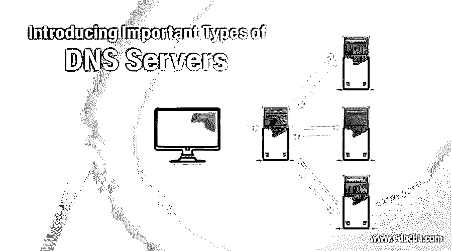

# 介绍重要类型的 DNS 服务器(功能强大)

> 原文：<https://www.educba.com/what-are-the-types-of-dns-servers/>

## 重要类型的 DNS 服务器介绍

我们在日常生活中经常听到 DNS 服务器。大多数时候，实际上是我们的网络浏览器向我们显示一个页面，说明 DNS 请求失败或类似的事情。那么，DNS 服务器到底是什么？它们是如何影响整个互联网的？有人甚至说，如果 DNS 服务器不存在，那么整个互联网都会关闭。那些威胁是真的吗？让我们深入了解一下 DNS 服务器，以及它们的存在是如何影响我们的。

### DNS 服务器和神话

所以让我们先从 DNS 服务器开始。 [DNS 服务器是一种网络技术](https://www.educba.com/web-technology-interview-questions/)，用于管理互联网上[网站的名称。但事情并没有就此结束。它也有很多配置。例如，让我们假设您的](https://www.educba.com/online-website-builder/)[实际地址](https://www.educba.com/physical-address-vs-logical-address/)是加利福尼亚州贝克街 42 号，邮编 50001。而经纬度是 70.92854301 和 65.102840203(随便一个)。所以，如果有人问你住在哪里，你不要在地图上指出你的纬度和经度。如果你这样做，人们会发疯的。但更糟糕的事实是人们甚至不会记得它。即使是最简单的数字变化也会改变整个地址。DNS 服务器的工作方式类似。DNS 服务器或域名系统服务器是给特定网站的临时名称。然而，它可以改变，但在流行网站上不太可能。所以经纬度被称为互联网的 IP 地址。以谷歌为例，IP 地址是 216.58.220.14，但你记得在浏览器的地址栏中输入过吗？不太可能。你总是输入[www.google.com](http://www.google.com/)或者甚至大多数只是谷歌，然后按 ctrl+enter(如果你像我一样懒的话)。所以，Google.com 在这里只是一个给定 IP 地址的名字，它永远不会改变，除非你改变谷歌的 DNS 记录(稍后将在博客中回到 DNS 记录)。这就是为什么当您没有连接到互联网或如果您键入无效内容时，您的浏览器会出现 DNS 请求失败或“此网页不可用”错误，因为它无法查找您在地址栏中键入的特定名称。

<small>网页开发、编程语言、软件测试&其他</small>

 

#### 神话

互联网上有一个巨大的黑社会神话，如果 DNS 服务器停止工作，整个互联网将关闭。没有。除非发生大范围的核爆炸，否则这永远不会发生。这纯粹是白痴政治。如果 DNS 服务器停止工作，你将无法调用任何网站的名称，比如说，microsoft.com，但是，如果你知道 IP 地址，那么你可以直接在地址栏中键入它，你就可以了。唯一更糟糕的是，到目前为止，您可以使用终端或命令提示符 ping 特定的 DNS 服务器，以获取其 IP 地址，或者您甚至可以通过查找来检查它，但如果互联网出现故障，将不会有 DNS 服务器可以通过命令提示符和终端或通过查找来 ping。唯一可能的连接方式是记住或列出你访问的网站的所有 IP 地址。但说真的，我不认为互联网是一件容易的事情。所以，既然流言被终结了，让我们来看看在 DNS 服务器中实际上是如何工作的。

### DNS 记录和 DNS 查询

现在我们知道了什么是 DNS 服务器，让我们看看它是如何工作的。DNS 服务器由多种东西组成，但最重要的是 DNS 记录和 DNS 查询。让我们一个一个来看看:

#### DNS 记录

DNS 记录只是定义 DNS 系统需要如何工作的资源记录列表。DNS 系统由 IP 地址和邮件服务器以及其他指向的记录组成。比如说，你有一个名为 www.iamawesome.co 的网站；然后你可能需要一个类似于**adam.smith@iamawesome.com**的电子邮件 ID。同样，在这里，当邮件到达 iamawesome.com 域时，您需要一个 IP 地址来指示指向哪里，这一部分由配置 DNS 服务器的 DNS 记录来完成。DNS 记录由很多东西组成。我不会详细介绍，但我肯定会在这里列出重要的 DNS 记录:

| **记录** | **描述** | **功能** |
| 英语字母表中第一个字母 | 地址记录 | 它返回一个 32 位的 IPv4 地址。这是实际网站最常被重定向的地方。 |
| CNAME | 规范名称记录 | 这是化名。DNS 服务器将继续查找这个新名称。 |
| DNAME | 委托名称 | 这也是一个名称及其子名称的别名，不像 CNAME，它只是一个别名。但是与 CNAME 类似，DNS 服务器也尝试使用这个新名称进行查找。 |
| 丹尼斯基 | DNS 密钥记录 | 还有一种记录叫做关键记录，我在这里没有提到。DNSKEY 的格式与密钥相同，在 DNSSEC 使用(更多信息请见说明)。 |
| 通信线路（LinesofCommunication） | 位置记录 | 这提供了取决于域名的地理位置。 |
| 麦克斯韦(maxwellˌ磁通量单位)ˌ中性(Middlesex) | 邮件交换记录 | 这与我之前提到的电子邮件路由相关。这将域名与电子邮件 ID 进行映射。 |
| 纳秒 | 名称服务器记录 | 为授权的名称服务器提供 DNS 区域。 |
| TKEY | 秘密密钥记录 | 这是 TSIG 使用的密钥，在公钥下加密。 |
| TSIG | 交易签名 | 这用于验证来自批准的源或名称服务器的更新。它与 TKEY 一起使用。 |
| 文本文件（textfile） | 文本记录 | 这个文件提供了与框架和加密相关的机器数据。 |

DNSSEC 或域名系统安全扩展旨在保护互联网协议中使用的 DNS 上的信息。默认情况下，DNS 服务器没有足够的安全性。开发 DNSSEC 是为了保护数据免受伪造证书或被操纵的 DNS 信息的侵害，如 DNS 黑客攻击或众所周知的 DNS 缓存中毒。来自 DNSSEC 的回复都是数字签名和安全的。然而，就像其他证券一样，即使是 DNSSEC 也有漏洞。它只检查数据是否被认证，但是它[实际上不加密任何数据](https://www.educba.com/encryption-process/)。因此，不存在数据保密性。这里，公钥加密用于对记录进行数字签名以验证来源。

#### DNS 查询

DNS 查询是客户端用来与 DNS 服务器交互以获得答案的回复的一种方式。以下是 DNS 查询的类型:

### 递归查询

在递归查询中，DNS 服务器接收您的查询，并将执行从接收答案到回复给您的所有工作。在处理这个问题时，DNS 服务器还会查询网络上其他类似的服务器来为您获取答案。因此，当一个递归查询被发送到一个 DNS 服务器时，它可以做两件事中的任何一件:首先是返回提供与所请求的主机名相关联的 IP 地址的记录，或者它可以提供一个错误，表明指定的域名不存在，这是我们通常在没有连接到互联网时得到的，正如我上面所述。但是，另一方面，如果 DNS 服务器无法在自己的区域数据库中找到请求的名称，它将开始 ping 其他 DNS 服务器进行相同的查询。这就是整个递归查询的工作方式。

您还可以禁止对选定的 DNS 服务器进行这些类型的递归查询。在这种情况下，DNS 服务器只能在迭代查询的帮助下工作。

#### 迭代或非递归查询

在我开始迭代或非递归查询之前，需要注意的是，所有 DNS 服务器必须首先支持这个查询才能工作。当客户端不使用递归查询，并试图发送迭代查询时，DNS 服务器返回客户端的最佳可能答案。这个答案可以是需要解析的名称，也可以是对一个完全不同的服务器的引用，该服务器可以提供客户端所需的数据。并且该服务器不属于它已经请求的任何旧服务器。推荐在这里作为一个指针。被查询的 DNS 服务器不会试图从其他地方获取或请求答案，但如果它自己已经有答案，它会向您提供答案。

#### 反向查询

在此查询中，通过 DNS 解析器向 DNS 服务器发送请求，以回复主机名和地址。因此，这里需要彻底搜索这个特定的主机名，以便找到正确的答案。DNS 解析器只是简单的应用程序，它向 DNS 服务器询问正确的答案。

### DNS 服务器的类型

具体来说，在整个互联网上实际上有“n”个 DNS 服务器包含这些数据，但只有 13 个服务器更适合称为根 DNS 服务器，在这 13 个服务器中的每一个上包含整个全局数据库。总共只有两种类型的 DNS 服务器，一种是主服务器，另一种是辅助服务器。然而，关键是要记住，这两个 DNS 服务器中的任何一个都可以用作主要服务器或辅助服务器，这显然取决于服务器管理员的选择。也可以将一台服务器作为一个区域的主服务器，将一台服务器作为任何其他区域的辅助服务器。关于这些类型的 DNS 服务器的详细信息如下:

#### 主 DNS 服务器

该服务器定位并读取域区域文件中的数据，主要是位于 web 服务器上的 A 记录，如 [Godaddy](https://in.godaddy.com/) 或 [Bigrock](https://www.bigrock.in/?location=IN) 。该主服务器还负责将该信息发送到辅助服务器。

在这里，服务器管理员写入区域信息，该区域信息命令服务器如何与其他服务器协作。这些主要包括我之前提到的 DNS 记录文件。当主服务器将域区域信息从一台服务器传输到另一台服务器时，这称为区域传输或区域重定位。每个域总是配置两个 DNS 服务器。这样做的主要原因是，由于有多台服务器，安全性提高了一倍，从而使管理员的工作更加轻松，同时还可以创建备份。一旦创建了主服务器并复制了区域数据，实际上就不需要备份了。所有这些都已经处理好了，因为默认情况下，主服务器每次都会将所有这些数据复制到辅助服务器。

#### 辅助 DNS 服务器

辅助 DNS 服务器也称为从属服务器，因为它只负责从主服务器捕获数据并充当备份。在微软的 DNS 服务器软件中，主服务器被称为主服务器。

但是，可以配置两个以上的 DNS 服务器，并且只能保留一个作为主服务器，第二个作为主服务器，第三个作为辅助服务器。这可能有点令人困惑，所以我不会深究。但这只是为了提供信息。大多数时候，主服务器和主服务器是相同的。

辅助服务器在数据管理中扮演着至关重要的[角色，它与主服务器一样重要。这是因为它们降低了主服务器上的负载，并且如果没有配置指定的负载分配比率，负载会平均分配。此外，在某些情况下，如果主服务器由于负载减少、过载或](https://www.educba.com/database-management-tools/)[黑客](https://www.educba.com/hackers-vs-crackers/)的其他攻击而停机，总会有一个辅助服务器充当主服务器，不间断地提供数据。因此，通过这样做，它们也提供了很大的安全性。一般来说，DNS 服务器实际上有更多的内容，但我可以在这篇博客中涵盖到目前为止。

### 推荐文章

这里有一些文章将帮助您获得更多关于 DNS 服务器类型的详细信息，所以只需浏览链接。

1.  [Windows Server 面试问题](https://www.educba.com/windows-server-interview-questions/)
2.  [Linux 应用程序](https://www.educba.com/linux-apps/)
3.  [DNS 放大攻击](https://www.educba.com/dns-amplification-attack/)
4.  [介绍重要类型的 DNS 服务器(功能强大)](https://www.educba.com/what-are-the-types-of-dns-servers/)

