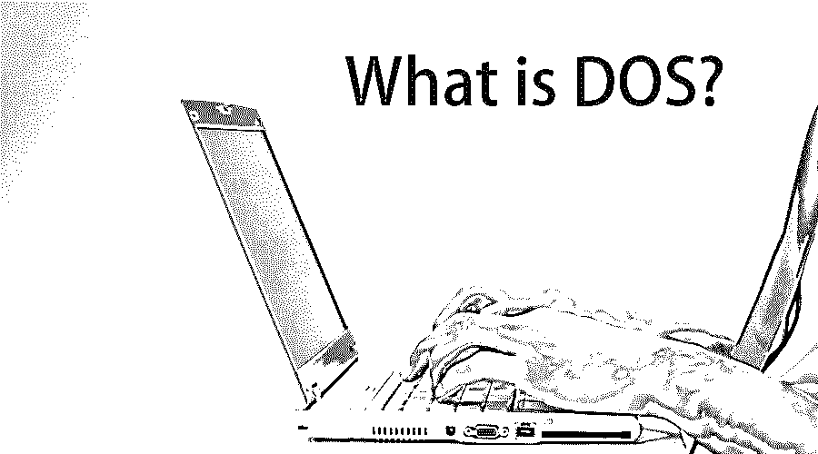

# DOS 是什么？

> 原文：<https://www.educba.com/what-is-dos/>

## DOS 简介

任何从硬盘运行的操作系统都被称为磁盘操作系统。这也指被称为 MS-DOS 或微软磁盘操作系统的特定系列的磁盘操作系统。任何通过控制程序来命令和控制计算机硬件和外围设备的东西，其功能称为操作系统。这个在硬盘上运行的操作系统被称为磁盘操作系统。1981 年，微软第一次为 IBM 制造并推出了它，即 IBM PC DOS。

### 待办事项列表

从 1981 年到 1998 年制定的 do 列表如下:

<small>网页开发、编程语言、软件测试&其他</small>

1.  IBM PC dos–1981 年
2.  dr-dos-1988 年
3.  ROM-DOS–1989 年
4.  PTS-DOS–1993 年
5.  自由活动–1998 年

它被更名为 IBM PC DOS，这两个版本都是在 1981 年发布的。市场上除微软之外的 DOS 有:

1.  苹果 DOS
2.  苹果 Pro DOS
3.  Atari DOS
4.  准将多斯
5.  特拉多斯
6.  阿米加多斯

这是 IBM 兼容计算机使用的第一个操作系统。它最初有两个不同的版本，这两个版本通常是相同的，但在两个不同的品牌下销售和控制。在 Windows XP 之前，MS-DOS 是 Windows 操作系统背后的框架。

“PC-DOS”是 IBM 开发的 DOS 版本，出售给第一批 IBM 生产的兼容计算机。“MS-DOS”是微软购买了权利和专利的 DOS 版本，并与第一批 Windows 版本合并。DOS 使用命令行，或基于文本的界面，用户允许输入命令。通过简单的指令，如 pwd(打印工作目录)和 cd(更改目录)，用户可以打开文件或运行程序或浏览硬盘上的文件。最初由 Tim Patterson(被认为是 DOS 之父)编写，归西雅图计算机产品公司所有，微软以 75，000 美元收购了 86-DOS，许可了同样的软件，并在 1982 年与 IBM 和微软合资的 IBM PC MS-DOS 1.0 一起发布。

### 命令

它的工作原理是通过命令操作功能的现象；这里，我们有 8 种类型的命令:

*   Assoc:关联扩展
*   树:查看目录结构
*   文件搜索和比较
*   网络命令
*   Windows 实用程序
*   AT 命令
*   比较

为了更好地解释它，我可以在它的命令提示符下给你一些命令的例子，它们是:

*   附加
*   阿尔普
*   分配
*   一批
*   整理磁盘文件碎片的工具
*   埃德林和梅莫尔

为了参考 ms-dos 下的更多命令，我分享了一个链接，你可以稍后查看，Computerhope。

### DOS 的功能

以下是一些你应该清楚了解的显著特征:

*   它是一个 16 位操作系统。
*   鼠标不能用来操作它，输入是通过基本的系统命令。
*   最大可用空间为 2 GB。
*   这是一个免费的操作系统。
*   它使用基于文本的界面，需要文本和代码来操作。
*   它不支持图形界面。
*   它是一个单用户操作系统。
*   这是一个基于字符的界面系统。
*   它有助于进行文件管理，如创建、编辑、删除文件等。

### 优点和缺点

现在你一定已经清楚如何使用 DOS 了；我们需要知道使用它的优点和缺点。

#### 优势

所以以下是优点:

*   我们可以直接访问 BIOS 及其底层硬件。
*   它的大小将“启动”比任何 windows 版本快得多；因此，它将在一个较小的系统中运行。
*   它非常轻量级，所以没有多任务操作系统的开销。
*   对于管理 MS 系统和组合程序来说，这是一个很好的解决方法。

#### 不足之处

虽然有优点，但它也有许多缺点，列举如下:

*   操作系统不支持多任务处理。
*   当寻址超过 640 MB 的 RAM 时，内存访问困难。
*   硬件的中断级别需要我们自己管理。
*   操作系统不支持自动 IRQ 排序。

### 技能

具备必备知识的必备技能如下:

*   能够创建程序集
*   能够调试和测试小型。com 文件
*   能够修补。exe 和。com 文件
*   能够使用 80*86 组件
*   能够处理指令，如 MOV，加法，整数，数据库，JMP，循环等。
*   能够与著名的模仿者一起工作，包括 DR-DOS、OpenDOS 和 FreeDOS。

虽然它仅仅是一个操作系统，但它有大量的功能和操作系统。这是一个关于做的少而得到的多的现象的研究。它为 IBM PC 兼容机的辉煌过去打开了一扇大窗户，而且有许多网站可以下载数百个旧的、存档的 DOS 程序。它真的很重要，因为它是开发临时批处理(*。bat)文件或程序，任务可以被自动化。命令行界面还允许您使用带有开关的命令与 PC 资源进行交互。它还允许我们使用未记录的 API，例如:

*   微软的 QuickPascal
*   本质代码

### 结论

所以随着 Windows 3.0 的推出，它几近灭绝。Gui 严重破坏了 Ms DOS 的使用。随着 Windows 95 的引入，它被用于引导、故障排除和向后兼容其旧软件，特别是游戏，并且不再作为独立产品发布。这就是 Ms DOS 的全部概况。所以，最后，我想说，它有一个暴露的视频元素，所以它永远不会过时。因此，从事这项工作的人总是有利可图的，因为它是免费的，而且与 IOS、Windows 10 等任何操作系统的付费版本相比，它拥有完整的功能。除此之外，它是微软授权的操作系统，所以我们可以信任它，因为它是最大的软件公司之一。

### 推荐文章

这是一个什么是该做的指南。这里我们讨论了命令、所需的技能、优点和缺点。您也可以浏览我们推荐的其他文章，了解更多信息——

1.  [什么是 AWS？](https://www.educba.com/what-is-aws/)
2.  [什么是大型机？](https://www.educba.com/what-is-mainframe/)
3.  [什么是自举？](https://www.educba.com/what-is-bootstrap/)
4.  什么是 Ansible？

