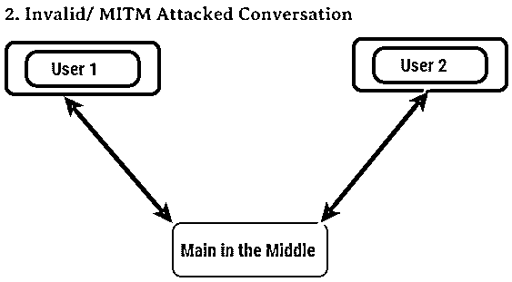

# 中路进攻的人是什么

> 原文：<https://www.educba.com/what-is-man-in-the-middle-attack/>

## 什么是中间人攻击概述

中间人攻击也称为 bucket brigade 攻击，发生在一些未经授权的人获得授权的消息或数据时，这是从发送者到接收者的传输，反之亦然。例如，假设用户 A 希望与 B 通信，A 将 3 作为值发送给 B，位于 A 和 B 之间的攻击者获得 A 的值并将其更改为 9，然后将 9 发送给 B。换句话说，我们可以说，当攻击者位于发送方和接收方之间并修改它们之间传输的数据时，这被称为中间人攻击。

### 中间人攻击

当两个用户正在相互通信时，另一个第三未知实体进入会话来窃听以从会话中获取数据。该第三未知实体对于通信的接收者和发送者(用户)来说是完全未知的。例如，你正在网上和某人聊天。在交流中有第三个未知的实体，你们两个都完全不知道。第三个人可能会单独与两个人聊天，这样两个人都会认为对方在发送信息。或者第三实体可以截取消息并向其添加新内容。这一切都将如此谨慎地进行，以至于两个用户都将完全不知情。

<small>网页开发、编程语言、软件测试&其他</small>

下图描述了 MITM 是如何发生的:

**图 1:** 这是通信应该通过的常规路线或渠道。

**图 2:** 通信通过改变的信道进行，中间人攻击了系统/用户。

简而言之，中间人攻击与窃听对话并利用信息为自己谋利的人是一样的。

### 中间人攻击的类型

以下是中间人攻击的不同类型:

#### 1.会话黑客

当我们浏览 cookies 和会话时，我们经常会收到通知。所以这些 cookies 和会话存储了我们的个人信息。例如，它可能包含登录 id 和密码。因此，MITM 攻击者所做的就是获得这些会话 cookiess，一旦他们获得这些 cookie，他们就可以访问所有敏感数据，然后数据盗窃就发生了。一般来说，所有的网站都有自动填写表格，要求用户输入密码和验证等功能。，这是他们获取人们数据的地方。

#### 2.电子邮件黑客

MITM 攻击者获取两个用户之间的消息拦截。第一个用户通过网络向第二个用户发送一些敏感信息。因此，它的工作方式与图 2 完全一样。攻击者发送电子邮件给任何一方，这是掩盖的，这意味着任何一方没有发现它是假的，并要求一些敏感信息或帐户细节，然后黑客攻击发生。

#### 3.无线网络黑客

一般来说，当用户连接到免费的 Wi-Fi 源时，就会出现这种情况，黑客可以很容易地将这类用户作为目标。[免费 Wi-Fi 资源](https://www.educba.com/wifi-vs-ethernet/)是连接的重要媒介，因为通过它可以获得非常低的安全级别。另一个 Wi-Fi 黑客是，攻击者开发了一个与用户当前工作非常相似的网络。

### 中路进攻中人的目的和动机

袭击者中间的人；通常以不熟悉网络控制的用户为目标。容易攻击的目标。但是，这并不意味着复杂的系统不能被黑。这些攻击者收集这些信息，然后作为普通用户使用这些信息。它的主要目标是获取用户的敏感信息，如帐户详情、银行密码。这些信息帮助他们进入系统并使用它，甚至出售这些信息。最近已经多次看到，由于攻击者的原因，系统数据已经在网上公布，或者敏感数据已经泄露。

### 中间的人是如何发生的？

MITM 攻击者借助两个主要步骤侵入系统；即:

#### 1.拦截

攻击者创建一个用户可以免费使用的虚拟网络。当用户输入数据时，数据首先被传输到攻击者的文件中，然后被重新分配。这是被动的，也是最容易攻击系统的。

攻击者也可能使用以下方法之一:

*   **IP 欺骗:**所有设备都有 IP 地址。当用户通过网络输入数据时，数据被传送到接收者的 IP 地址。但是在这两者之间，攻击者会创建一些与接收者的 IP 地址非常相似的 IP 地址。因此，数据不是发送到真正的目的地，而是传输到攻击者的 IP 地址。
*   **ARP 欺骗:**在这种情况下，攻击者的 MAC 地址与用户的 IP 地址一起附上。因此数据一发送出去就被传送到攻击者的 IP 地址。
*   **DNS 欺骗:** DNS 是域名系统的意思。攻击者改变浏览器的缓存记录。因此，当用户进入给定的站点时，它不是进入正确的 URL /网站，而是被发送到攻击者创建的某个虚拟站点。

#### 2.[通信]解密

*   **HTTPS 欺骗:**通常，所有用户都认为“HTTPS”是安全的。但是在这种情况下，攻击者手动输入一个证书，看起来安全可靠。所以，所有的数据都是通过它传送的。但由于它看起来像一个安全的网站，浏览器发送密钥来读取数据；攻击者获得了对信息的访问权。
*   **SSL Beast:** 攻击者用一些虚假的 cookies 感染用户的电脑，CBC 被攻破，数据被轻易解密。
*   **SSL 劫持:**如前所述，HTTPS 代表安全。就在浏览器从 HTTP 连接到 HTTPS 之前，它被路由到攻击者的浏览器。
*   **SSL 剥离:**攻击者将网站安全性降低到介于 HTTPS 和 HTTP 之间的水平。所以所有数据都是以非加密的文本格式提供的。

### 中间人攻击后怎么办，怎么防？

在攻击发生后，可以遵循某些方法/步骤来防止攻击，即:

*   检查您所连接的网络的安全级别。
*   永远不要连接到免费的 Wi-Fi 源，除非它来自已知的来源。
*   对潜在的欺诈性电子邮件和未知链接保持警惕，它们可能会导致其他未知网站。
*   与《HTTPS 议定书》相关网站保持联系；他们在 HTTP 上有更多的安全级别。
*   在网络上使用 VPN，以便安全地使用或传输数据。所有的数据都是通过加密的 VPN 获取和保存的。
*   使用反恶意软件检测和消除恶意软件。

### 结论

在网络上使用数据时，始终保持与安全网站的连接，避免点击链接，导致一些未知的来源。

### 推荐文章

这是一个什么是中间人攻击的指南。在这里，我们讨论了概述，类型，目的和动机等。您也可以浏览我们推荐的其他文章，了解更多信息——

1.  [什么是网络安全？](https://www.educba.com/what-is-cyber-security/)
2.  [什么是网络安全？](https://www.educba.com/what-is-network-security/)
3.  [网络安全职业](https://www.educba.com/careers-in-cyber-security/)
4.  [网络安全面试问题](https://www.educba.com/cyber-security-interview-questions/)

