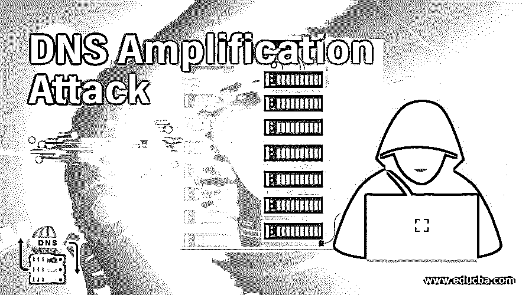

# DNS 放大攻击

> 原文：<https://www.educba.com/dns-amplification-attack/>

## 什么是 DNS 放大攻击？

DNS amplification 是攻击者的[域名系统(DNS)服务器](https://www.educba.com/what-are-the-types-of-dns-servers/)漏洞中的 DDoS 攻击，最初将小请求转化为大得多的有效载荷，使用受害者的服务器进行破坏。DNS 放大是一种反射附件的形式，它操纵公共域名系统，使它们充斥着大量的 UDP 数据包。通过使用不同的放大方法，作者可以“膨胀”这些 UDP 数据包的大小，以使攻击如此有效，以至于互联网基础设施甚至是最可靠的。

DNS 放大攻击使用各种方法来达到拒绝服务的最终目的。这个想法是想象六辆宽负载卡车并排行驶在同一条六车道公路上，而不是数千辆汽车同时进入高速公路。结果，交通流量被完全打乱了，不是因为数千辆车的突然袭击，而是因为少数车辆无法正常通行。而且，虽然大多数 [DDoS 攻击通过用大量平均数据包淹没网络](https://www.educba.com/what-is-ddos-attack/)来工作，但是 DNS 放大攻击可以获得相同的结果。尽管如此，没有一个类比是完美的，DNS 放大过去有一些额外的细微差别，让我们深入看看这个攻击。

<small>网页开发、编程语言、软件测试&其他</small>

### DNS 扩增攻击是如何工作的？

恶意行为者利用域名系统(DNS)的正常运行——互联网的“地址簿”，在 DNS 放大攻击中作为攻击目标受害者网站的工具。目的是通过使用虚假的 DNS 搜索请求使网站溢出，从而导致网站失败。让我们从高层次回顾一下 DNS 是如何工作的，以理解攻击是如何工作的。DNS 是接受这一请求的互联网服务，当用户在浏览器中键入 www.example.com 时，它会找到分配给该域名的 [IP 地址，并将其发送回浏览器，供客户端连接到该网站。那么，袭击者的下一步是什么？放大。记住他们的目标是把小的 DNS 请求变成大的答案。一个标准的 DNS(只有几行)请求非常小——通常只有十个字节——并且只返回稍微大一点的响应。](https://www.educba.com/how-do-ip-addresses-work/)

#### DNS 放大攻击描述

DNS 的放大是一种反射攻击，和其他放大攻击一样。在这里，反射是通过对来自 DNS 解析器的假冒 IP 地址的应答来完成的。DNS 响应的数量很容易被多个重复的请求和同时重复的 DNS 解析的数量淹没。一旦加剧，反射性影响甚至更危险。“增强的”指的是与发送的初始分组请求无关的服务器响应。使用 EDNS0 DNS 协议扩展或 DNS 安全扩展加密功能，可以发送每个 DNS 请求来加强 DNS 攻击，edns 0 DNS 协议扩展允许大型 DNS 消息，而 DNS 安全扩展加密功能可以提高消息大小。也可以使用“ANY”类型的欺骗查询，在一条消息中返回 DNS 区域的所有已知信息。

### 如何缓解 DNS 攻击？

对于运营网站或服务的个人或公司，存在有限的缓解解决方案。这是因为受害者的服务器并不是体积攻击的主要影响所在，尽管它可能是目标。服务器周围的网络以其产生的巨大流量而著称。ISP 或其他上游基础设施提供商无法在不被淹没的情况下处理输入流量。因此，ISP 可以将所有流量锁定到目标方的 IP 地址，保护自己并删除目标站点。除了诸如 Cloudflare DDoS 保护之类的场外保护服务之外，缓解策略主要是保护性互联网基础架构方法。由于僵尸网络攻击者发送的 UDP 应用程序需要一个伪造成受害者 IP 地址的源 IP 地址，因此必须拒绝互联网提供商(ISP)伪造 IP 地址的内部流量。如果某个地址看起来来自网络外部的数据包是从网络内部发送的，那么它很可能是一个欺骗数据包，可以被丢弃。

### 推荐文章

这是一个 DNS 放大攻击的指南。在这里，我们讨论了一个简单的概述及其工作原理，以及如何减轻 DNS 攻击？您也可以看看以下文章，了解更多信息–

1.  [网络安全面试问题](https://www.educba.com/network-security-interview-questions/)
2.  [网络安全攻击](https://www.educba.com/types-of-network-security-attacks/)
3.  [拒绝服务攻击的类型](https://www.educba.com/types-of-dos-attacks/)
4.  [拒绝服务攻击](https://www.educba.com/denial-of-service-attack/)

