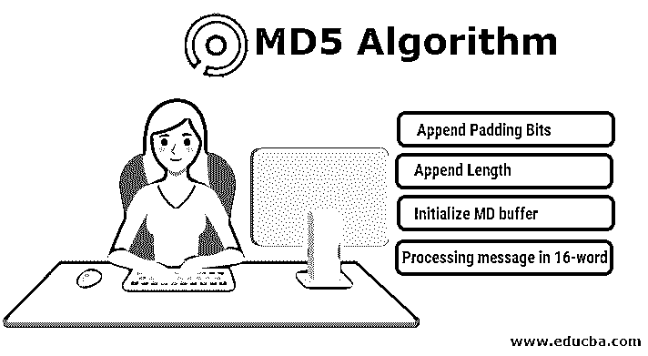

# MD5 算法

> 原文：<https://www.educba.com/md5-alogrithm/>

## MD5 算法简介

MD5 消息摘要算法是 Ron Rivest 开发的第五版消息摘要算法，用于生成 128 位消息摘要。MD5 比其他版本的消息摘要快得多，它采用 512 位块的纯文本，再进一步分成 16 个块，每个 32 位，并产生 128 位消息摘要，这是一组四个块，每个 32 位。MD5 通过五个步骤产生消息摘要，即填充、附加长度、将输入分成 512 位块、初始化链接变量 a 过程块和 4 轮以及在每次迭代中使用不同的常数 it。

### MD5 算法的使用

开发它的主要目的是为了安全，因为它接受任何大小的输入，如果是 128 位的哈希值，它会产生一个输出。为了被认为是密码安全的，MD5 应该满足两个要求:

<small>网页开发、编程语言、软件测试&其他</small>

1.  不可能产生不能产生相同散列函数的两个输入。
2.  不可能生成具有相同散列值的消息。

最初，开发 MD5 是为了存储密码的单向散列，一些文件服务器还提供文件的预先计算的 MD5 校验和，以便用户可以将下载文件的校验和与其进行比较。大多数基于 Unix 的操作系统在其分发包中包含 MD5 校验和工具。

### MD5 算法是如何工作的？

众所周知，MD5 产生 128 位哈希值的输出。这种将任意大小的输入加密为哈希值的[加密](https://www.educba.com/what-is-encryption/)经历 5 个步骤，每个步骤都有其预定义的任务。

#### 步骤 1:添加填充位

*   填充意味着在原始消息中添加额外的比特。因此，在 MD5 中，原始消息被填充，使得其比特长度等于 448 模 512。进行填充使得总比特数减少 64，是 512 比特长度的倍数。
*   即使原始消息的长度已经等于 448 模 512，也要进行填充。在填充位中，只有第一位是 1，其余位是 0。

#### 步骤 2:添加长度

填充后，在末尾插入 64 位，用于记录原始输入长度。模数 2^64.此时，生成的消息长度是 512 位的倍数。

#### 步骤 3:初始化 MD 缓冲区。

四字缓冲区(A、B、C、D)用于计算消息摘要的值。这里，A、B、C、D 是 32 位寄存器，按以下方式初始化

| 单词 A | 01 | Twenty-three | Forty-five | Sixty-seven |
| 单词 B | Eighty-nine | 抗体 | 镉 | 仰角指示器 |
| 单词 C | （英国）继续教育 | 哥伦比亚特区 | 钡 | Ninety-eight |
| 单词 D | Seventy-six | Fifty-four | Thirty-two | Ten |

#### 步骤 4:在 16 字块中处理消息

MD5 使用辅助函数，这些函数将输入作为三个 32 位数字，并产生 32 位输出。这些函数使用逻辑运算符，如 OR、XOR、NOR。

| F(X，Y，Z) | XY v 而不是(X)Z |
| G(X，Y，Z) | XZ v Y not (Z) |
| H(X，Y，Z) | x 异或 Y 异或 Z |
| I(X，Y，Z) | Y xor (X v not (Z)) |

使用该辅助缓冲器将四个缓冲器的内容与输入混合，并且使用 16 个基本操作执行 16 轮。

**输出-**

毕竟，轮次已经执行，缓冲器 A、B、C、D 包含 MD5 输出，从低位 A 开始，到高位 D 结束。

**举例:**

| 输入:这是一篇关于加密算法的文章 |

| 输出:e4d 909 c 290 DFB 1c a 068 ffaddd 22 cbb 0 |

### MD5 算法的优缺点

以下是解释的优点和缺点:

*   MD5 算法很有用，因为比较和存储这些较小的散列比存储一个大的可变长度文本更容易。这是一种广泛使用的单向散列算法，用于验证而不必给出原始值。Unix 系统使用 MD5 算法以 128 位加密格式存储用户密码。MD5 算法广泛用于检查文件的完整性。
*   此外，使用这种算法很容易生成原始消息的消息摘要。它可以执行具有任意位数的消息的消息摘要；它不限于 8 的倍数的消息，不像 MD5sum，它只限于八位字节。
*   但多年来，MD5 容易出现哈希冲突的弱点，即可能为两个不同的输入创建相同的哈希函数。MD5 对这些冲突攻击不提供安全性。代替 MD5，SHA(安全散列算法，其产生 160 位消息摘要并且由 NSA 设计为数字签名算法的一部分)现在在加密领域中可接受用于产生散列函数，因为它不容易产生 SHA-1 冲突，并且直到现在还没有产生冲突。
*   而且比优化后的 [SHA 算法](https://www.educba.com/sha-algorithm/)还慢。SHA 比 MD5 算法安全得多，此外，与 MD5 不同，它可以在现有技术中以超高速率实现。如今，市场上出现了新的哈希算法，记住像 SHA256(它生成 256 位的文本签名)这样的数据具有更高的安全性。

### 结论

如今，随着所有数据存储在云和互联网上，将数据的安全性放在第一位至关重要。应该采用最安全的算法来加密私有数据。最近的研究表明，SHA 算法应该比 MD5 更重要，因为 MD5 更容易受到冲突攻击。然而，研究人员正在提出新的算法，这些算法是安全的，最不容易受到像 SHA256 这样的攻击。

### 推荐文章

这是 MD5 算法的指南。这里我们讨论了 MD5 算法的基本概念、用途、工作原理、优点和缺点。您也可以浏览我们推荐的其他文章，了解更多信息——

1.  [加密算法](https://www.educba.com/encryption-algorithm/)
2.  [什么是解密？](https://www.educba.com/what-is-decryption/)
3.  [什么是密码学？](https://www.educba.com/what-is-cryptography/)
4.  [密码术 vs 加密](https://www.educba.com/cryptography-vs-encryption/)

