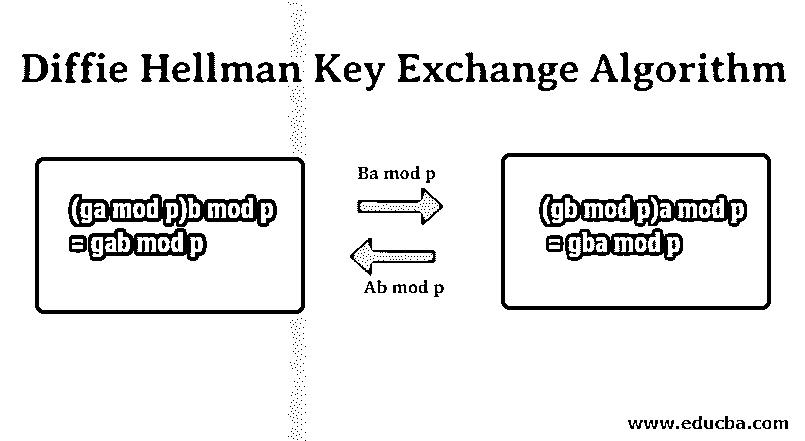

# Diffie Hellman 密钥交换算法

> 原文：<https://www.educba.com/diffie-hellman-key-exchange-algorithm/>

## Diffie Hellman 密钥交换算法简介

Whitefield Diffie 和 Martin Hellman 在 1976 年开发了 Diffie Hellman 密钥交换算法，以克服密钥协商和交换的问题。它使希望相互通信的双方能够就对称密钥达成一致，该密钥可用于加密和解密；注意，Diffie Hellman 密钥交换算法只能用于密钥交换，不能用于加密和解密过程。该算法基于数学原理。

### 用于密钥生成的 Diffie Hellman 密钥交换算法

该算法基于椭圆曲线加密，这是一种基于有限域上椭圆曲线的代数结构进行公钥加密的方法。DH 也使用陷门函数，就像其他许多使用公钥加密的方法一样。理解 DH 算法的简单思路如下。

<small>网页开发、编程语言、软件测试&其他</small>

1.第一方挑选两个素数，g 和 p，告诉第二方。

2.然后第二方挑选一个秘密数(姑且称之为 a)，然后它计算 g a mod p，并将结果发回给第一方；我们姑且称结果为 a，记住，暗号不发给任何人，只有结果才是。

3.然后第一方也这样做；它选择一个秘密数字 B，并以类似于

4.第二步。然后，将这个结果发送给第二方。

5.第二方获取接收到的数字 B 并计算 B a mod p

6.第一方获取接收到的数字 A 并计算 A b mod p

这就是有趣的地方。步骤 5 中的答案与步骤 4 中的答案相同。这意味着无论取幂的顺序如何，双方都将得到相同的答案。

`(ga *mod* p)b *mod* p = gab *mod* p
(gb *mod* p)a *mod* p = gba *mod* p`

我们在步骤 4 和 5 中得到的数字将被作为共享密钥。这个密钥可以用来对将要传输的数据进行任何加密，比如 blowfish、 [AES](https://www.educba.com/advanced-encryption-standard/) 等。

### 迪菲·赫尔曼算法

1.key =(YA)XBmod q->这个和 B 计算的一样

2.全球公共要素

*   问:q 是一个质数
*   答:a < q，α是 q 的本原根

3.用户 A 的密钥生成

*   这里选择一个私钥 X 一个，X 一个一个<问

现在，计算公钥 YAYA= AXAmod q

4.用户 B 的密钥生成

*   在这里选择一个私钥 X B ，XBT4】q
*   现在，计算公钥 YBYB= aXbmod q

5.由 A 计算密钥

*   key =(Y B ) XA mod q

6.由 B 计算密钥

*   key =(Y A ) XB mod q

**例子**

1.爱丽丝和鲍勃都使用公众号 P = 23，G = 5

2.Alice 选择私钥 a = 4，Bob 选择私钥 b = 3

3.Alice 和 bob 现在计算 x 和 y 的值，如下所示:

*   艾丽斯:x = (5 4 mod 23) = 4
*   鲍勃:y = (5 3 mod 23) = 10

4.现在，爱丽丝和鲍勃互相交换公众号。

5.爱丽丝和鲍勃现在计算对称密钥

*   爱丽丝:ka= yamod p = 104mod 23 = 18
*   鲍勃:kb= xbmod p = 43mod 23 = 18

6.18 是共享密钥。

### Diffie Hellman 算法的使用

除了使用生成公钥的算法之外，DH 算法还可以在其他一些地方使用:

*   **加密:** Diffie Hellman 密钥交换算法可以被[用来加密](https://www.educba.com/what-is-encryption/)；第一个做[的方案是 ElGamal 加密](https://www.educba.com/elgamal-encryption/)。一个现代的例子是集成加密方案，它提供了针对选择明文和选择剪贴板攻击的安全性。
*   **口令认证协议:**当双方共享一个口令时，可以使用口令认证的密钥协议来防止中间人攻击。这个密钥协商可以是 Diffie-Hellman 的形式。安全远程口令协议就是基于这种技术的一个很好的例子。
*   **前向保密:**基于前向保密的协议可以为每个新的会话生成新的密钥对，当会话结束时，它们可以自动丢弃它们。在这些前向保密协议中，通常使用 Diffie Hellman 密钥交换。

### Diffie Hellman 算法的优点

*   发送者和接收者不需要彼此的任何先验知识。
*   一旦交换了密钥，就可以通过不安全的通道进行数据通信。
*   秘密密钥的共享是安全的。

### Diffie Hellman 算法的缺点

*   该算法不能用于任何非对称密钥交换。
*   同样，它也不能用于签署数字签名。
*   由于 Diffie Hellman 密钥交换不验证传输中的任何一方，因此容易受到中间人攻击。

### 结论

Diffie Hellman 密钥交换由于其优点而被证明是一种有用的密钥交换系统。虽然窥探网络的人很难解密数据并获得密钥，但如果生成的数字不是完全随机的，还是有可能的。还有，密钥交换系统使得中间人攻击成为可能；为了避免这种情况，双方在交换开始时都应该非常小心。

### 推荐文章

这是 Diffie Hellman 密钥交换算法的指南。在这里，我们讨论的用途，不同的算法，优点和缺点。您也可以浏览我们推荐的其他文章，了解更多信息——

1.  [机器学习算法](https://www.educba.com/machine-learning-algorithms/)
2.  [加密算法](https://www.educba.com/encryption-algorithm/)
3.  [分类算法](https://www.educba.com/classification-algorithms/)
4.  [算法类型](https://www.educba.com/types-of-algorithms/)

