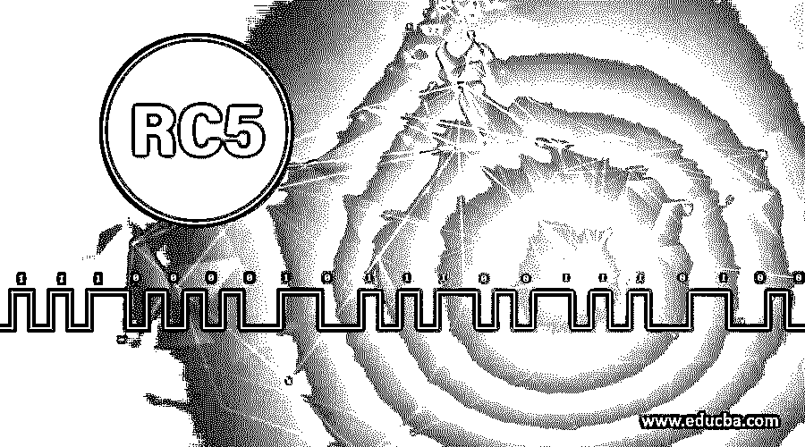

# RC5

> 原文：<https://www.educba.com/rc5/>

## RC5 简介

RC5 是由 Ron Rivest 开发的。它是基于对称密钥的[的块](https://www.educba.com/symmetric-key-encryption/)[加密算法](https://www.educba.com/encryption-algorithm/)。它的主要特点是速度很快，因为它只使用原始的计算机操作。它允许可变的轮数和可变的位大小密钥来增加灵活性。使用 RC5 的另一个优点是它需要更少的内存来执行。这个特性使得 RC 5 可以用于各种用途，比如桌面操作、智能卡等等。

### RC5 算法是如何工作的？

在 RC5 算法中，输入纯文本块大小、轮数和密钥的 8 位字节可以是可变长度的。一旦决定了这些值，对于[密码算法](https://www.educba.com/algorithms-and-cryptography/)的特定执行，这些值将保持不变。纯文本块的大小可以是 32 位、64 位或 138 位。密钥的长度可以是 0 到 2040 位。RC5 生成的输出是密文，其大小与纯文本大小相同。

<small>网页开发、编程语言、软件测试&其他</small>

在 RC5 中，明文消息被分成两个块 A 和 B，每个块 32 位。然后生成两个子密钥 S[0]和 S[1]。这两个子键分别添加到 A 和 B 中。这个过程分别产生 C 和 D，并标志着一次性操作的结束。然后这一轮的过程开始了。在每一轮中，执行以下操作。

*   按位异或。
*   向左循环移位。
*   对于 c 和 d，添加到下一个子键。这是加法操作，然后执行加法模 2^w 的结果。

让我们详细讨论上述过程。

#### 一次性初始操作

这个过程包括两个步骤:

*   **第一步:**将明文分成大小相等的两块 A 和 b。
*   **第二步:**将 S[0]加到 A，将 S[1]加到 b。

这些操作分别是 mod 2^32 和生成 c 和 d。

#### 回合的详细信息

在本节中，我们将讨论一轮的结果。第一轮的过程将与其他轮相同。

*   **第一步:**异或 C 和 D

这是 C 和 D 异或形成 e 的每一轮的第一步。

*   **第二步:**循环左移 E

步骤 1 中生成的输出，即 E，现在循环左移 D 个位置。

*   **步骤 3:** 添加 E 和下一个子密钥

在这一步中，E 被添加到下一个子密钥中以形成 f。

**Note:** Step 4 to step 6 are similar to Step 1 to step 3 only difference is the input used for the operations.

*   **第四步:**异或 D 和 P

d 和 P 被异或以形成 g。

*   **第五步:**循环左移 G

步骤 4 中生成的输出，即 G，现在循环左移了 F 位置。

*   **步骤 6:** 添加 G 和下一个子密钥

在这一步中，G 被添加到下一个子密钥以形成 h。

*   **第七步:**其他步骤

在这些步骤中，进行检查是为了确保全面正确完成。这是使用以下步骤来执行的。

1.  将 I 增加 1
2.  检查我是否< r

如果 I 小于 r，那么将 F 重命名为 C，H 重命名为 d，如果 I 大于 r，那么过程将停止。

#### 子项创建

在 RC5 中，可以分两步生成 subkey

*   **第一步:**生成子项
*   **步骤 2:** 将步骤 1 中生成的子项与原始项的相应子部分混合。

### RC5 算法的模式

RC5 中有 4 种模式，如下所示。

#### 1.RC5 分组密码

这也称为电子码本模式。它将 2w 比特的固定大小的输入块加密成相同长度的密文块。

#### 2.RC5 CBC

[这是 RC5 的密码](https://www.educba.com/types-of-cipher/)链接块。在这种情况下，长度等于 RC5 块大小倍数的纯文本消息被加密。

#### 3.RC5 CBC 垫

这是 CBC 的修改版。这里输入消息可以是任意长度。密文比纯文本最多长一个 RC5 块。它使用填充来处理长度的不匹配。这使得消息的长度等于 2w 位的倍数。

#### 4.RC5 CTS

它也被称为密文窃取模式。它类似于 RC5 CBC 垫。明文消息的长度可以是任意长度，密文的长度也是相等的。

### 推荐文章

这是 RC5 的指南。在这里，我们讨论什么是 RC5 算法，它如何工作以及它的模式，包括 RC5 分组密码、RC5 CBC、RC5 CBC pad 和 RC5 CTS。您也可以阅读以下文章，了解更多信息——

1.  [对称密钥加密](https://www.educba.com/symmetric-key-encryption/)
2.  [DFS 算法](https://www.educba.com/dfs-algorithm/)
3.  [深度学习算法](https://www.educba.com/deep-learning-algorithms/)
4.  [KNN 算法](https://www.educba.com/knn-algorithm/)

