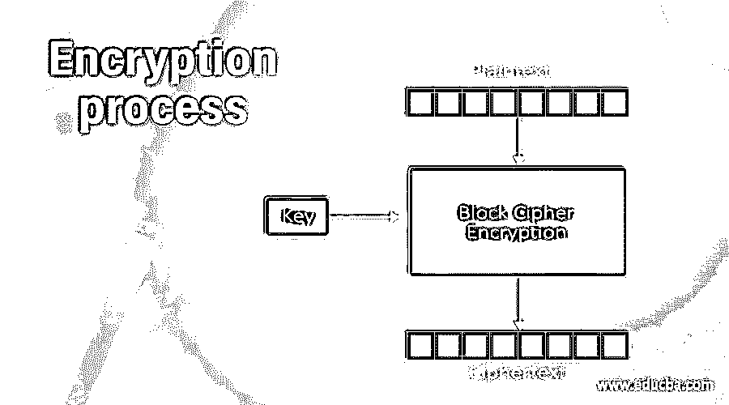

# 加密过程

> 原文：<https://www.educba.com/encryption-process/>

## 加密过程简介

我现在要讲的东西，你可能在网上找不到太多。见鬼，当我自己学习这个的时候，我在学习算法、数学、加密、密码术和编程、可信密钥等等的每一点上都遇到了很多麻烦。

最糟糕的是，当我知道世界上所有其他加密的东西都可以被解密或破解，不管是什么。是啊，没有万无一失的安全。但我写这篇博客的主要原因是，几乎没有人会在这方面帮助你。我的目的是帮助人们理解什么是加密，以及它与密码学和数学的关系。

<small>网页开发、编程语言、软件测试&其他</small>

### 密码学是什么意思？

首先，加密只是密码学的一个分支。所以，现在的问题一定是，什么是密码学。比起艺术，我更喜欢密码学。它并不完全与编程或类似的东西相关。密码术甚至在古代就被使用了。有史以来最著名的密码学家是莱昂纳多·达芬奇。他的加密处理方法极具挑战性，即使在今天，他的大部分作品仍然没有被解密。

因此，密码学是一门书写或编码的艺术，只有特定的人才能理解。没有人能理解它。这种加密可以是图像、文字、文本、设计、建筑或任何形式。对此没有限制。

听说过蒙娜丽莎吗(没错，是达芬奇画的)？是的，它甚至说她的左眼也在画中被加密了。更不用说这里可能还有很多阴谋。现在你可能已经大概知道我在说什么，我要去哪里。

还有，你还记得之前我告诉你的那部分吗，连图像都是加密的？是的。实际上，手绘图像可以被加密，以显示某种地图或其他东西的代码。同样，图片也可以在句子中加密。这被称为隐写术。[隐写术是加密过程的一种形式](https://www.educba.com/steganography-techniques/),你写的是一样东西，但实际上你指的是别的东西。

如今，恐怖分子和许多 ISIS 分子使用这种形式相互交流。他们在报纸上张贴广告，这实际上看起来像一些正常的广告，但他们实际上意味着别的东西。

### 数字密码术和加密

读完所有这些，你可能想知道这一切是如何与计算机纠缠在一起的。很简单。当你以数字方式存储东西时，你可能需要某种安全措施。例如，我们都有许多互联网账户，我们需要保证它们的安全。因此，这里的加密过程部分与服务器有关。例如，假设您创建了一个电子邮件帐户。

现在，您使用的密码必须存储在服务器上。但是这个密码不能是明文。原因是如果服务器被黑客入侵，那么里面的所有数据都会被泄露，任何人都可以滥用。因此，这些数据需要得到保护。这就是加密过程介于两者之间的地方。

这里创建的加密程序不是一个简单的过程。比如说密码是 Abcd@123(只是假设)。因此，当输入这个密码时，它被转换成一个存储在服务器上的 32 位散列文件。无论何时输入密码，转换后的哈希文件都需要与存储在服务器上的哈希文件相匹配。现在你可能会想，如果某个黑客正在进行中间人攻击，并获得了散列文件，那该怎么办呢？这就是神奇之处。每个散列文件在这里几乎有“n”种可能性。

这意味着，即使黑客得到了加密的程序哈希文件，并说，即使他或她解密，他也不会得到相同的密码。从哈希文件中获得相同密码即 Abcd@123 的可能性是百万分之一。简而言之，这也是密码学的主要目的。也就是说，只有相关方应该认可该代码。在我们的例子中，相关方是服务器和输入密码的用户。

### 加密电子邮件

坦率地说，提供加密程序安全性的电子邮件提供商非常少。最糟糕的是，现在，黑客们甚至不倾向于哈希破解。他们直接通过社交工程进入客户群。另外，职业黑客甚至不需要你的密码就能进入你的账户。假设您处于中间人攻击的相同情况，攻击者可以直接嗅探您的电子邮件，它以数据包的形式发送。

因此，保护自己安全的唯一方法是让电子邮件提供商提供电子邮件加密过程，而不仅仅是密码加密过程。目前我知道的唯一一个是 Protonmail.com。他们非常老练。最近，一些黑客甚至试图侵入他们的帐户，但由于极端的安全性，他们无法做到，他们后来结束了 DDOSing protonmail 的系统，这种情况持续了 3-4 天，直到它再次成为生命(DDOS:分布式拒绝服务攻击是一种发送极端数量的数据包来扰乱系统的方法)。

### 加密和安全性

加密过程有几种形式。尽管加密服务很难解密，但并非不可能。例如，WEP 是 Wi-Fi 安全的一种，但它非常不安全，而 WPA 和 WPA2 个人版是完全安全的。但是绝对安全并不意味着万无一失。一个由 12 个字符组成的 WPA2 加密 Wi-Fi 可能需要 15-20 天才能破解，但它是可以破解的。

同样，它可以在 3-5 天内用足够好的电脑破解同样的密码。我家里有一个运行 pipper OS(pipper 是一个比特币挖掘操作系统)的系统，采用酷睿 i7 6 第六代(处理器无关紧要)和 15000 RPM 固态硬盘以及两个 gtx980 显卡。有了这个设置和 Kali Linux(Kali Linux 是一个渗透测试操作系统)的单词表字典，我可以在 10-12 小时内轻松破解相同的密码。震惊？是的。但这只是我。

极端主义黑客大多雇佣机器人来控制数百台电脑，更不用说数千台电脑，并照看它们破解密码。通过这样做，他们可以在几分钟内轻松破解密码。想想这有多可怕。它立刻从 20 天上升到 20 分钟。而这些只是纯数学。根据数学的解密哲学，只要有足够的时间，其他所有加密都可以被破解。只是纯概率和蛮力密码破解。

如果你对加密过程更感兴趣，我推荐你看《数字堡垒》这本书。对于初学者来说，这是一本理解加密过程如何工作的极好的书。而且没有！这不是一本数学或编程的书。这是一部虚构的小说，但加密过程的细节足够接近现实生活。

### 加密类型

正如我前面说过的，加密有多种形式。以下是主要的加密类型:

#### 1.对称加密

对称加密收集纯文本数据，然后将其打乱，使其不可读。并且就在到达所需方之前，它再次重新排列数据。对称类型的加密是其他加密过程中最快的。这里要记住的可行部分是，加密方和解密方都需要有相同的密钥来拦截数据。

关于[对称密钥](https://www.educba.com/symmetric-key-encryption/)不好的一面是，即使你的数据被加密，软件也很容易需要未加密的数据来匹配密码，而不是加密的。这也间接证明了软件本身是有漏洞的。保护你自己的唯一方法是设计软件，当用户退出系统时，数据保持加密状态，只留下不可读的加密格式的密钥，这实际上是很困难的。

#### 2.不对称加密

[非对称加密](https://www.educba.com/asymmetric-encryption/)，和对称加密类似，也是收集明文，洗牌，在另一端重新排列一遍。尽管如此，这里每个端点都使用了多个可变键。用户和解密者使用公钥和私钥对数据进行洗牌和重新排列。公钥的唯一问题是确保您信任您持有的公钥。如果公钥受到某种程度的损害，那么一切都会受到损害。简单的中间人攻击是破坏它的一种简单方法。

#### 3.散列法

如今，当你听到术语加密过程时，它实际上是在后台发生的散列。然而，散列并不是加密过程的纯粹形式。还记得我之前举的关于电子邮件安全的例子吗？

耶！这就是哈希，真的。散列一个字符串将总是产生相同的字符串，但相反的字符串是永远不会相同的。但是有了足够的信息，人们可以很容易地使用其他一些数据来创建相同的散列。事实上，在哈希的情况下，哈希就是密码本身。

说到加密程序，无论你做什么，都没有万无一失的安全性。永远都是默默无闻的安全感。一个人只有足够偏执才能足够安全。

### 推荐文章

这是加密过程的一个有用的指南。在这里，我们讨论了不同的加密过程和加密类型，这有助于人们理解什么是加密，您也可以看看下面的文章来了解更多信息

1.  [加密算法](https://www.educba.com/encryption-algorithm/)
2.  [对称密钥加密](https://www.educba.com/symmetric-key-encryption/)
3.  [公钥加密](https://www.educba.com/public-key-encryption/)
4.  [不对称加密](https://www.educba.com/asymmetric-encryption/)

