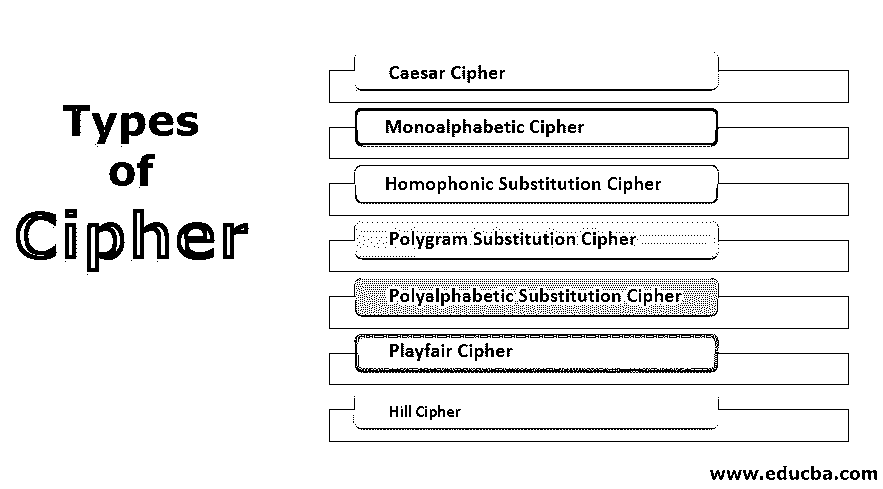

# 密码的类型

> 原文：<https://www.educba.com/types-of-cipher/>

## 密码类型介绍

在字的数字欺诈，以防止我们的数据，许多技术被用来保持我们的数据安全，从黑客或任何第三方。在本文中，我们将讨论密码的类型。在此之前，让我们先看看它的意义。纯文本是发送者、接收者或任何第三方都可以阅读的消息或数据。当使用一些算法或技术修改明文时，产生的数据或消息称为密文。简而言之，将纯文本(即可读文本)转换为不可读文本称为密文。

### 密码的类型

下面给出了几种类型的密码:

<small>网页开发、编程语言、软件测试&其他</small>

#### 1.凯撒密码

在凯撒密码中，纯文本字符集被任何其他字符、符号或数字替换。这是一种非常弱的隐藏文本的技术。在凯撒密码中，信息中的每个字母都被向下三位替换。让我们看一个例子。明文是 EDUCBA。作为一个凯撒密码，每个字母都被向下三位替换，因此 E 将被 H 替换，D 将被 G 替换，U 将被 X 替换，C 将被 F 替换，B 将被 E 替换，A 将被 D 替换。

凯撒密码算法如下:

1.  阅读每个纯文本字母表。
2.  将每个字母向下替换 3 个位置。
3.  对纯文本中的所有字母表重复该过程。

**凯撒密码的修改版:**这个密码的作用和凯撒密码一样；唯一的区别是——在凯撒密码中，每个字母都被替换为三位向下，在凯撒密码的修改版本中，用户决定替换字母的数字，该数字将是常数。例如，用于替换的 EDUCBA 和 number 都是 1，所以 E 会被 F 替换，D 会被 E 替换，U 会被 V 替换，C 会被 D 替换，B 会被 C 替换，A 会被 B 替换，所以这里，明文是 EDUCBA，密文是 FEVDCB。

凯撒密码算法的修改版本如下。

*   阅读每个纯文本字母表。
*   取号换人。
*   用指定的数字向下替换每个字母表。
*   对纯文本中的所有字母表重复该过程。

#### 2.单字母密码

由于凯撒密码和凯撒密码的修改版本容易被破解，单表密码应运而生。在单字母表中，纯文本中的每个字母表都可以被除原始字母表之外的任何其他字母表替换。也就是说，A 可以被从 B 到 z 的任何其他字母表替换。B 可以被 A 或 C 替换。C 可以被 A、B 和 D 到 z 替换，等等。由于存在随机替换和大量排列组合，单字母密码给破解消息带来困难。

#### 3.谐音替代密码

同音替代密码类似于单字母密码；唯一的区别是在单字母表中，我们用任何其他随机字母代替字母表，除了原始字母表，其中谐音替换密码，字母表被固定字母表或字母表集代替。替换字母表被替换为 te fixed。比如用 x 代替 A，用 B 代替 E，用 A 代替 S 等等。或者用 E，x 或 L 代替 A，用 T，A，Z 代替 B 等。

#### 4.多字码替代密码

在 polygram 子站密码中，不是用一个字母替换另一个字母，而是用另一个字母块替换一个字母块。将 EDUCBA 替换为 XYQLAB。在这种情况下，EDUCBA 将替换为 XYQLAB，但 EDU 可以替换为另一组 block，让我们假设 EDU 将替换为 LOD。在这种类型的密码中，明文替换是逐块进行的，而不是逐字符进行的。

#### 5.多字母替代密码

多字母密码又称维格纳密码，是莱昂·巴蒂斯塔·阿尔伯蒂发明的。在多字母替换中，密码是一种加密字母文本的方法。它使用多个替代字母进行加密。Vigener square 或 Vigenere table 用于加密文本。该表包含写在不同行的 26 个字母；每个字母表按照前面的字母表循环左移，相当于 26 个可能的凯撒密码。在加密过程的不同阶段，该密码使用不同于其中一行的字母表。

我们先考虑原文是 Educba，关键词是苹果。对于[加密过程](https://www.educba.com/encryption-process/)，E 与 A 配对，原文的第一个字母 E 与密钥的第一个字母 A 配对。因此，使用 Vigenère 正方形的 E 行和 A 列，即 E。同样，对于原始文本的第二个字母，使用密钥的第二个字母，d 行和 p 列的字母是 s。原始文本的其余部分以相同的方式加密。Educba 的最终加密是 Esjnfa。

#### 6.公平密码

公平密码也叫公平广场。这是一种用于加密数据的[加密技术](https://www.educba.com/cryptography-techniques/)。公平加密过程如下:

*   矩阵的创建和填充。
*   加密过程。

让我们详细讨论上述步骤的方式创建和人口的矩阵。它使用一个 5 * 5 的矩阵来存储关键字或密钥，用于[加密和解密过程](https://www.educba.com/encryption-vs-decryption/)。

这一步工作如下。

1.  按行的方式在矩阵中输入关键字，即从左到右和从上到下。
2.  跳过关键字中的重复单词。
3.  用不属于关键字的其余字母(A-Z)填充剩余的空格。

**Note:** while doing so, combine I and J in the same cell of the table. i.e. If I or J is present in the keyword, discard both I and J while filling the remaining space encryption process.

加密过程如下进行:

*   将字母分组(每组必须包含两个值)。将对这些组执行加密过程。
*   如果组中的两个字母相同，则在第一个字母后添加 x。
*   如果组中的两个字母都出现在矩阵的同一行中，则分别用它们右边的字母替换它们。如果原始组位于行的右侧，则会绕到行的左侧。
*   如果该组中的两个字母出现在同一列中，则分别用紧接在下面的字母替换它们。如果原始组位于行的底部，则会绕到行的顶部。
*   如果该组中的两个字母不在同一行或同一列，则立即用同一行但在矩形的另一对角(由原始组定义)的字母替换它们。

#### 7.希尔密码

希尔密码工程在同一时间对多个字母。希尔密码的工作原理如下:

1.  以纯文本形式将数字分配给每个字母表。A = 0，B= 1…z = 25
2.  根据上述步骤，以数字格式将纯文本消息组织为数字矩阵。生成的矩阵称为纯文本矩阵。
3.  用随机选择的密钥乘以纯文本矩阵。注意，键矩阵的大小必须是 n*n，其中 n 代表纯文本矩阵中的行数。
4.  将两个矩阵相乘，即步骤 2 和步骤 3。
5.  计算上述矩阵的 mod 26 值，即步骤 4 中的矩阵结果。
6.  现在将数字翻译成字母，即 0 =A，1 =B，等等。
7.  步骤 6 的结果成为我们的密文。

### 推荐文章

这是一本密码类型指南。这里我们讨论密码的基本概念和各种类型，分别包括凯撒密码、单字母密码和谐音替代密码。您也可以阅读以下文章，了解更多信息——

1.  [对称算法](https://www.educba.com/symmetric-algorithms/)
2.  什么是 SFTP？
3.  [高级加密标准](https://www.educba.com/advanced-encryption-standard/)
4.  [密码系统](https://www.educba.com/cryptosystems/)

