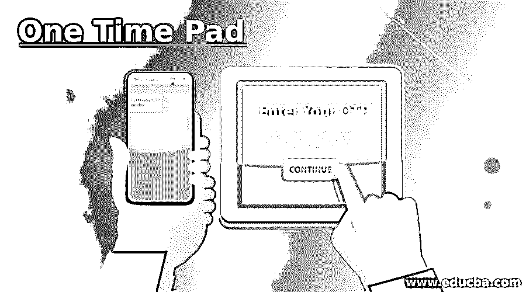

# 一次性密码本

> 原文：<https://www.educba.com/one-time-pad/>

## 一次性密码本概述

一次一密是 vernam 密码的子集，使用一组随机的不重复字符作为输入密码文本来实现。输入密文的长度必须等于原始明文的长度。它被称为一次性密码本，因为一旦输入密文被用于传输，它就不会再被用于任何其他消息，即输入密文在被用于短消息一次后被丢弃。例如，我们用于安全传输的一次性密码。

### 什么是一次性密码本？

它是一个生成随机组织且唯一的“私钥”的系统；接收方使用匹配的一次一密和密钥，用这个一次性使用的私钥对以后解密的消息进行加密。用密钥加密的信息几乎不可能被破解。每个[加密都是唯一的](https://www.educba.com/what-is-encryption/)，并且与其他加密没有关系。在一次性密码本中，所使用的密钥被称为秘密密钥，因为它们保存了非常重要的信息。

<small>网页开发、编程语言、软件测试&其他</small>

### 谅解

为了理解一次性密码本，我们必须关注加密过程，看看它是如何工作的。这将有助于我们更好地理解一次性密码本。理解加密过程至关重要；在这种情况下，一些键成对使用。每个用户都有一份密钥副本，在加密过程之前安全地分发。一次性密钥是高度机密的，因此在存储和分发阶段，它们受到高度连续的保护。

存在与整个加密过程相关联的 XOR 的组合和变化。让我们看看地面上的事情是如何运作的

1.  在加密任何纯文本数据时，发送方使用与文本长度相似的密钥字符串。通过逐位混合(异或)来使用该密钥。逐位混合意味着一位“密钥”与一位“明文”创建一位“密文”。
2.  然后，该密文被转发给接收者。
3.  在接收端，编码的消息与一次性密钥的副本(XOR-ed)混合，然后恢复为纯文本*。*此后，属于发送者和接收者的密钥被自动销毁。这确保了不可能再次应用和使用相同的内容。

### 一次性密码本是如何工作的？

在其核心，一次性密码系统持有一个“随机密钥”。这个随机密钥是一个用于转换原始消息的数字块或集合。

**Note:** The Original Message is called Plaintext.

编码文本称为密文。首先，你必须创建一个“随机密钥”并做到这一点；你需要一种“方法”将字母转换成数字。

**遵循下述转换表图表:**

| 英语字母表中第一个字母 | 英语字母表的第 2 个字母 | 英语字母表中第三个字母 | 英语字母表中第四个字母 | 英语字母表中第五个字母 | 英语字母表中第六个字母 |  | 英语字母表第七个字母 | 英语字母表中第八个字母 | 英语字母表中第九个字母 | 英语字母表中第十个字母 | 英语字母表中第十一个字母 | 英语字母表中第十二个字母 | 英语字母表中第十三个字母 | 英语字母表中第十四个字母 | 英语字母表中第十五个字母 | 英语字母表中第十六个字母 | 英语字母表中第十七个字母 | 英语字母表中第十八个字母 | 英语字母表的第 19 个字母 | 英语字母表中第二十个字母 | 英语字母表中第二十一个字母 | 英语字母表中第二十二个字母 | 英语字母表中第二十三个字母 | 英语字母表中第二十四个字母 | 英语字母表中第二十五个字母 | 英语字母表中第二十六个字母 |
| 01 | 02 | 03 | 04 | 05 | 06 |  | 07 | 08 | 09 | Ten | Eleven | Twelve | Thirteen | Fourteen | Fifteen | Sixteen | Seventeen | Eighteen | Nineteen | Twenty | Twenty-one | Twenty-two | Twenty-three | Twenty-four | Twenty-five | Twenty-six |
|   |  |  |  |  |  |  |  |  |  |  |  |  |  |  |  |  |  |  |  |  |  |  |  |  |  |  |

**例如:**

您的消息是:ASFKHRGQLRIUGQLFHT

**1)** 为了使方法更简单有效，我们必须把它分解成一组两个字符；让我们看看如何

澳大利亚、FK、HR、GQ、LR、IU、GQ、LF、HT

**2)** 按照上面提到的换算表图表——我们有这样的东西。

FK、HR、GQ、LR、IU、GQ、LF、HT = 0119、0611、0818、0717、1218、0921、0717、1206、0820

最后，文本“ASFKHRGQLRIUGQLFHT**”**被转换为**”**0119 0611 0818 0717 1218 0921 0717 1206 0820。

 **### 原则

“密码术”和“一次一密”的工作有一个基本原理。19 世纪，奥古斯特·克霍夫在荷兰创立了克霍夫密码原理。这一原则构成了开放安全的基础，即设计安全。“系统的设计不应该要求保密”。

### 你能用一个时间簿做什么？

*   一次性密码本可用于超级加密。
*   它可以是密码学导论的一部分。
*   流密码模仿它。
*   在两个独立的环境被认为是完全保密的情况下，这是最受欢迎的选择。

### 优点和缺点

让我们看看下面的一些优点和缺点:

#### 优势

*   这个装置是完全无法破解的。
*   它是安全的，因为它只能使用一次。
*   一次性密码本中的每个字节都与 ley 的另一个字节有任何联系。

#### 不足之处

*   更换一次性密码本。
*   “密钥”与“消息”一样长。
*   详细的缺点链接。

### 使用

*   **保密性**:首要原因之一就是“保密性”。一次性密码本的用户理解这一点，因为信息和抄本是保密的。
*   **完整性:**信息是统一的，无论是在存储过程中还是在传输过程中，都不能更改或改变。如果有人试图这样做，发送者和预定接收者将会得到关于改变的预先信息。
*   **不可否认性**:信息的发送者和创建者不能否认他们创建或传输信息的意图。
*   **认证**:发送者/接收者都可以通过信息的来源/目的地来表明自己的身份。

### 需要

一次性密码本的需求在于:

*   国防(全球范围内)。
*   安保人员。
*   间谍和
*   其他几个机密机构。

此外，对于那些希望在保持隐私的情况下进行交流的用户。

### 结论

我们遇到了一些关于古代加密科学和一次性密码本的重要事实，这种加密技术如何帮助需要安全信息交流的社会。由于每枚硬币都有两面，一次性密码本技术也没有什么不同，因为它既有用又有缺点。

### 推荐文章

这是一个时间垫指南。这里我们已经讨论了理解、使用、需要、工作原理、优点和缺点。您也可以浏览我们推荐的其他文章，了解更多信息——

1.  [密码术 vs 加密](https://www.educba.com/cryptography-vs-encryption/)
2.  [什么是解密？](https://www.educba.com/what-is-decryption/)
3.  什么是网络攻击？
4.  [密码技术](https://www.educba.com/cryptography-techniques/)

**