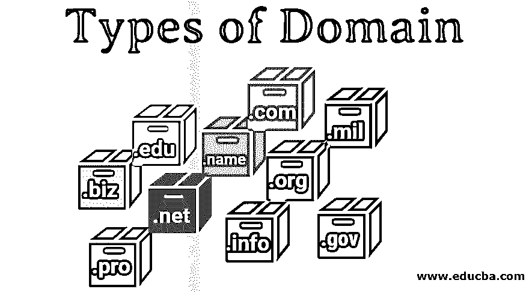

# 域的类型

> 原文：<https://www.educba.com/types-of-domain/>

## 领域类型介绍

域名分为三个部分通用域，国家域和反向域，其中通用域根据其通用行为定义注册主机，国家域使用两个字符国家缩写，反向域映射地址。通用域名包括 com(商业组织)、Edu(教育机构)、gov(政府机构)、org(非盈利组织)、biz(商业公司)等。国家域名有美国、印度等。逆域类似于 121.45.34.132.in -addr.arpa。

### 什么是域？

先说网站的域名是什么。域名的本质是第一次点击在 URL 或网址之间的协议符号(HTTP:/)。因此，URL 的域名将是 dominain.com:https:/www . domain . com/hosting/。你今天可能没有注意到或看到这个域构成了桌面或网站的 IP 地址。注册域名对你来说是独一无二的，不能被任何人使用，因为它在网站上就像现实世界中的街道地址一样。

<small>网页开发、编程语言、软件测试&其他</small>

### 域名的类型

下面是不同的域类型，如下所示。

#### 1)顶级域名

*   **。网络**
*   **。edu**
*   **。组织**
*   **。com**
*   **。mil**
*   **。gov**

每个域名的描述如下

**a)。网络**

网络速记是专门为参与网络系统的机构开发的，如网络服务提供商或基础设施公司。和一样。com 的限制从未坚持到 limit.net 联网的目的，它是最受欢迎的顶级领域之一，许多人认为它接近顶级 domain.com。

**b)。edu**

.edu 是为教育机构制作的，是教育的简称。虽然 TLD.edu 是为世界各地的大学设计的，但只有美国的教学中心与之相连。其他国家的学校使用。edu 连同他们的国家领域，这将在下一章讨论。

**c)。组织**

.org 是为非营利组织开发的，是该组织的简称。正如我们在顶部的其他领域中所看到的，这些意图经常没有随着时间的推移而得到维护或实现。如今，公司的非盈利、盈利企业、学校和社区都被用作高级域名。

**d)。com**

第一个普遍使用的高级域名是商业速记。com 最初是为商业使用而开发的，这没有严格的限制。.到 20 世纪 90 年代中期，com 是公司、网站和电子邮件最常见的高级域名。

**e)。mil**

军事速记，。mil 是专门为美国军方开发的。与其他顶级域名相比，这一限制仍然存在。与结合使用。米尔 TLD，这是常见的。mil 使用二级和三级域名。

**f)。gov**

速记是政府的专利。mil 仅供联邦政府机构和员工使用。今天，。gov 已被政府机构用于城镇、城市、地区、城市、县和美国土著部落。

#### 2)通用顶级域名(GTLD)

通用顶级域名在 [DNS](https://www.educba.com/what-are-the-types-of-dns-servers/) 中作为顶级域名类别。目前，根区域内有 21 个顶级通用域名，这是域名方案结构的最佳级别。尽管使用了 1500 多个 gTLDs，但这 21 个中的大多数构成了所有类型的域名。

包括四个子类别:

1.**(。com，。信息，。网，。org )** 普遍适用的领域。

2.**(。亲，。商业。名称)**该域名一般用于特定原因或目的。

#### 3)二级域名

二级域是指在 DNS 层次结构中位于顶级之后的域。例如，耐克是 top.com 域的二级域，在 Nike.com。向注册服务商注册域名的公司或卖家的名称通常是二级域名。对于潜在的客户，品牌名称，企业名称或项目名称是标识符。

#### 4) **三级域名**

第三阶段中的域显然是 DNS 层次结构中的二级域。它位于 SLD 的左侧，通常被称为子域。较大的企业通常使用第三级区域作为标识符来区分不同的部门。“www”一般是最常见的三级域名。

### 域名系统

域名系统的工作原理是将域名转换成 IP 地址的服务器。它位于全球数百万台服务器上，但作为一个统一的数据库。接下来，当您插入搜索浏览器的域名时，名称服务器会联系浏览器以找到匹配的 IP 地址。如果您之前没有请求域名，该请求将通过按照域名系统层次结构排序的服务器，从顶级扩展名开始向下传递。

### 推荐文章

这是一个关于域名类型的指南。这里我们详细讨论了不同类型域名的基本概念:顶级域名、二级域名和三级域名。您也可以看看以下文章，了解更多信息–

1.  [虚拟主机的类型](https://www.educba.com/types-of-web-hosting/)
2.  [网络攻击的类型](https://www.educba.com/types-of-cyber-attack/)
3.  [M](https://www.educba.com/mac-vs-ip-addresses/)T2】AC vs IP 地址
4.  [域分析测试](https://www.educba.com/domain-testing/)

