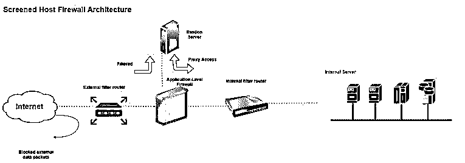
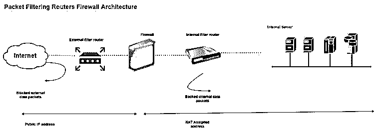

# 防火墙架构

> 原文：<https://www.educba.com/firewall-architecture/>

## 防火墙体系结构介绍

防火墙是一个非常庞大的概念。每天都有新的改进伴随着更好的设计、新的固件、新的软件升级、新的特性等等。防火墙中有不同的体系结构，如屏蔽主机防火墙体系结构、包过滤路由器防火墙体系结构、双宿防火墙体系结构、屏蔽子网防火墙体系结构。根据工业要求、网络设计，我们需要选择合适的防火墙体系结构。

防火墙的基本概念是保护内部或组织环境免受任何外部安全攻击。类似地，三个主要方面将定义防火墙的配置，如从组织的角度来看网络的目标、开发能力以及我们需要如何实现它。在考虑硬件水平的同时，我们还需要考虑预算。

<small>网页开发、编程语言、软件测试&其他</small>

### 详细的防火墙架构

防火墙中有不同类型的体系结构。以下是建筑的类型:

#### 1 屏蔽主机防火墙架构

在屏蔽主机防火墙体系结构中，我们对包过滤路由器防火墙体系结构进行了一些改进。在这种体系结构中，我们使用包过滤路由器防火墙技术和专用或独立的防火墙。它被称为应用程序代理服务器。在包过滤路由器的防火墙架构中，我们有一个非常大的开销来过滤网络流量(一旦访问控制列表增加)。因此，我们面临许多问题。在这里，我们已经尝试克服它，我们已经添加了专用的防火墙。这种技术将允许路由器通过防火墙。由于这种架构，路由器将预先筛选网络流量或数据包，以最小化网络开销。这也有助于分散负荷。

独立的应用程序代理服务器将工作在第 7 层(在 TCP 协议上)。它将在应用层过滤数据包。它有能力过滤掉像 HTTP，HTTPS，FTP，SFTP 等数据包。换句话说，独立的应用程序代理服务器也称为堡垒主机。这将是一个外部攻击的高机会，也将是不太安全的。动作主机或单独的应用程序代理服务器保存 web 文档的缓存副本。但是在这种体系结构中，外部攻击者需要破坏这两个不同的系统。在进行任何攻击之前，它还会访问内部数据。

*   **工作流程:**根据上述架构，有一个单独的主机可用，即堡垒主机。它像代理服务器一样平衡防火墙上的负载。防火墙保存着所有的规则和访问控制。堡垒服务器将帮助过滤掉网络流量。如果它是一个有效的数据包，它将允许它通过代理访问内部过滤路由器，在内部网络中进一步移动。

#### 2.包过滤路由器防火墙体系结构

许多组织需要互联网连接。如果我们启用互联网连接，没有防火墙的组织将暴露于外部世界。为了避免外部安全攻击，我们需要安装和配置防火墙。在包过滤路由器中，我们有路由器的概念。在这里，路由器接口充当组织的互联网提供商。路由器是组织和互联网提供商之间的中介。在同一层面上，我们正在启用网络包过滤过程。

如果有任何不想要的数据包可能到来，那么它将在同一级别上过滤掉它们。因此，包裹将被丢弃或被拒绝。它不会出现在组织级网络中。这是一个非常简单的实现方法。这也将有助于降低来自外部安全威胁的风险。但是它也没有什么顾虑。如果我们使用包过滤路由器，那么对网络流量的审计就会减少。同样，我们也有强认证机制的缺点。每天，访问控制列表都会增长。因此，过滤传入的网络数据包将是一项非常大的开销。因此它也会降低网络性能。在少数情况下，我们将面临滞后。

*   **工作流程:**这是实现防火墙的基本技术。在这里，ISP 将为组织提供互联网连接。然后，它连接到外部过滤路由器。首先，在防火墙上，我们需要添加 ACL 和配置列表。然后，在相同配置的帮助下，网络流量将过滤并传递到内部过滤路由器。此外，内部过滤路由器会将网络流量分离到内部组织级网络中。

#### 3.双宿主防火墙体系结构

现在，由于我们需要更高的性能和更少的网络延迟，体系结构的复杂性正在增加。在以前的防火墙架构中，我们使用的是单网络界面卡。但是当我们使用这种类型的防火墙架构时，bastion 主机将包含两种不同的网络界面卡。在这种架构中，一个网络相间卡将连接外部网络，另一个网络相间卡将连接内部网络。在这里，所有网络流量都将从防火墙物理传输，防火墙位于内部和外部网络相间卡之间。

*   **工作流程:**在这个架构中，没有单独的代理服务器。在这种防火墙体系结构中，有两种不同的网卡可用。在一个网卡中，将连接外部 ISP 连接。在第二个网卡中，内部网络将会连接。一旦流量到来，防火墙将过滤流量并将其传递到内部网络。如果流量无效，防火墙将丢弃数据包，不再继续传输。

### 结论–防火墙架构

我们已经看到了带有适当解释的“防火墙架构”的完整概念。有许多可用的防火墙体系结构；我们需要根据自己的需求和预算来选择。防火墙还将跟踪应用层的流量。

### 推荐文章

这是防火墙体系结构的指南。为了更好地理解，我们在这里详细讨论介绍和防火墙体系结构。您也可以看看以下文章，了解更多信息–

1.  [什么是防火墙？](https://www.educba.com/what-is-a-firewall/)
2.  [防火墙设备](https://www.educba.com/firewall-devices/)
3.  [防火墙的类型](https://www.educba.com/types-of-firewall/)
4.  [防火墙使用](https://www.educba.com/firewall-uses/)

