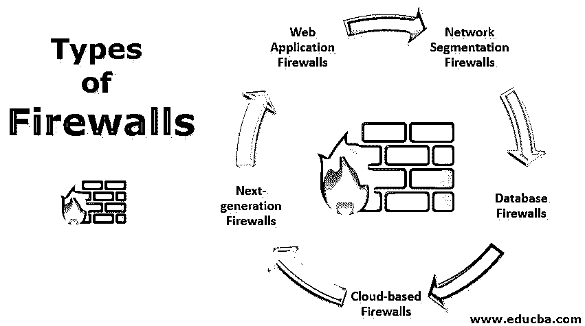

# 防火墙的类型

> 原文：<https://www.educba.com/types-of-firewall/>

## 防火墙类型介绍

以下文章概述了防火墙的类型。寻求合适的工作工具是企业在保护敏感数据时面临的主要问题之一。大多数企业可能不清楚如何找到适合其需求的防火墙，如何设置这些类型的防火墙，或者为什么即使对于防火墙这样的常用工具也需要这样的防火墙。

### 什么是防火墙？

防火墙是一种用于控制网络流量的网络安全工具。防火墙可用于将网络节点、内部资源甚至特殊程序与外部流量源隔离开来。软件、硬件或云都可以是防火墙，每种防火墙都有不同的优缺点。防火墙的主要目的是阻止恶意的网络请求和数据包，同时允许合法的流量。然而,“防火墙”这个词对于 IT 安全购买者来说太宽泛了。有许多不同类型的防火墙，每一种都以不同的方式运行，包括在云内部和外部，以保护不同类型的重要数据。

<small>网页开发、编程语言、软件测试&其他</small>

### 五大防火墙类型

下面给出了 5 种最常见的防火墙类型:

#### 1.Web 应用防火墙

web 应用程序的防火墙通常是服务器上的应用程序和从企业网络外部访问应用程序的应用程序用户之间的代理服务器。代理服务器接收输入数据，然后代表内部客户端用请求创建一个连接。这种配置的一个主要优点是，数据库受到保护，不会受到端口检查、定位应用服务器代码的尝试或最终用户驱动的其他恶意行为的影响。代理服务器还会分析这些数据，以防止它们到达 web 应用程序的数据库，从而过滤恶意请求。

*   **保护级别:**高，因为 [web 应用服务器](https://www.educba.com/what-is-web-application/)为身份不明的潜在恶意用户提供了缓冲区，否则这些用户可能会直接访问 web 应用服务器。这一点很重要，因为许多应用程序携带对黑客有价值的秘密数据，这些数据在面向 Web 的应用程序中特别有吸引力。
*   **缺点和优点:** Web 应用程序防火墙比 Web 服务器本身更简单，更不易受到攻击，也更容易修补。这意味着黑客可以认为防火墙后的应用程序相当困难。但是代理防火墙不容易支持所有的应用，并且会降低最终用户的安全应用性能。

#### 2.网络分段防火墙

用于网络分段的防火墙(我们也可以说是内部网络防火墙)用于管理位置、操作区域、部门或其他业务单位之间的网络流量。它适用于子网限制。这样，一个区域可能会出现网络漏洞，而不是整个网络。它还可以保护它所保护的网络区域，如数据库或研发单位。

对于非常大的公司或网络边界难以保护的公司，网络分段防火墙是最有帮助的。

*   **保护级别:**虽然攻击者可能无法将网络分段防火墙从网络的一部分移动到另一部分，但如果最初的漏洞能够快速识别，它实际上只能减慢攻击者的进度。
*   **优势和劣势:**如果攻击者实现了网络访问，那么网络分段防火墙访问特别敏感的信息就会变得更加困难。

#### 3.数据库防火墙

顾名思义，防火墙是一种用于 Web 应用程序的防火墙，旨在保护数据库。这些通常安装在数据库的服务器上(或者靠近网络入口，在这种情况下，不止一个服务器有几个服务器专门用来保护它们)。他们旨在识别和避免独特的服务器攻击，如[跨站点脚本](https://www.educba.com/what-is-cross-site-scripting/)，这可能导致攻击者访问数据库中的机密信息。

*   保护级别:机密信息的损失通常是昂贵的，考虑到失去的可信度和糟糕的广告**。**为此，需要采取所有适当的措施来保护数据库及其数据。为了保证这些存储数据的安全，相当程度上增加了网络防火墙。如果您保存有价值或机密的数据库数据，强烈建议使用防火墙。根据基于风险的安全性，超过 40 亿份记录被盗，比 2013 年高出四倍。当黑客继续有效地以数据库为目标时，这意味着记录变得越来越重要。
*   **优点和缺点:**服务器防火墙可以提供有效的安全措施，还可以用于跟踪、审查和报告法规遵从性。然而，只有正确地配置和修改，并且对零日攻击提供很少的保护，它们才会有效。

#### 4.基于云的防火墙

基于云的防火墙是企业数据中心防火墙的替代方案，但具有相同的目标:保护网络、应用程序、数据库或其他 IT 资源。

*   **保护级别:**专门从事防火墙管理的安全专家配置和管理云防火墙即服务，为其保护的资源提供出色的保护。它还将高度可访问，很少或没有计划内或计划外停机时间。当移动用户通过 VPN 或代理连接到云防火墙时，通常通过公司路由器的配置将流量转移到云防火墙。虽然提供了专用的容器防火墙，但是也可以通过运行在具有主机防火墙的容器上的 iptables 来保护容器。
*   优点和缺点:容器防火墙的配置可能比在每个容器上运行的主机防火墙更容易。但在较小的环境中，这可能会造成浪费，并且很难从成本角度证明其合理性。

#### 5.下一代防火墙

下一代防火墙用于保护网络免受不希望的数据流量，但它们不同于传统的防火墙。除了它的端口、来源、目的 IP 地址和协议，NGFWs 通过查看每个数据包的内容提供了软件可见性和全栈可见性。它允许您在应用层禁止使用特定的应用程序，如用于文件共享的对等应用程序，并通过使用应用层防火墙来限制应用程序，如允许 Skype 用于 IP 语音通话，但不能用于文件共享。

NGFW 提供了比传统防火墙更好的网络防火墙覆盖范围，一方面留下了成本和性能问题。此外，许多 NGFWs 还提供其他功能，如检测入侵、恶意软件扫描和 SSL 软件检查**。**对于拥有这些应用程序但还没有单点解决方案的组织来说，这些应用程序非常有用，并且在禁用时会导致 NGFW 的数据吞吐能力显著下降。

*   **优势和劣势:** NGFW 对数据的控制更加精细，使 NGFW 能够应对更广泛的潜在威胁，并且无法访问公司网络。然而，NGFWs 比传统防火墙成本更高，这可能会导致网络性能问题，因为它们进行数据包检查，而不仅仅是数据包过滤器。
*   **级别保护:**相当高，因为它们提供了高度的粒度控制。这些任务可能需要遵守 PCI 和 HIPAA。

### 统一威胁管理

统一的 UTM 设备为中小型企业提供了一个几乎完整的安全解决方案，作为一个连接到网络的单一盒子。典型的 UTM 功能包括标准防火墙、入侵检测系统(包括检查传入流量、电子邮件中的病毒和恶意软件、黑名单)，以及阻止员工访问已识别网站(如网络钓鱼)的网址黑名单。web 应用程序防火墙和下一代防火墙(NGFW)功能也具有安全的 Web 网关(有时)。

*   **优势和劣势:**UTM 有一个重要的吸引力:一次购买就能满足所有安全需求，并且可以通过一个管理控制台控制和配置所有安全特性。大多数 UTM 以原始购买价格提供基本的安全级别，额外的安全产品(如 IPS)可能以可选的许可费提供。主要缺点是 UTMs 不能提供与更复杂产品组合相同的安全级别。尽管如此，这可能是学术性的，因为通常在 UTM 和没有安全解决方案之间有一个选择。UTM 适用于没有专职安全人员且缺乏配置单点解决方案所需专业知识的小型公司。**T3】**
*   **保护级别:**一些 UTM 可以很好地保护网络，但同类最佳的解决方案可能为每种安全功能提供更好的保护。

### 结论–防火墙的类型

因此，在本文中，我们看到了不同类型的防火墙及其优缺点。无论您选择什么类型的防火墙，请记住，在某种程度上，功能不正常的防火墙可能比防火墙更糟糕，因为它提供了一个危险的安全印象，同时提供很少或没有防火墙。

### 推荐文章

这是防火墙类型的指南。在这里，我们讨论了前 5 种类型，如 web 应用程序、网络分段、数据库、基于云的防火墙和下一代防火墙及其优缺点。您也可以阅读以下文章，了解更多信息——

1.  [网络安全的类型](https://www.educba.com/types-of-cyber-security/)
2.  [安全技术](https://www.educba.com/security-technologies/)
3.  [什么是网络安全？](https://www.educba.com/what-is-network-security/)
4.  [防火墙设备](https://www.educba.com/firewall-devices/)

