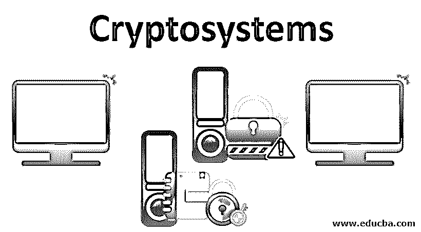
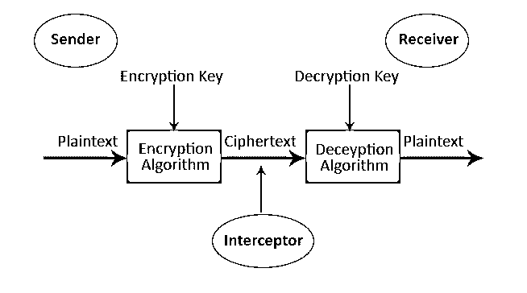
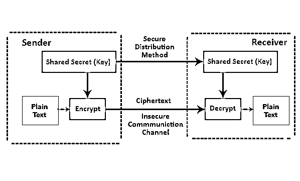
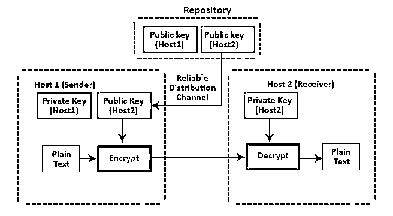

# 密码系统

> 原文：<https://www.educba.com/cryptosystems/>

## 什么是密码系统？

密码系统也称为密码系统。它使用各种加密组件(如明文、加密算法、密文、解密算法和加密密钥)来实现加密技术，以提供信息安全服务。有两种类型的密码系统，如对称密钥加密和非对称密钥加密。

<small>网页开发、编程语言、软件测试&其他</small>

在上图中，您可以看到发送者想要秘密地向接收者发送消息，而不将其透露给任何第三方。为了实现这一点，密码系统就出现了。在发送方系统，密码系统获取发送方信息 I .明文，并使用密钥(加密密钥)执行某种[加密算法](https://www.educba.com/encryption-algorithm/)，形成密文，然后将其发送给接收方。接收方密码系统收到密文后，使用密钥(解密密钥)执行解密算法，并将密文转换为明文。密码系统的目标是在没有任何第三方解释的情况下将私人数据从发送者发送到接收者。

### 密码系统的组件

让我们讨论下面的一些组件。

#### 1)纯文本

纯文本是任何人都能理解的消息或数据。

#### 2)密文

密文是不可读的消息或数据；这是通过使用加密密钥对纯文本执行加密算法来实现的。

#### 3)加密算法

这是一个使用加密密钥将明文转换为密文的过程。产生密文需要两个输入，即明文和加密密钥。

#### 4)解密算法

它是加密算法的相反过程；它使用解密密钥将密文转换成纯文本。生成明文需要两个输入，即密文和[解密](https://www.educba.com/what-is-decryption/)密钥。

#### 5)加密密钥

它是发送者用来将明文转换成密文的密钥。

#### 6)解密密钥

它是接收者用来将密文转换成明文的密钥。

### 密码系统的类型

有两种类型的密码系统–对称密钥加密和非对称密钥加密。下面详细讨论一下这两种类型。

#### 1)对称密钥加密

*   在对称密钥加密中，发送方和接收方使用相同的秘密密钥，即加密密钥，来执行加密和解密。对称密钥加密也称为对称加密。
*   一些算法使用对称密钥概念来实现安全性。比如 DES(数据加密标准)，IDEA(国际数据加密算法)，3DES(三重数据加密标准)，Blowfish。
*   所有的密码系统大多使用对称密钥加密。
*   在对称密钥加密中，发送方和接收方同意使用相同的密钥。发送方使用秘密密钥对私有数据(即纯文本)进行加密，并将其发送给接收方。接收数据后，接收方使用发送方用来加密数据的相同密钥。使用这个密钥，它将密文转换成明文。

在下图中，我们可以看到对称密钥加密的工作原理。

**对称密钥加密情况下的密码系统的特征:-**

*   因为他们使用相同的密钥进行加密和解密，所以他们必须共享这个密钥。
*   为了防止任何类型的攻击，密钥需要定期更新。
*   对称密钥加密中的密钥长度较小；因此，加密和解密速度更快。
*   必须有一种机制在发送方和接收方之间共享密钥。

**对称密钥加密面临的挑战-**

*   **生成密钥:**要共享密钥，发送方和接收方需要就对称密钥达成一致，这需要一个密钥生成机制。
*   信任问题:发送方和接收方之间必须有信任，因为它们共享对称密钥。例如，假设接收者向攻击者丢失了他的密钥，并且他没有通知发送者。

#### 2)非对称密钥加密

在非对称密钥加密中，发送方和接收方使用两种不同的密钥进行加密和解密。非对称密钥加密也称为[公钥加密](https://www.educba.com/public-key-encryption/)。

在上图中，我们可以看到非对称密钥加密的工作原理。

*   在非对称密钥加密中，使用两个密钥。即公钥和私钥。这两个键在数学上是相互关联的。公钥存储在公共存储库中，私钥存储在私有存储库中。
*   发送方使用接收方的公钥加密私有数据，并将其发送给接收方。接收到私有数据后，接收方用自己的私有来解密私有数据。
*   非对称密钥加密中的密钥长度很大；因此，与对称密钥加密相比，非对称密钥加密中的加密和解密过程变得很慢。
*   基于公钥计算私钥在计算上并不容易。因此，公钥可以自由共享，允许用户轻松方便地加密内容和验证[数字签名](https://www.educba.com/digital-signature-cryptography/)，私钥可以保密，确保内容可以被解密，私钥所有者只能创建数字签名。非对称密钥密码系统面临着挑战，即用户必须确信他用于与个人传输的公钥确实是那个人的公钥，并且没有被攻击者处理过。
*   还有，因为公钥需要共享，所以这些公钥的大小很大；因此，它们很难被记住，所以它们被存储在[数字证书](https://www.educba.com/digital-certificate/)中，以便安全传输和共享。虽然私钥不能共享，但它们只是存储在您使用的云软件或操作系统中，或者存储在硬件设备上。许多互联网协议，如 SSH、OpenPGP、SSL/TLS，在非对称加密中用于加密和数字签名功能。

### 结论

本文介绍了密码系统如何帮助安全方便地加密和解密消息。

### 推荐文章

这是密码系统的指南。在这里，我们分别讨论了其组件和类型的简要概述以及适当的框图。您也可以浏览我们推荐的其他文章，了解更多信息——

1.  [数字签名算法](https://www.educba.com/digital-signature-algorithm/)
2.  [什么是密码学？](https://www.educba.com/what-is-cryptography/)
3.  [密码术 vs 加密](https://www.educba.com/cryptography-vs-encryption/)
4.  [密码类型](https://www.educba.com/types-of-cipher/)

