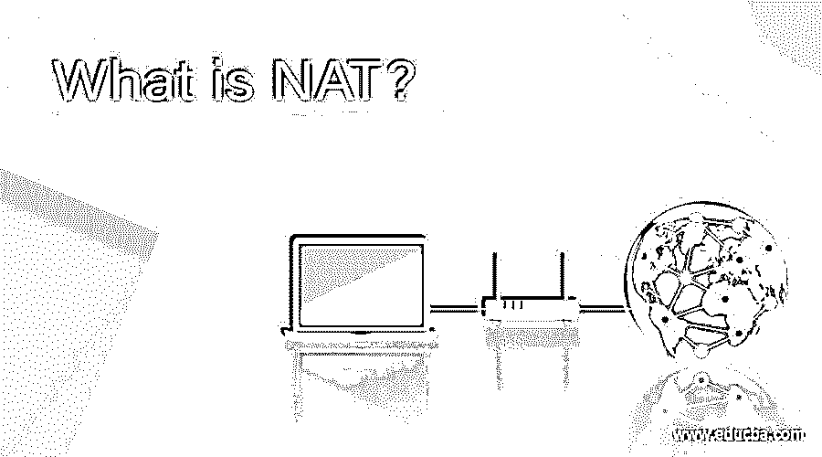
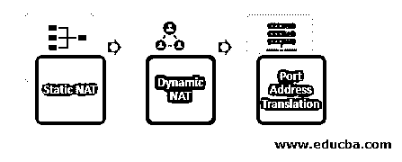

# 什么是 NAT？

> 原文：<https://www.educba.com/what-is-nat/>

## NAT 简介

NAT 代表网络地址转换，通过允许用户访问多个 IP 地址来解决 IP 地址短缺的问题。要使用 NAT，互联网管理机构规定，某些 IP 地址必须仅用作内部 IP 地址，其他 IP 地址应用作外部 IP 地址，用户可以访问多个内部 IP 地址，但只能访问一个外部地址，内部流量可以使用内部地址，外部流量可以使用外部地址。

### NAT 的类型

NAT 通常在防火墙或路由器上运行，通过将私有 IP 地址更改为全局 IP 地址(反之亦然)来实现对本地主机的 internet 访问。

<small>网页开发、编程语言、软件测试&其他</small>

#### 1.静态 NAT

静态 NAT 是一个私有 IP 地址，它是一个未注册的 IP 地址，映射到一个合法的公共 IP 地址。这里，在本地和全局地址内进行一对一的映射，该地址通常[应用于虚拟主机](https://www.educba.com/what-is-web-hosting/)。但是它们不适用于公司，因为许多人使用互联网并需要互联网接入，而公共 IP 地址是强制性的。例如，如果有 5000 台服务器需要访问互联网，公司必须购买 5000 个公共地址，这是很昂贵的。

#### 2.动态 NAT

动态 NAT 是将私有的未注册 IP 地址从一组公共 IP 地址中更改为注册的公共地址。如果 IP 地址组被占用，则数据包将使用固定数量的私有 IP 地址进行传输，该私有 IP 地址可以传输到公共地址。例如，如果有两个公共 IP 的组，并且它可以被两个私有 IP 访问，则可以在估计的时间传输。但是，如果第三个 IP 需要访问互联网，则数据包会被传输，因为许多私有 IP 地址都连接到一组公共 IP 地址。当互联网用户数量有限时，就要部署 NAT，因为创建一个全球 IP 地址池是非常昂贵的。

#### 3.端口地址转换

端口地址转换被称为 NAT 过载，其中许多私有 IP 地址可以被传输到单元注册的 IP 地址。端口号用于区分属于单个 IP 地址的流量。这是一种节省成本的方法，因为数千台服务器可以通过一个真实的全球公共 IP 地址连接到互联网。

### 工作

*   NAT 中配置了两个接口，一个是边界路由器，一个路由器有一个接口存在于本地网络内部，另一个接口存在于全局网络外部。
*   当数据包传输到网络内外时，网络地址转换会将本地 IP 地址调制为全局 IP 地址。但是当数据包进入内部网络或本地网络时，全局 IP 地址会被调制为本地 IP 地址。
*   在 NAT 中，如果没有可用的 IP 地址，则传输数据包，并将互联网控制消息协议的主机不可到达的数据包传送到给定的目的地。
*   在网络中，两个不同的主机 A 和 B 被映射，并且如果两者都请求具有相同端口号的相同目的地端口，比如主机端同时为 2000，则 NAT 仅执行 IP 地址的改变，并且当分组到达 NAT 时，A 和 B 的 IP 地址都被已建立网络的全局或公共 IP 地址屏蔽，并被传送到估计的目的地。
*   路由器的公共 IP 地址从目的端口接收传递消息。一旦收到回复，NAT 就会混淆主机回复的来源，因为它们有两个相同的端口号 A 和 b。为了克服这种问题，NAT 会屏蔽源端口号并更改 NAT 的条目表。
*   内部 IP 地址可以被调制，而外部 IP 地址不在组织的直接控制之下。地址的改变或转换是在网络内外进行的。

### NAT 的优点和缺点

让我们看到一些优点和缺点。

#### 优势

1.当用户使用 NAT 过载时，NAT 有助于保留 IPv4 地址空间

2.NAT 通过部署多个源池、负载平衡池和备份池，增强了全球网络互连的可靠性和灵活性。

3.NAT 有一个突出的网络寻址方法。如果使用全局 IP 地址，那么应该正确分配地址空间。因为当网络发展时，可能需要许多 IP 地址

4.NAT 为网络提供了额外的安全层，因为根据用户偏好，NAT 网络中内置的主机不可被其他网络设备访问。

#### 不足之处

1.当一个客人请求远程访问时，它会仔细检查连接是否来自属于 NAT 的路由器。但是一些来宾从另一个主机建立了连接；如果特定的用户没有响应正确的主机，那么它将得到一个请求，另一个主机。这个标准将导致网络性能的下降

2.如果多个应用程序和协议依赖于端到端功能，那么其他用户就无法访问该用户的网络。因为主机内置在 NAT 网络中，这是不可到达的，如上所述

3.如果需要从远程区域对网络进行故障排除，那么故障排除将会非常困难，并且会导致终端可追溯性的丧失。

4.由于 IP 报头中的 NAT 转换值，隧道协议的应用变得更加复杂，并且它还中断了 IPsec 和左隧道协议进行的完整性验证[。](https://www.educba.com/ipsec/)

5.需要来自全局端的 [UDP 或 TCP 安装](https://www.educba.com/tcp-vs-udp/)连接的服务可能会受到影响，有时可能无法到达。

### 推荐文章

这是什么是 NAT 的指南。这里我们也讨论一下什么是 NAT？其类型同 NAT 的优缺点。您也可以看看以下文章，了解更多信息–

1.  [什么是自然语言处理？](https://www.educba.com/what-is-natural-language-processing/)
2.  [什么是原生广告？](https://www.educba.com/native-advertising/)
3.  [网络设备的类型](https://www.educba.com/types-of-network-devices/)
4.  [NAT 的类型](https://www.educba.com/types-of-nat/)

