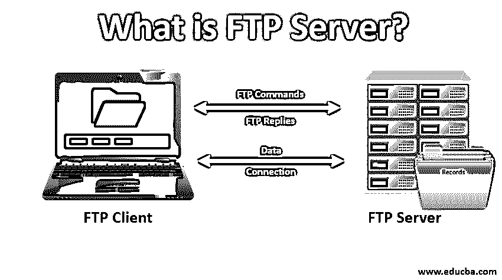

# 什么是 FTP 服务器？

> 原文：<https://www.educba.com/what-is-ftp-server/>

## FTP 服务器简介

FTP 服务器也称为 FTP 站点，它是一台具有文件传输协议(FTP)地址的计算机，专用于接收 FTP 连接并通过互联网交换文件。为了通过 TCP/IP 网络将文件从一个位置传输到另一个位置，FTP 使用 FTP 服务器来存储数据，并通过诸如登录、连接、数据集、传输模式、安全性等基本步骤来传输文件。

### 什么是 FTP 服务器？

FTP 是一种成熟的协议，可以通过 TCP/IP 网络(互联网)在计算机之间交换数据文件。协议为网络环境中网络设备之间的交互规定了一套标准的规则和条例。FTP 协议使用服务器中的端口 21 与用户通信。

<small>网页开发、编程语言、软件测试&其他</small>

FTP 服务器遵循服务器/客户机体系结构。数据文件通过 FTP 服务器进行交换。发送方应该将要以客户端模式交换的数据文件上传到 FTP 服务器，接收方应该以客户端模式从服务器下载。发送者和接收者都应该具有对 FTP 服务器的经过验证的访问权限。

大型企业组织拥有自己的 FTP 服务器环境，用于与供应商、经销商和其他利益相关者共享大型文件。这些文件将由各个部门上传到他们的 FTP 服务器，并与其他人共享。中小型企业可以利用 FTP 托管服务与客户共享文件。FTP 托管服务也在云中提供。

### FTP 服务器是做什么的？

FTP 服务器的工作方式如下:

#### 1.注册

FTP 客户端软件必须安装在客户端计算机上。通过这个客户端软件登录到服务器。使用 FTP 命令将用户名和密码发送到服务器[，服务器将登录状态作为消息发回。一些 FTP 服务器提供使用匿名用户 id 下载和上传文件的登录/免密码访问。](https://www.educba.com/ftp-commands/)

#### 2.关系

通过主动和被动模式建立与服务器的通信。非活动模式下，客户端在防火墙内可用，与服务器建立直接数据通道进行数据传输，而在被动模式下，客户端在防火墙外，使用通过 PASV 命令获得的 IP 号和端口号与服务器建立间接连接。

#### 3.传输中使用的数据集

在 FTP 中，数据以四种不同的数据表示形式在网络上传输:

*   **ASCII:** 数据在传输前被转换成 8 位、128 个字符的 set ASCII 码，该方法用于交换纯文本、数字和特殊字符。
*   **EBCDIC:** 使用 EBCDIC 字符集传输纯文本数据。
*   **二进制:**数据以二进制格式(0，1 位值)逐字节传输到接收器。使用此模型传输图像、绘图、应用程序代码和 CAD 模型。
*   **专有:**使用发送方和接收方之间兼容的任何本地格式进行数据传输。

#### 4.转移方式

数据可以通过三种模式传输:

*   **流模式:** FTP 以连续流的方式发送数据，TCP 管理传输。
*   **块模式:**数据在发送到 TCP 之前，被 FTP 分成带有报头、字节数和数据的块。TCP 简单地传输它。
*   **压缩模式:**数据在传输前被压缩。

#### 5.安全性

根据设计，除了登录验证之外，FTP 不是一个安全的平台。它面临许多漏洞，如暴力攻击、FTP 反弹、数据包捕获、欺骗攻击等。它不加密数据，用户名、密码和命令对任何人都是公开的，很容易被黑客攻击，这些安全问题通过

*   使用 SFTP 和 FTP/S，安全版本的 FTP 而不是 FTP。FTP/S 提供了一种将黑客拒之门外的加密工具。
*   使用 SSH 文件传输协议或安全复制协议。SFT
*   通过类似安全隧道的 SSH(安全外壳)和 VPN ( [虚拟专用网](https://www.educba.com/why-we-use-vpn/))传输数据

#### 6.最新的 FTP 版本

旧的 FTP 客户端软件通常以命令模式运行，用户可以通过查看服务器的响应来以交互模式工作。后来的软件在 URL 中嵌入了 FTP 命令，并通过浏览器管理 FTP 操作。

最新的移动应用程序或其他网站内置了许多下载和上传选项，它在后端使用 FTP 方法来回传输文件。一个人使用 FTP 甚至没有意识到它。

### FTP 服务器的应用

FTP 服务器的应用如下:

#### 在大型组织中

*   员工与组织内不同地点和分支机构的其他员工共享数据文件。
*   企业范围内的实时数据以安全的方式备份到灾难恢复(DR)站点，以管理业务连续性运营。
*   开发人员将应用程序代码转移到生产环境中。

#### 大型组织的外部

*   设计部门的员工与供应商共享零部件和组件的 CAD 模型和图纸，以开展联合设计活动并减少设计时间。
*   出于采购目的，采购团队与零部件供应商共享图纸。
*   质量控制团队与供应商共享检查报告，以便在供应商端进行流程纠正。
*   经销商分享故障部件的照片，用于保修索赔和设计改进。

#### 其他广泛使用 FTP 的中小型企业

*   土木工程、建筑和施工
*   转录服务和印刷
*   IT 咨询
*   商业咨询
*   金融服务
*   法律服务
*   媒体和营销

### FTP 服务器的优势

*   支持在两台计算机之间传输大型文件/文件夹，而不管其大小，否则任何其他软件都无法做到这一点。
*   确保文件的完整传输，即使在与恢复设施有关的中断的情况下。
*   提供计划文件传输、将项目添加到等待上传/下载的队列的选项。
*   它在命令行中有一个脚本选项来管理大量文件的传输。
*   广泛支持所有主机，并以更快的速度传输数据。

### 结论

FTP 在各行各业都有大量的应用，在过去的 30 年里，它在大型文件传输业务中占据了领先地位。FTP (SFTP)的安全版本仍在使用，它比其他替代版本如 HTTPS、AS2、MFT 和 WebDAV 更受青睐。

### 推荐文章

这是一个什么是 FTP 服务器的指南？.这里我们讨论 FTP 服务器做什么，以及 FTP 服务器的应用和好处。您也可以浏览我们推荐的其他文章，了解更多信息——

1.  [Linux 中的 FTP 服务器](https://www.educba.com/ftp-server-in-linux/)
2.  什么是 TFTP？
3.  [什么是网络协议](https://www.educba.com/what-is-networking-protocols/)
4.  [代理服务器的类型](https://www.educba.com/types-of-proxy-servers/)

