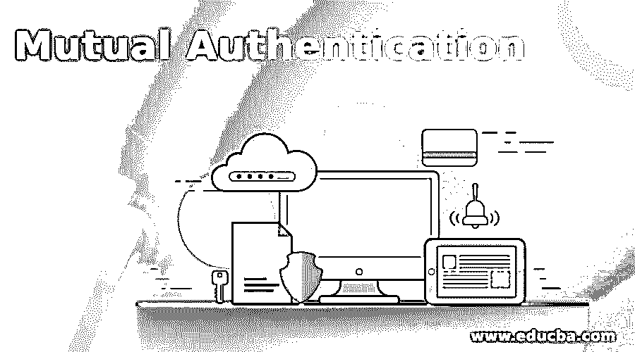

# 相互认证

> 原文：<https://www.educba.com/mutual-authentication/>

## 相互身份验证简介

相互认证是一种用于用户认证的安全机制，其中通信链路中的两个实体相互认证以进行安全通信。相互认证也称为双向认证，因为通信中涉及的两个实体相互认证。例如，如果用户 X 和用户 Y 想要使用相互认证进行通信，则用户 X 认证用户 Y 和用户 Y 以认证用户 X，然后开始通信。

在本文中，我们将详细讨论相互认证的概念及其实现。

<small>网页开发、编程语言、软件测试&其他</small>

### 相互认证的实现

相互身份验证可以通过多种方式实现，即共享秘密、公钥和基于时间戳。

#### 1.使用共享密钥的相互认证

假设用户 X 和用户 Y 想要使用共享密钥进行身份验证，协议工作如下:

*   假设用户 X 和用户 Y 都有共享密钥 KAB。
*   用户 X 将其用户名发送给用户 y。
*   从 X 处收到用户名后，用户 Y 向 X 发送随机挑战 R1
*   一旦 X 收到随机挑战 R1，他加密 R1 使用共享密钥 KAB。
*   x 向 y 发送一个加密的随机挑战。
*   用户 X 再次向用户 y 发送随机挑战 R2
*   一旦 Y 收到随机挑战 R2，他加密 R2 使用共享密钥 KAB。
*   y 向 x 发送一个加密的随机挑战。

**说明:**从上面提到的步骤中，我们可以得出结论，用户 X 和 Y 都互相认证。但是正如我们可以看到的，由于交换了很多消息，这使得协议效率低下，并且增加了步骤的数量。我们可以通过逐步添加更多信息来减少这些步骤。

修改工作如下:

*   用户 X 将用户名和随机挑战 R2 发送给用户 a
*   用户 Y 使用对称密钥 KAB 加密 R2。y 生成自己的随机挑战 R1，并将 R1 和加密的 R2 发送给 x
*   用户 X 验证加密的 R2。并用对称密钥 KAB 加密 R1 并发送给 Y。用户 Y 验证加密的 R1。

这个版本的协议减少了步骤的数量，但是它遭受反射攻击，假设攻击者 Z 想要充当 X 到 Y。第一个攻击者 Z 向 Y 发送包含用户 id 和随机挑战 R2 的消息。然后 Y 将使用共享对称密钥 KAB 对其进行加密，并生成新的随机挑战 R1，并将这两个发送给 z。用户 Y 认为他正在发送给用户 x。Y 不知道攻击者 z

攻击者 Z 不能用 KAB 加密 R1，但是他有加密的 R2。现在，攻击者 Z 创建了一个与用户 y 的新会话，并发送了用户 id X 和随机挑战 R1。y 用 KAB 加密 R1，生成新的随机挑战 R3，并发送给 z

攻击者无法继续第二个会话，因为他无法加密 R3。所以他回到了之前用 Y 创建的第一个会话。请注意，攻击者 Z 在第一个会话中无法用 KAB 加密 R1，而是在等待。但是现在，由于第二次会话，攻击者已经对 R1 进行了加密。然后它将加密的 R1 发送给 Y 并完成认证。

为了避免反射攻击，浪涌使用两个不同的密钥，即 KAB 或 KBA。当 X 想加密某个东西并发送给 X 时，可以使用 KAB 当 Y 想加密某个东西并发送给 X，使攻击者 Z 无法加密时，可以使用 KBA。用 KAB 加密 R1。

#### 2.使用公钥的相互认证

也可以使用公钥实现相互身份验证。要继续使用这种方法，用户 X 和用户 Y 都必须知道彼此的公钥。该协议的工作原理如下:

*   用户 X 使用 Y 的公钥加密随机挑战 R2，并将其与用户 Y 的用户名一起发送给用户 Y。
*   用户 Y 用他的私钥解密随机挑战 R2。用户 Y 创建其自己的随机挑战 R1，并使用公钥 X 对其加密，并将两者(加密的 R1 和解密的 R2)发送给 X
*   用户 X 用他的私钥解密随机挑战 R1，并将其发送给 Y。用户 Y 验证 R1。

上述步骤可以不同。

*   用户 X 向 Y 发送他的用户名和随机挑战 R1
*   用户 Y 用他的私钥加密 R2，并把它和 R1 一起发送给 X
*   用户 X 用他的私钥加密 R1，并将其发送回 y

#### 3.使用时间戳的相互认证

使用时间戳可以将相互认证步骤简化为两步。该协议的工作原理如下:

*   用户 X 向用户 y 发送他的用户名和用共享对称密钥 KAB 加密的当前时间戳。
*   用户 Y 使用 KAB 解密时间戳并获得原始时间戳。然后 Y 在时间戳上加 1，用 KBA 而不是 KAB 加密额外的时间戳，并把它和用户 X 的用户名一起发送给用户 X。

### 推荐文章

这是相互认证的指南。这里我们讨论相互认证的三大方法，如共享秘密、公钥和基于时间戳等。您也可以浏览我们推荐的其他文章，了解更多信息——

1.  [什么是网络安全框架？](https://www.educba.com/cybersecurity-framework/)
2.  [您应该学习的 6 大安全技术](https://www.educba.com/security-technologies/)
3.  [什么是网络安全？|概念&优势](https://www.educba.com/what-is-network-security/)
4.  [网络安全面试问题|前 6 名](https://www.educba.com/network-security-interview-questions/)

