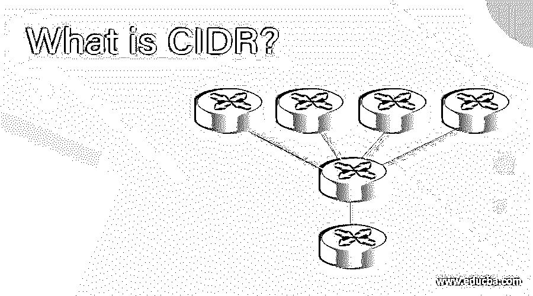

# 什么是 CIDR？

> 原文：<https://www.educba.com/what-is-cidr/>

## CIDR 简介

无类域间路由(CIDR)是一种分配 IP 地址和 IP 路由的方法。互联网协议(IP)标准的集合用于创建网络和单个设备的唯一标识符。IP 地址允许向特定的计算机传输独特的信息包。

### 什么是 CIDR？

CIDR 主要用于高效使用 IP 地址和解决路由表爆炸问题。RFC(征求意见稿)1518 和 RFC 4632 对此进行了定义。这是一个地址块分配。IPV4 寻址系统中有五种不同的类别。IP 地址类别用于互联网 IP 地址分配。

<small>网页开发、编程语言、软件测试&其他</small>

它们是 A 类地址、B 类地址、C 类地址、D 类地址、E 类地址。

**A 类地址:**A 类中，考虑第一位。它总是被设置为零。它可以从 1 获取 IP 地址。X.X.X 至 126.X.X.X。

**B 类地址:**B 类中，考虑前两位。它可以将 IP 地址从 128.0.X.X 改为 191.255.X.X。

**C 类地址:**C 类中，考虑前三位。它可以采用从 192.0.0.X 到 223.255.255.X 的 IP 地址。

**D 类地址:**考虑 D 类内前四位。它可以采用 224.0.0.0 到 239.255.255.255 之间的 IP 地址。这个类用于多播。

**E 类地址:**E 类中的 IP 地址保留用于研发。它可以采用 240.0.0.0 到 255.255.255.254 之间的 IP 地址。

因此，根据需求，我们可以选择 IP 地址。

对于主机地址，我们使用 A 类/B 类/c 类的 IP 地址。

如今，网络地址范围使用无类域间路由。通过使用 CIDR，旧的使用 A 类、B 类、C 类 IP 地址的方式被取代。在旧的方法中，如果我们以 B 类为例，因为它是最常用的。如果任何机构或任何组织需要主机，他们将获得主机，但在大多数情况下，所有分配的主机都没有得到使用，甚至导致路由表爆炸。

在 CIDR，需要 IP 地址的人必须从服务提供商那里购买 IP 地址分配器；它可以是购买者要求的任何尺寸。每当基于地址前缀启用它时，它允许不同级别的不同路由器使用不同长度的前缀进行路由。CIDR 用于 IPV4。IPV4 是 32 位，最常用的网络是/8、/16、/24 和/32。

### CIDR 是如何工作的？

CIDR 是传统子网划分的替代方案。它也被称为无类寻址。它由 CIDR 板块组成；通过这种方式，它可以根据用户的需求，按照一定的规则动态地分配 IP 地址。互联网号码分配机构(IANA)处理 CIDR 块的分配。

#### CIDR 街区

该块包含 IP 地址。这个程序块由 3 个基本规则组成。

下面提到的 3 条基本规则:

**规则 1:** 在 CIDR 块中，分配给主机的 IP 地址应该是连续的。

**规则 2:** 块的大小应该是 2 的幂，应该等于 IP 地址总数。

**规则三:**块的大小必须能被块的第一个 IP 地址整除。

#### CIDR 符号

CIDR IP 地址表示与 IP 地址相同；它以一个反斜杠后跟一个数字结束。n 代表网络位数。它被称为 IP 网络前缀。

CIDR IP 地址的一般表示方式是

阿拉伯联合酋长国

### 例子

如果给我们 CIDR 表示，我们可以找到 IP 地址的范围。

我们可以用例子来看这个。

#### 示例#1

21.19.35.40/24.是 CIDR 的代表，找到 CIDR 区块的 IP 地址了吗？

24 代表用于识别网络的位数。

这 5 位用于标识主机。

21.19.35.40/24.是 CIDR 的地址

第一个 IP 地址是 21.19.35.0

最后一个 IP 地址是 21.19.35.255

总费用是 256。

网络掩码是 255.255.255.0。

#### 实施例 2

表示为 255.255.255.255/31。找到 CIDR 街区的 IP 地址吗？

31 代表用于识别网络的位数。

1 位用于标识主机。

CIDR 的地址是 255.255.255.255/31。

第一个 IP 地址是 255.255.255.254

最后一个 IP 地址是 255.255.255.255

总成本为 2。

网络掩码是 255.255.255.254。

我们可以从 IP 地址块中找到 CIDR 地址块。

#### 实施例 3

IP 地址范围是从 21.19.35.64 和 21.19.35.127。找到 CIDR 街区了吗？

IP 地址范围是从 21.19.35.64 和 21.19.35.127。

在继续之前，应该检查上面提到的 CIDR 块规则，如果它们被满足，那么它是 CIDR 块。

所以块的大小是 2 6。(即 127–64+1 = 64)

位数= 32–6 = 26。

21.19.35.64/26.的 CIDR 街区

#### 实施例 4

IP 地址范围从 255.255.255.32 到 255.255.255.63。找到 CIDR 街区了吗？

IP 地址范围从 255.255.255.32 到 255.255.255.63。

在继续之前，应该检查上面提到的 CIDR 块规则，如果它们被满足，那么它是 CIDR 块。

所以块的大小是 2 5。(即 63–32+1 = 64)

位数= 32–5 = 27。

CIDR 街区是 255.255.255.32/27。

### 推荐文章

这是一本关于什么是 CIDR 的指南。在这里，我们讨论 CIDR 是如何工作的，并举例说明如何找到 IP 地址的范围。您也可以看看以下文章，了解更多信息–

1.  什么是亚马逊 VPC？
2.  [什么是 DHCP？](https://www.educba.com/what-is-dhcp/)
3.  [PHP 中的套接字编程](https://www.educba.com/socket-programming-in-php/)
4.  [c++中的重载和重写](https://www.educba.com/overloading-and-overriding-in-c-plus-plus/)

