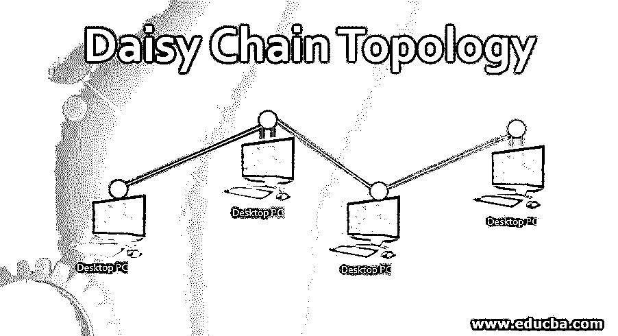

# 菊花链拓扑

> 原文：<https://www.educba.com/daisy-chain-topology/>

## 菊花链拓扑简介

网络的结构由一个或多个节点或计算机连接而成。这取决于任何额外节点对于网络布置都是强制性的要求。根据结构和要求向网络拓扑添加节点称为菊花链。菊花链这个名字来源于病毒恶作剧。本文简要论述了菊花链网络的重要性和应用。

### 什么是菊花链拓扑？

在菊花链网络中，一个网络节点连接到计算机网络中的下一个节点。它用于在计算机网络的中途传输信息。一旦消息从节点发送出去，它就沿着通道向下传递，直到相关的消息到达目的节点。有两种类型的菊花链网络，如线性菊花链和环形菊花链。它可以以线性结构或环形结构连接。

<small>网页开发、编程语言、软件测试&其他</small>

如果网络的第一个节点和最后一个节点不相连，则称之为线性。如果网络的第一个节点和最后一个节点相连接，则形成一个环形结构菊花链拓扑。在线性结构中，消息从一个系统流向另一个系统。但是在环形结构中，消息的流动是双向的。线性菊花链结构与电气串联结构相同，其中一个节点上的任何攻击都会影响电路的其他部分。

它的通用性最低，因为对一个网络的攻击会影响整个系统的其余部分，从而导致生产效率下降。但是在环形结构中，数据可以双向传输，并且可以双向发送。它防止一个节点故障消除网络中受影响的部分。网络拓扑包括将通道从一个系统传输到另一个系统的集线器。例如，星型拓扑在多节点攻击时进行管理，而不影响工作系统的生产率。

### 为什么我们使用菊花链拓扑？

菊花链网络有很多优点。它不会创建任何复杂的电缆网络，并且多台计算机的功能只需要有限的布线。它通过降低集群形成的复杂性来清理空间。它仅使用长度最短的短电缆来连接端口和显示器。因此，它减少了电线的总长度，只需要最少的 PVC 数量，这是有成本效益的。显示器之间的连接很容易实现，即使它位于偏远地区。因为连接计算机和端口只需要一根显示电缆。

要求计算机图形板具有单个显示输出端口，而不是几个板。因此，对于小型个人电脑用户和笔记本电脑用户来说，实现菊花链网络非常简单，因为他们只需要有限的输出。菊花链网络是一个可靠的系统，因为与其他复杂的电缆系统不同，电缆不会意外拔出。毕竟，显示端口的夹子连接到终端，这对于查看敏感信息是很重要的。菊花链不会影响显示器的刷新率，这意味着图像的清晰度不会下降，因为它们直接连接到个人电脑。

菊花链接口的一个例子是 firewire 和小型计算机系统接口，它们使计算机能够与诸如 CD-ROM、磁盘、磁带驱动器、扫描仪和打印机之类的外围组件进行交互，这比现有的接口组件工作得更快、更灵活。它因其简单性和可伸缩性而广为人知。

根据需要，我们可以在网络中添加或删除多个节点。菊花链系统可以尽可能地扩展，但是如果节点分散在整个特定的地理区域，则它在该系统中不适用。因此，在这些情况下，电缆在整个网络中以之字形连接，与节点之间的实际距离相比，电缆变得很大。这降低了位于系统另一端的用户的操作速度。

### 菊花链网络的重要性

小型计算机系统接口是遵循菊花链网络的数字系统的最好例子，菊花链网络意味着总线结构。由于它是一种总线模型，因此应使用接口选项在内部端接器件，或者在系统的最后一个组件上插入一个终结器。MIDI 通常被实现为菊花链组件。

对于设备来说，在用于链接的 OUT 或 THRU 端口上操作是标准的。THRU 端口以最小的延迟传递信息，而 OUT 端口传输整个再生信号，该信号可以在任何延迟的情况下添加、改变或删除消息。如果链很长，信号到达的差异可能会变化，并且有可能发生断裂，导致系统不可靠，因此一些系统具有菊花链功能。

当内置个人电脑和 RAID 阵列时，JTAG 和 Thunderbolt 接口支持菊花链网络。对于模拟信号，连接类似于总线，可以部署在网络内的中继器或放大器中，以响应衰减。但是在数字信号中，它不能被修改，因为它们是离散的。

### 结论

因此，菊花链网络是一个简单可靠的网络，有其特定的应用和部署。UART 端口的多个组件相互链接以协同工作，并有助于在紧急情况下随时抓住总线的激活，防止网络的其余部分，而不影响其工作效率。

### 推荐文章

这是菊花链拓扑的指南。在这里，我们讨论为什么我们使用菊花链拓扑及其网络的重要性。您也可以看看以下文章，了解更多信息–

1.  [部分网状拓扑](https://www.educba.com/partial-mesh-topology/)
2.  [星形网络拓扑](https://www.educba.com/star-network-topology/)
3.  [混合网络拓扑](https://www.educba.com/hybrid-network-topology/)
4.  [什么是网络拓扑？](https://www.educba.com/what-is-network-topology/)

