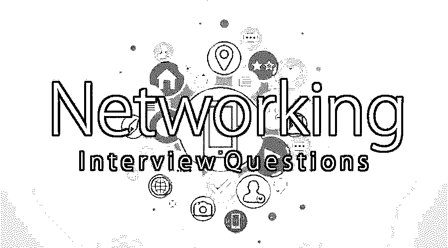

# 网络面试问题

> 原文：<https://www.educba.com/networking-interview-questions/>

## 网络面试问题介绍

大多数软件行业都是在网络上运行的。不在网络中的计算机只是系统中无法使用的一部分。网络是两台或多台使用协议的计算机的连接，它们倾向于在需要时提供信息。网络面试问题在大多数领域都很常见，无论是系统管理员、程序员还是 it 部门的任何人。

现在，如果你想找一份与网络相关的工作，你需要准备 2022 年的网络面试问题。根据不同的职位描述，每次面试都是不同的。在这里，我们准备了重要的[人脉](https://www.educba.com/networking-commands/)面试问答，帮助你面试成功。

<small>网页开发、编程语言、软件测试&其他</small>

在这篇 2022 年网络面试问题的文章中，我们将提出 10 个最重要和最常用的网络面试问题。让我们来看看在网络面试中可以问到的基本问题。

### 第 1 部分-网络面试问题(基础)

这第一部分包括基本的面试问题和答案。

#### Q1。解释 OSI 参考模型的七层？

**答案:**
下面是 OSI 参考模型的七层:

*   **物理层**:该层将数据位转换成无线电信号。以太网就是一个例子。
*   **数据链路层**:在数据链路层，对数据包进行编码和解码，并提供给节点数据传输。
*   **网络层**:该层将可变长度的数据从一个节点传输到另一个节点。这种数据称为数据报。
*   **传输层**:该层在不同节点之间传输数据，并不断对数据包进行确认。它跟踪所有传输和传输故障。
*   **会话层**:这一层管理网络上不同系统之间的连接。它有助于在所有应用程序之间建立协调和终止连接。
*   **表示层**:将数据转换成应用层可以接受的形式。
*   **应用层**:这是最终用户和应用程序交互的最后一层。这一层提供诸如电子邮件、文件传输等服务。

#### Q2。解释一下 DNS 的概念？

**回答:**
[DNS 代表域名系统](https://www.educba.com/what-are-the-types-of-dns-servers/)。它是一个命名系统，包括物理节点及其应用程序。DNS 是一种通过网络轻松找到资源的方式。它给一个特定的 IP 地址命名。人们总是很容易记住 xyz.com 的 IPV4 地址或 IPV6 地址。域名系统负责通过分层映射对应的 IP 地址来分配域名并工作。

让我们转到下一个网络面试问题。

#### Q3。简单解释一下盘、兰、韩、三、万的意思？

**答案:**

*   PAN: 这表示个人区域网络。它是一个人使用的连接。
*   LAN: 表示局域网，连接学校、办公室等小型场所的所有计算机。
*   韩:这代表家庭区域网络，帮助连接一些个人电脑、电话、传真机等设备。
*   **SAN** :这代表存储区域网络。它是不同存储设备之间的连接。
*   **WAN** :这是广域网的缩写。它连接各种设备、电话、打印机等。可以是不同的城市或国家，甚至是大洲。

#### Q4。交叉电缆和标准电缆的用途是什么？

**回答:**
以上是面试中问的基本人脉面试问题。网络电缆是将网络中的所有系统连接在一起所必需的。这种电缆可以是直线电缆，也可以是交叉电缆。这两种电缆具有不同的布置，用于不同的目的。直电缆可用于将计算机连接到交换机、集线器、调制解调器或路由器。当计算机连接到计算机或带有交换机的交换机，或带有集线器的集线器时，使用交叉电缆。

#### Q5。什么是防火墙？

**回答:**
防火墙是一种[网络安全系统](https://www.educba.com/what-is-network-security/)，帮助保护你的网络免受未经授权的访问。它可以防止来自网络外的计算机的恶意访问。当您想要限制外部用户的访问时，防火墙也很有用。防火墙主要由硬件设备、软件程序或两者的组合组成。所有来自网络或去往网络的消息都必须通过这个防火墙。安全标准检查防火墙，满足这些标准的消息通过网络传递。如果消息不满足标准，则消息被阻止，并且不再发送到网络。防火墙可以像任何软件一样安装，并且可以在以后进行定制，以获得对功能和安全性的控制。

### 第 2 部分-网络面试问题(高级)

现在让我们来看看高级面试问题。

#### Q6。什么是代理服务器，如何保护它？

**答:**
[代理服务器是防止未被授权访问一个 IP 地址的外部用户访问它的服务器](https://www.educba.com/types-of-proxy-servers/)。当数据传输开始时，需要 IP 地址，也需要将正确的 IP 地址路由到域名的 DNS。代理服务器还维护所有黑名单网站的列表，以自动防止所有内部用户受到病毒、蠕虫等的攻击。

#### Q7。什么是 127.0.0.1 和 localhost？

**答案:**
IP 地址 127.0.0.1 是为本地主机连接预留的。这些本地主机网络是为互联网上最大的客户或一些关键人物保留的。要检查本地主机服务器是否工作正常，您必须 ping 服务器并检查其响应。如果不是责任，那么原因可以是服务器宕机或者网卡状态不好。127.0.0.1 是一个环回连接，如果您得到了一个响应，那么这表明您的硬件状况良好。

让我们转到下一个网络面试问题。

#### Q8。解释互联网、内部网和外部网的区别？

**答:**
这三个都是网络接入方式的术语。它们定义了网络内外每个用户的访问级别。

*   互联网:在互联网中，任何人都可以通过万维网从任何地方访问所有应用程序。
*   **内网**:限制同一组织内用户的访问。组织外的所有用户都不能访问该网络。
*   **外联网:**当外部用户被允许访问一个组织的网络时，那么它就是外联网。他们可以访问组织中有限的应用程序。

#### Q9。什么是路由器？

**答案:**
这些是在面试中被问到的流行的网络面试问题。路由器是一种物理设备，是两个网络之间的网关。它负责将数据包从一个网络转发到另一个网络，并在两个网络之间建立互连链路。

#### Q10。VPN 在企业界是如何使用的？

**答案:**
虚拟专用网络允许远程用户安全地连接到组织的网络。所有公司、教育机构都使用 VPN，这样用户就可以远程访问网络。

### 推荐文章

这是一个网络面试问题和答案的列表指南，以便候选人可以轻松地解决这些网络面试问题。在这篇文章中，我们研究了在面试中经常被问到的网络面试问题。您也可以阅读以下文章，了解更多信息——

1.  [网络安全面试问题](https://www.educba.com/network-security-interview-questions/)
2.  [网络战略](https://www.educba.com/networking-strategies/)
3.  [Teradata 面试问题](https://www.educba.com/teradata-interview-questions/)
4.  [数字营销面试问题](https://www.educba.com/digital-marketing-interview-questions/)

