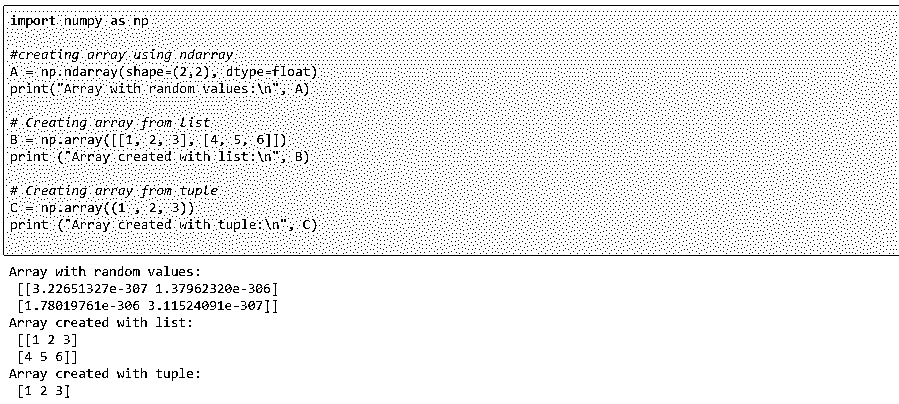

# NumPy 简介

> 原文：<https://www.educba.com/introduction-to-numpy/>


## NumPy 简介

在本文中，我们将了解 NumPy 的简介。NumPy 是一个 python 包，主要用于科学和数值计算。NumPy 是两个词的组合词，由“数字”和“Python”混合而成。它在数据科学家和分析师中非常有名，因为它提供了高效率(运行时速度)和大范围的数组操作。在本帖中，我们将了解 NumPy 库。NumPy 最初是由 Jim Hugunin 在 90 年代后期作为“数字”开发的。numpy 的当前版本是由 Travis Oliphant 在 2005 年通过将 numarray 竞赛中的功能整合到 numeric 中而创建的。

### 什么是 NumPy 库？

NumPy 库让我们能够高效地存储和处理大量密集数据。在 NumPY 中，数据以数组的形式存储。这些数组是这个库的关键。NumPy 中的数组类似于 python 内置类型“list”。最接近 numpy 数组的是 C 数组。这可以归因于 NumPy 主要是用 C 语言编写的。但是 [numpy 阵列提供了](https://www.educba.com/numpy-array-functions/)比两者更高效的数据存储和操作。

<small>网页开发、编程语言、软件测试&其他</small>

### NumPy 的组件

现在，我们将开始了解 Numpy 的一些基本组件。第一步是 NumPy 安装。如果您一直在关注我们，您可能已经阅读了关于“Numpy 安装”的帖子。您可以按照上面提到的步骤在您的系统上安装模块/库。如果您想亲自尝试并了解安装过程:

#### 导入数字

在 python 中，像 numpy、matplotlib、scipy 等包/库。不过是一个扩展模块。因此，安装一个包或多或少类似于下载它的脚本并把它作为一个头文件/扩展文件。因此，每当您想要使用 NumPy 库的一个属性时，您必须将它作为一个头文件导入。我们可以使用下面的命令导入 NumPy。为了方便起见，我们创建了“np”作为 NumPy 的别名。这个别名在数据科学界非常流行。

```
import numpy as np
```

**输出:**


因此，我们将使用上述方法在 Numpy 中导入和使用各种类和方法。

#### 使用 NumPy 类和方法

[多维数组](https://www.educba.com/powershell-multidimensional-array/)构成了 Numpy 库的核心。我们可以用下面的方法在 NumPy 中创建一个数组。

*   **ndarray(shape，type):** 用随机数创建给定形状的数组
*   **array(array_object):** 从列表或元组中创建给定形状的数组
*   **zeros(shape):** 创建一个给定形状的全零数组
*   **ones(shape):** 创建一个给定形状的全 1 数组
*   **full(shape，array_object，dtype):** 用复数创建给定形状的数组
*   **数组(范围):**创建具有指定范围的数组

### NumPy 数组创建简介示例

下面是更好理解的程序:

**代码:**

```
import numpy as np
#creating array using ndarray
A = np.ndarray(shape=(2,2), dtype=float)
print("Array with random values:\n", A)
# Creating array from list
B = np.array([[1, 2, 3], [4, 5, 6]])
print ("Array created with list:\n", B)
# Creating array from tuple
C = np.array((1 , 2, 3))
print ("Array created with tuple:\n", C)
```

**输出:**




### NumPy 的特性

在这里，我们将学习 NumPy 库的一些特性。这些功能类似于 C 语言。

*   **支持 n 维数组:** NumPy 数组是多维或 n 维的固定大小的列表或矩阵，具有同质元素(即数组中所有元素的数据类型都相同)。
*   **需要连续的内存分配:**这样可以提高效率，因为数组的所有元素都可以从数组开始处的固定偏移量直接访问。
*   支持使用裁剪、切片、选择等进行选择。
*   支持矢量化和复杂操作。
*   支持[线性代数](https://www.educba.com/numpy-linear-algebra/)，傅立叶变换，以及复杂的广播功能。

简而言之， [NumPy 提供了类似于 C/C++的](https://www.educba.com/numpy-ndarray/)功能，但使用起来却很简单。

### Numpy 的优点和缺点

下面是 Numpy 的优点和缺点:

#### NumPy 的优势

以下几点解释了 NumPy 的优势:

*   Numpy 的核心是它的数组。使用 Numpy 数组的[的一个主要优点是，与 python 中类似的数据结构(列表和元组)相比，它们占用更少的内存空间，并提供更好的运行速度。](https://www.educba.com/numpy-arrays/)
*   Numpy 支持一些特定的科学功能，如线性代数。它们帮助我们解线性方程。
*   Numpy 支持矢量化运算，如元素加法和乘法，计算 Kronecker 积等。Python 列表不支持这些特性。
*   它是 MATLAB、OCTAVE 等的很好的替代品，因为它提供了类似的功能和支持，开发速度更快，精神负担更少(因为 python 很容易编写和理解)
*   NumPy 非常适合数据分析。

#### NumPy 的缺点

以下几点解释了 NumPy 的缺点:

*   **在 Numpy 中使用“南”:**“南”代表“不是数”。它旨在解决缺少值的问题。NumPy 本身支持“nan ”,但 Python 中缺乏跨平台支持，这给用户带来了困难。这就是为什么我们在 Python 解释器中比较值时可能会遇到问题。
*   **需要连续的内存分配:**插入和删除操作成本很高，因为数据存储在连续的内存位置，而移位需要移位。

### 结论 NumPy 简介

NumPy 是一个用于数值和科学计算的 python 包。它提供了更好的运行时间和空间复杂度。它提供了各种各样的数组操作。如果您希望执行通用操作，请使用 python 列表。但是，如果您关心性能和空间复杂性，请使用 Numpy。

### 推荐文章

这是 NumPy 入门指南。这里我们讨论什么是 NumPy 库？Numpy 的组件、示例以及优缺点。您也可以浏览我们的其他相关文章，了解更多信息——

1.  [NumPy 是什么？](https://www.educba.com/what-is-numpy/)
2.  [Linux 简介](https://www.educba.com/introduction-to-linux/)
3.  [Python 简介](https://www.educba.com/introduction-to-python/)
4.  [NumPy 中的矩阵](https://www.educba.com/matrix-in-numpy/)


