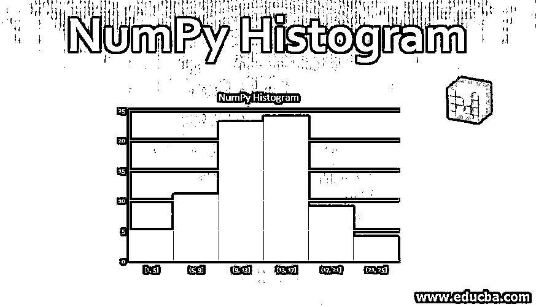
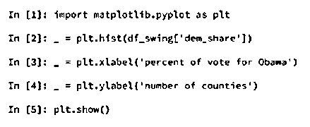
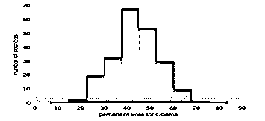

# 数字直方图

> 原文：<https://www.educba.com/numpy-histogram/>




## 数字直方图简介

著名的编程语言 python 有一个专门为科学计算设计的核心库，它提供了集成 C 和 C ++等语言的工具，称为 NumPy(意为数字 python)。对于那些通过调用预定义的 [numpy 函数](https://www.educba.com/numpy-functions/)或工具进行并行数学运算来处理数据科学和大数据分析的编码人员来说，它特别有用。这个库中的特性之一是直方图函数，称为 NumPy Histogram()。

numpy 直方图功能使数据科学家能够根据数据及其各自的频率分布进行图形分析。Numpy 直方图函数有两个参数，称为条柱和输入数组。箱是矩形块，以对应于各自的类间隔的相等水平宽度隔开。这些豆子高度的差异，代表了这些课间频率的差异。

<small>网页开发、编程语言、软件测试&其他</small>

### 句法

以下是 numpy histogram 函数的应用程序必须用 [Python 语言编写的代码表示:](https://www.educba.com/python-scripting-language/)

```
import numpy as np
//The core library of numpy is being imported so that the histogram function can be applied which is a part of the numpy library
numpy.histogram (a, bins=10, range = None, normed = None, weights = None, density = None)
```

设置各种标准以定义直方图数据由仓、范围、密度和权重表示。

matplot 库中另一个名为 plt()的函数用于将数字数据转换成直方图。该函数使用数组中的数据作为参数，将其转换为直方图。

### 因素

下面是下面提到的 NumPy 直方图的参数

**1。a:** array_like(代表用户输入的一组值)

这些值将被排列在一组数组中，这些数组将被展平并计算给返回直方图的人。

**2。bin:**可以是 int 或 sequence(字符串或标量值)

如果箱是 int(其定义了在默认值为 10 的范围内已经提到的具有相等宽度的箱的总数)

如果引脚是顺序的，那么这表示阵列中的单调增加，这影响到容器的宽度边缘(这包括产生两个不一致的容器宽度的最右边的年龄)

直方图的条块边缘定义了根据条块的最佳宽度必须使用的计算方法。如果 bin 有字符串值，情况尤其如此。

**3。范围:**(浮动[上限值]，浮动[下限值])(可选)

操作和仓位的下限通过浮点值表示。如果没有提供限制，自动范围由语法 a.min()、a.max()表示的系统获取。该范围有助于忽略或绕过在计算过程中不考虑的位于该范围之外的任何值，这对自动 bin 计算有很大影响。必须注意，在该范围中提到的第一元素的值必须小于或至少等于第二元素的值。

**4。normed:** bool(代码语法可选)[从 Python 1 . 6 . 0 版本发布以来，它已被弃用]

Python 中使用的密度参数在功能上是等效的，但是当条柱宽度的分布相等时，其应用会产生结果差异。

**5。权重:** array_like(代码语法可选)

一个权重数组，与形状相同。中的每个值仅将其关联权重贡献给容器计数(而不是 1)。如果密度为真，则权重被归一化，因此密度在该范围内的积分保持为 1。

**6。density :** bool(代码语法可选)

容器计数根据其相关权重计算每个值的贡献。权重的密度值真实归一化使得密度的积分保持在 1 以上。如果该值为假，则每个结果箱中包含多个样本。

### 在 NumPy 中实现直方图的示例

让我们考虑一下在不同国家的选举中支持奥巴马的票数的例子。因此，无论是否调用 matplot 库模块的函数来生成直方图，都必须使用该模块。




*   名为下划线的虚拟变量被分配给直方图。创建直方图后，必须标记轴。直方图的条轴可以由用户具体改变。


*   除此之外，用户还可以通过使用 bins 关键字来指定 bin 的数量(比如 20 个), matplotlib 将自动生成 20 个均匀分布的 bin。
*   一般来说，最好使用 seaborn 风格设置，这是一个可视化软件包，主要由 Michael Waskom 编写。也可以通过使用 SNS set 函数，使用下面提到的代码，将其用作默认值。


通过执行上述编码过程，生成以下直方图作为输出，该直方图表示各个国家支持奥巴马的票数。




### 结论

数字直方图功能提供了预先开发的图形表示功能，这是典型的并且非常方便地充当执行诸如边缘检测或阈值处理的四个功能的准备步骤。在处理需要可视化的数据和使用压缩和未压缩的图像格式创建视觉差异时，它是一个非常有效的工具。作为执行分析的工具，对各种直方图之间的颜色变化进行项目检测是特别有利的。

### 推荐文章

这是一个数字直方图指南。这里我们讨论在 NumPy 中实现直方图的例子以及参数。您也可以看看以下文章，了解更多信息–

1.  [NumPy 是什么？](https://www.educba.com/what-is-numpy/)
2.  [NumPy 数据类型](https://www.educba.com/numpy-data-types/)
3.  [NumPy 地板()](https://www.educba.com/numpy-floor/)
4.  [NumPy Ndarray](https://www.educba.com/numpy-ndarray/)


