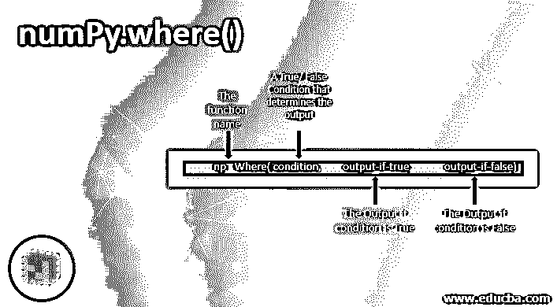
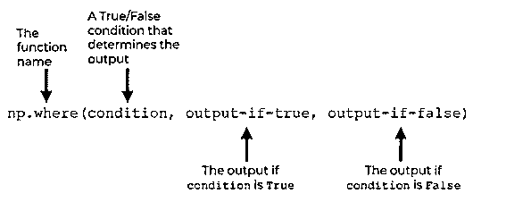
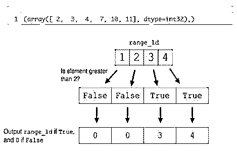

# numPy.where()

> 原文：<https://www.educba.com/numpy-where/>




## numPy.where()简介

numPy.where()函数用于向用户返回数组中存在的某些元素的特定索引，该数组由用户输入，其中满足关于函数参数的某些预定义条件。简而言之，我们可以说，该函数帮助用户定位具有指定条件的元素在已输入的数组中的确切位置。这可以通过使用单个参数以及指定多个参数来实现。

【numPy.where()函数的语法

<small>网页开发、编程语言、软件测试&其他</small>

```
numpy.where(condition[,x,y]
```

**Python 语言中 numPy.where()函数的参数**

```
condition : array_like , bool
```

用于识别用户输入的数组中的元素的条件检查符合代码语法中指定的条件。如果条件为假，则使用 x 值。如果条件假为假，则使用 y 值。这些通常是布尔值。

```
x, y: array_like
```

在真或假的情况下要被替换的值以及作为参数的条件必须被转换成广播到结构化的数组，以显示需要具有特定方向的结果元素。

**返回 Python 语言中的 numPy.where()函数**

```
out:ndarray
```

它是在用户输入的原始数组根据所应用的条件进行处理之后被吸收的输出数组，并且元素被条件元素 X 和 y 替换。

**注意当 numPy.where()函数的条件参数被传递时**

*   必须注意的是，当您的条件中的所有参数都已通过，并且生成的结果消除了由所选 X 和 Y 值替换的条件值时，将生成所有自由数组，这些数组应该具有相似的维数大小。
*   如果替换值(即，x 和 y 自变量)没有被传递，并且条件单独被应用于 numpy.where()函数，则结果再现将是数组元组(即，对于输入的原始数组的每个轴有一个数组)。这些数组元组将包含特定的索引，即测试出与已通过的布尔条件的真值相匹配的元素。

### numPy.where()函数是如何工作的？

在 numPy.where()的函数能力中，我们必须看到，当逻辑运算通过函数运行时，如果条件为真，则返回一个布尔数组。




运行 numpy.where()函数时，直观地显示系统处理和识别的内容:

创建一个包含元素列表的数组:

```
a1 = n1.array([21 , 22 , 23, 24 , 25 , 26 , 27 , 28 , 29 , 30)]
```

为输入要测试的数组传递条件表达式:

```
ans = n1.where((a1 > 22) & (a1 < 26))
```

该函数遍历用户输入的数组中的每个元素，以检查它是否按照函数中给定的条件执行。对于测试为真的每个元素，numpy.where()将该元素的索引捕获到一个新数组中，该数组包含测试为真的每个元素的索引。




此图显示了如何针对隐含的特定条件检查数组并根据返回的索引返回相关输出数组的机制。

### numPy.where()函数的示例

以下示例显示了如何在 python 语言代码中使用 numPy.where()函数来有条件地导出符合条件的元素:

#### 示例#1

Python numPy 函数集成程序，演示了 where()函数的用法。

**代码:**

```
import numpy as n1
# entering the array
a1 = n1.array([[10, 20, 30], [40, 50, 60]])
# printing the elements in the given array
print ("The original array entered by the user")
print(a1)
# specifically sorting out the array which are greater than 30
print ("Print all indices containing elements greater than 30")
ans = n1.where(a1>30)
print(ans)
print("Displaying all the elements of the array that are greater than 30")
print(a1[ans])
```

**输出:**


#### 实施例 2

Python numPy 函数集成程序，演示了 where()函数的用法。

**代码:**

```
import numpy as n2
# entering the elements of the original array
a2 = n2.array([[4, 5, 6], [7, 8, 9]])
# printing the elements in the given array
print ("The original array entered by the user")
print(a2)
# specifically sorting out the array which are less than 7
print ("Print all indices containing elements less than 7 ")
ans2 = n2.where(a2<7)
print(ans2)
print("Displaying all the elements of the array that are less than 7")
print(a2[ans2])
```

**输出:**


### 结论

numPy.where()函数提供了一个预先开发的功能，这是一个典型的非常方便的功能，可以作为主要的大阈值数据处理程序的预备步骤函数。它作为一种解决方案，可以防止创建许多额外的数组来存储新元素，这样会增加处理时间并减少程序的冗长性。

### 推荐文章

这是 numPy.where()的指南。在这里，我们讨论 numPy.where()的介绍，以及该函数的工作原理和相应的示例。您也可以看看以下文章，了解更多信息–

1.  [NumPy 函数](https://www.educba.com/numpy-functions/)
2.  [NumPy 数组函数](https://www.educba.com/numpy-array-functions/)
3.  [NumPy.argmax()](https://www.educba.com/numpy-argmax/)
4.  [numpy.linspace()](https://www.educba.com/numpy-linspace/)


