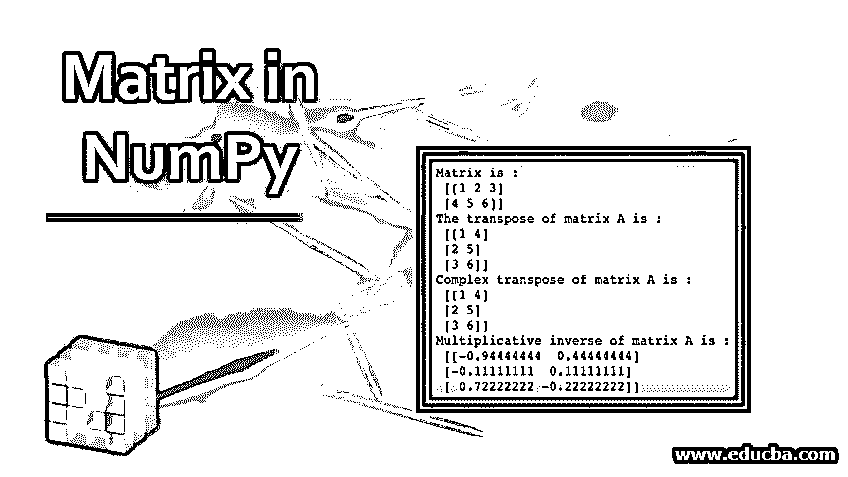
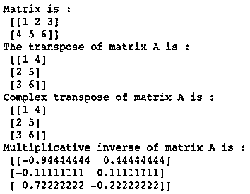
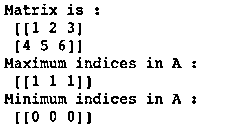
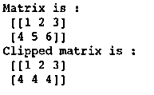
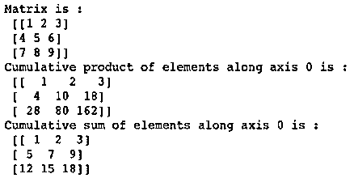
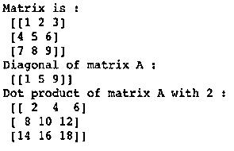

# 数字矩阵

> 原文：<https://www.educba.com/matrix-in-numpy/>




## NumPy 矩阵简介

Matrix 是 Numpy python 库中 ndarray 类的一个子类。它主要用于将字符串或类似数组的对象转换成 2D 矩阵。这样返回的矩阵是一个特殊的 2D 数组。说到语法，矩阵函数写如下:

**语法:**

<small>网页开发、编程语言、软件测试&其他</small>

```
numpy.matrix(data, dtype, copy)
```

**重要参数:**

*   **数据:**数据应该是数组的形式——就像用逗号分隔的对象或字符串
*   **Dtype:** 返回矩阵的数据类型
*   **复制:**这是一个像旗帜一样的物体。它确定数据是否已经是一个数组。该标志决定是复制数据还是构建新视图。

### 如何在 NumPy 中创建矩阵？

我们可以使用 array()、ndarray()或 matrix()之类的函数在 Numpy 中创建一个矩阵。默认情况下，矩阵函数根据给定的输入创建一个专用的 2D 数组。输入应该是字符串或类似数组对象的形式。让我们使用一个以 string 作为输入类型的 matrix()来演示矩阵的创建。

**代码:**

```
import numpy as np
#creating matrix from string
A = np.matrix('1 2 3; 4 5 6')
print("Array created using string is :\n", A)
```

**输出:**


现在，让我们演示如何使用 matrix()创建矩阵，将一个类似数组的对象作为输入类型。

**代码:**

```
import numpy as np
#creating matrix from array like object
B = np.matrix([[1, 2, 3], [4, 5, 6]])
print("Array created using array like object is :\n", B)
```

**输出:**


### 数字中的矩阵函数及实例

已经讨论了 Numpy 矩阵的创建，现在让我们讨论这个类中的一些重要函数。matrix 子类中的所有函数都非常类似于 ndarray 类。

| **功能** | **描述** |
| 矩阵。英语字母表中第二十个字母 | 返回输入矩阵的转置 |
| 矩阵。英语字母表中第八个字母 | 返回输入矩阵的复共轭转置 |
| 矩阵。英语字母表中第九个字母 | 返回矩阵的乘法逆运算 |
| 矩阵。英语字母表中第一个字母 | 将输入矩阵作为 ndarray 对象返回。 |
| matrix.all() | 检查给定轴上的所有矩阵元素的计算结果是否为真。它类似于 ndarray.all()函数。 |
| matrix.any() | 检查给定轴上的任何矩阵元素的计算结果是否为真。 |
| matrix.argmax() | 返回输入矩阵中沿轴的最大值的索引 |
| matrix.argmin() | 返回输入矩阵中沿轴的最小值的索引 |
| matrix.argsort() | 返回将对矩阵进行排序的索引 |
| matrix.astype() | 返回类型更改后输入矩阵的副本 |
| matrix.choose() | 从输入矩阵中返回一个带有所选索引的新矩阵 |
| matrix.clip() | 从输入矩阵返回一个在选定范围内的新矩阵 |
| 矩阵. compress() | 沿给定轴返回矩阵的选定部分 |
| matrix.conj() | 返回给定矩阵的复共轭 |
| matrix.cumprod() | 沿给定轴返回给定矩阵中元素的累积乘积 |
| matrix.cumsum() | 沿给定轴返回给定矩阵中元素的累积和 |
| matrix.diagonal() | 返回矩阵的对角元素 |
| matrix.dot() | 返回两个矩阵的点积 |

举例说明矩阵函数

#### 例子# 1–寻找给定矩阵的转置和乘法逆的程序

**代码:**

```
import numpy as np
A = np.matrix('1 2 3; 4 5 6')
print("Matrix is :\n", A)
#Transpose of matrix
print("The transpose of matrix A is :\n", A.getT())
#Complex conjugate transpose
print("Complex transpose of matrix A is :\n", A.getH())
#Multiplicative inverse
print("Multiplicative inverse of matrix A is :\n", A.getI())
```

**输出:**




#### 例# 2–在给定矩阵中寻找最大和最小指数的程序

**代码:**

```
import numpy as np
A = np.matrix('1 2 3; 4 5 6')
print("Matrix is :\n", A)
#maximum indices
print("Maximum indices in A :\n", A.argmax(0))
#minimum indices
print("Minimum indices in A :\n", A.argmin(0))
```

**输出:**




#### 例# 3–说明给定矩阵中剪辑的程序

**代码:**

```
import numpy as np
A = np.matrix('1 2 3; 4 5 6')
print("Matrix is :\n", A)
#clipping matrix
print("Clipped matrix is :\n", A.clip(1,4))
```

**输出:**




剪切、切片、压缩和选择是类似的功能，可用于选择输入矩阵/阵列的特定部分。

#### 例# 4–程序寻找一个给定矩阵的累积和与积

**代码:**

```
import numpy as np
A = np.matrix('1 2 3; 4 5 6; 7,8,9')
print("Matrix is :\n", A)
#cumulative product along axis = 0
print("Cumulative product of elements along axis 0 is : \n", A.cumprod(0))
#cumulative sum along axis = 0
print("Cumulative sum of elements along axis 0 is : \n", A.cumsum(0))
```

**输出:**




#### 例 5——用程序找出给定矩阵的点积和对角线值

为了找到给定矩阵的对角线值，我们可以使用带有偏移、轴 1 和轴 2 等属性的对角线函数。

**代码:**

```
import numpy as np
A = np.matrix('1 2 3; 4 5 6; 7,8,9')
print("Matrix is :\n", A)
#diagonal values
print("Diagonal of matrix A :\n", A.diagonal(0,0,1))
#dot product
print("Dot product of matrix A with 2 :\n", A.dot(2))
```

**输出:**




### 矩阵在数字中的优势

*   使用 NumPy 矩阵的一个主要优点是，与 python 中的类似数据结构(列表和元组)相比，它们占用的内存空间更少，运行速度更快。
*   NumPy 矩阵支持一些特定的科学函数，如元素级累积和、累积积、共轭转置和乘法逆等。python 列表或字符串无法支持这些特性**。**

### 结论

NumPy 矩阵是从字符串或类似数组的对象创建的专用 2D 数组。它对科学和数学计算非常有帮助。但是，我们应该记住，矩阵是 numpy 中 ndarray 类的一个子类。因此，matrix 子类中的所有函数都可以使用 ndarray 类来执行。因此，为了成为一名高效的数据科学家或机器学习工程师，必须对 numpy ndarrays 非常熟悉。

### 推荐文章

这是 NumPy 中的矩阵指南。在这里，我们讨论了矩阵的基本概念、功能、优点以及如何在 NumPy 中创建矩阵，并给出了示例和代码实现。您也可以阅读以下文章，了解更多信息——

1.  [numpy.linspace()](https://www.educba.com/numpy-linspace/)
2.  [NumPy.argmax()](https://www.educba.com/numpy-argmax/)
3.  [numpy.ravel()](https://www.educba.com/numpy-dot-ravel/)
4.  [Numpy.argsort()](https://www.educba.com/numpy-argsort/)


