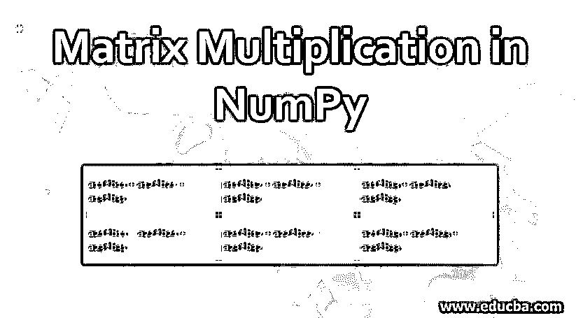
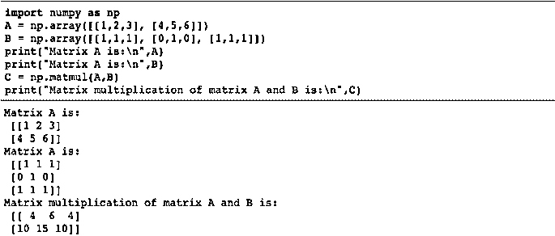
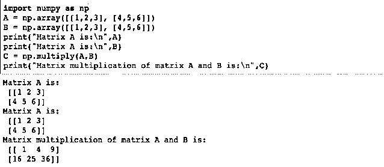
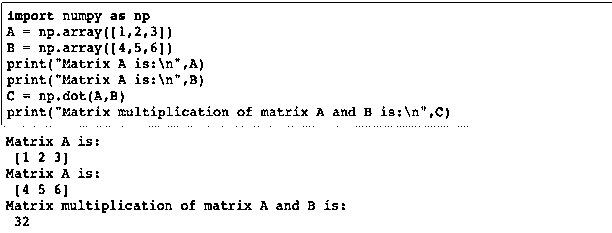
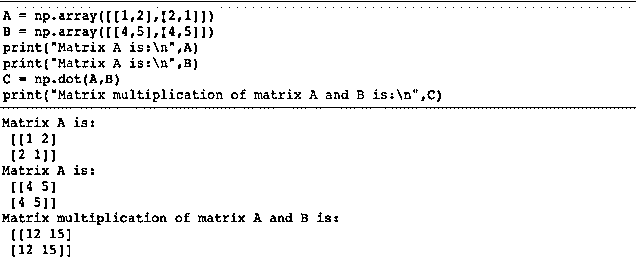

# 数字矩阵乘法

> 原文：<https://www.educba.com/matrix-multiplication-in-numpy/>




## NumPy 中矩阵乘法概述

NumPy 中的矩阵乘法是一个用于科学计算的 python 库。使用这个库，我们可以执行复杂的矩阵运算，如乘法、点积、乘法逆运算等。一步到位。在这篇文章中，我们将学习 numpy 库中不同类型的矩阵乘法。

### 不同类型的矩阵乘法

主要有三种不同类型的矩阵乘法:

<small>网页开发、编程语言、软件测试&其他</small>

| **功能** | **描述** |
| np.matmul(数组 a，数组 b) | 返回两个给定数组的矩阵乘积 |
| np.multiply(数组 a，数组 b) | 返回两个给定数组的逐元素乘法 |
| np.dot(数组 a，数组 b) | 返回两个给定数组的标量或点积 |

#### 1.两个给定数组的矩阵乘积

为了找到两个给定数组的矩阵乘积，我们可以使用以下函数:

```
np.matmul(array a, array b)
```

此函数的输入不能是标量值

| A = | 全部 | a12 | a13 |
| a21 | a22 | a23 |

| B = | b11 | b12 | b13 |
| b21 | b22 | b23 |
| b31 | b32 | b33 |

**A @B =**

| a11*b11 + a12*b21 + a13*b31 | a11*b12 + a12*b22 + a13*b32 | a11*b13 + a12*b23 + a13*b33 |
| a21*b11 + a22*b21 + a23*b31 | a21*b12 + a22*b22 + a23*b32 | a21*b13 + a22*b23 + a23*b33 |

##### 示例#1

说明两个给定的 n-d 数组的矩阵乘积的程序。

**代码:**

```
import numpy as np
A = np.array([[1,2,3], [4,5,6]])
B = np.array([[1,1,1], [0,1,0], [1,1,1]])
print("Matrix A is:\n",A)
print("Matrix A is:\n",B)
C = np.matmul(A,B)
print("Matrix multiplication of matrix A and B is:\n",C)
```




给定数组的矩阵乘积按以下方式计算:

| A= | One | Two | Three |
| Four | Five | Six |

| B= | One | One | One |
| Zero | One | Zero |
| One | One | One |

**A @ B =**

| 1*1 + 2*0 + 3*1 = 4 | 1*1 + 2*1 + 3*1 = 6 | 1*1 + 2*0 + 3*1 = 4 |
| 4*1 + 5*0 + 6*1 = 10 | 4*1 + 5*1 + 6*1 = 15 | 4*1 + 5*0 + 6*1 = 10 |

#### 2.两个给定数组的逐元素乘法

为了找到两个给定数组的元素乘积，我们可以使用下面的函数。

```
np.multiply(array a, array b)
```

| A = | 全部 | a12 | a13 |
| a21 | a22 | a23 |

| B = | a21 | a22 | a23 |
| a21 | a22 | a23 |

**A*B =**

| a11*b11 | a12*b12 | a13*b13 |
| a21*b21 | a22*b22 | a23*b23 |

##### 实施例 2

这个程序演示了两个给定矩阵的逐元素乘法

**代码:**

```
import numpy as np
A = np.array([[1,2,3], [4,5,6]])
B = np.array([[1,2,3], [4,5,6]])
print("Matrix A is:\n",A)
print("Matrix A is:\n",B)
C = np.multiply(A,B)
print("Matrix multiplication of matrix A and B is:\n",C)
```




给定数组的逐元素矩阵乘法按以下方式计算:

| A = | One | Two | Three |
| Four | Five | Six |

| B = | One | One | One |
| Zero | One | Zero |
| One | One | One |

**A * B =**

| 1*1 = 1 | 2*2 = 4 | 3*3 = 9 |
| 4*4 = 16 | 5*5 = 25 | 6*6 = 36 |

#### 3.两个给定数组的标量或点积

任何两个给定矩阵的点积基本上都是它们的矩阵积。唯一的区别是，在点积中，我们也可以有标量值。

| A= | a11 | a12 | a13 |

| B= | b11 |
| b12 |
| b13 |

形容词（adjective 的缩写）B = a11*b11 + a12*b12 + a13*b13

##### 实施例 3

说明两个给定的一维矩阵的点积的程序

**代码:**

```
import numpy as np
A = np.array([1,2,3])
B = np.array([4,5,6])
print("Matrix A is:\n",A)
print("Matrix A is:\n",B)
C = np.dot(A,B)
print("Matrix multiplication of matrix A and B is:\n",C)
```




两个给定一维数组的点积按以下方式计算:

| A= | One | Two | Three |

| B= | Four | Five | Six |

形容词（adjective 的缩写）B = 1*4 + 2*5 + 3*6 = 32

##### 实施例 4

说明两个给定二维矩阵的点积的程序

**代码:**

```
import numpy as np
A = np.array([[1,2],[2,1]])
B = np.array([[4,5],[4,5]])
print("Matrix A is:\n",A)
print("Matrix A is:\n",B)
C = np.dot(A,B)
print("Matrix multiplication of matrix A and B is:\n",C)
```




给定 2D 或 n-D 数组的点积按以下方式计算:

| A = | 英语字母表中第十二个字母 | Two |
| Two | One |

| B= | Four | Five |
| Four | Five |

**A.B =**

| 1*4 + 2*4 = 12 | 1*5+2*5 = 15 |
| 2*4+ 1*4 = 12 | 2*5+ 1*5 = 15 |

##### 实施例 5

一个程序来说明一个标量值和一个二维矩阵的点积

**代码:**

```
A = np.array([[1,1],[1,1]])
print("Matrix A is:\n",A)
C = np.dot(2,A)
print("Matrix multiplication of matrix A and B is:\n",C)
```


| A = | One | One |
| One | One |

标量值= 2

那么，np.dot(2，A) = 2* A

**2*A =**

| 1*2 = 2 | 1*2 = 2 |
| 1*2 = 2 | 1*2 = 2 |

### 结论

Numpy 为[执行矩阵乘法](https://www.educba.com/matrix-multiplication-in-matlab/)提供了广泛的函数。如果您希望执行逐元素矩阵乘法，请使用 np.multiply()函数。输入矩阵的维数应该相同。如果你必须计算两个给定数组/矩阵的矩阵乘积，那么使用 np.matmul()函数。输入阵列的尺寸应采用 mxn 和 nxp 的形式。最后，如果必须将一个标量值和 n 维数组相乘，那么使用 np.dot()。np.dot()是 np.matmul()和 np.multiply()函数的专门化。

### 推荐文章

这是 NumPy 中矩阵乘法的指南。这里我们讨论不同类型的矩阵乘法以及例子和输出。您也可以浏览我们的其他相关文章，了解更多信息——

1.  [Java 中的矩阵乘法](https://www.educba.com/matrix-multiplication-in-java/)
2.  [Java 中的多维数组](https://www.educba.com/multidimensional-array-in-java/)
3.  [NumPy 地板()](https://www.educba.com/numpy-floor/)
4.  [c++中的矩阵乘法](https://www.educba.com/matrix-multiplication-in-c-plus-plus/)


