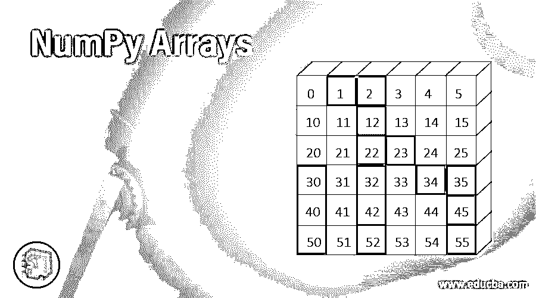
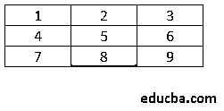
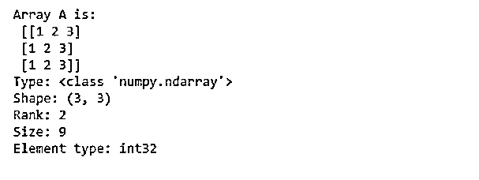
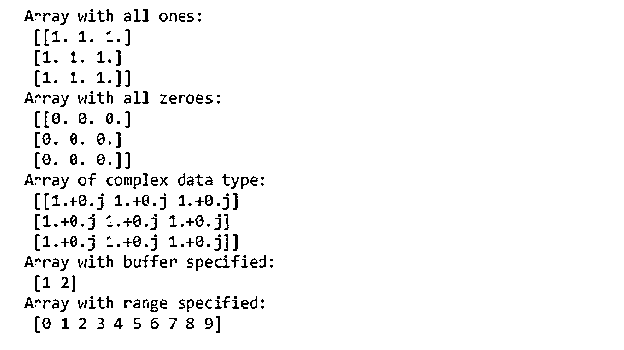
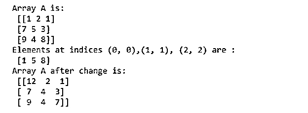
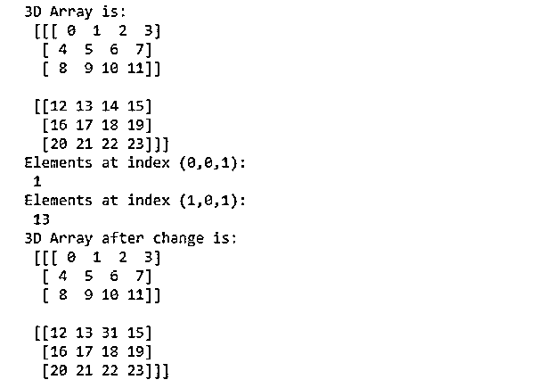

# NumPy 数组

> 原文：<https://www.educba.com/numpy-arrays/>




## NumPy 数组简介

Numpy 数组是 python 列表的良好替代品。它们比 python 列表更好。它们提供更快的速度，占用更少的内存空间。对于不了解 numpy 数组的人，让我们从它的定义开始。它们是多维矩阵或具有相似元素的固定大小的列表。

**1D 阵列**

<small>网页开发、编程语言、软件测试&其他</small>


**2D 阵列**




典型的数组函数如下所示:

```
numpy.array(object, dtype=None, copy=True, order='K', subok=False, ndmin=0)
```

这里，除了对象之外的所有属性都是可选的。因此，即使您不太了解其他参数，也不要担心。

*   **Object:** 指定需要数组的对象
*   **Dtype:** 指定数组所需的数据类型
*   **Copy:** 指定是否要复制数组
*   **顺序:**指定存储器创建的顺序
*   **Subok:** 指定您想要子类还是基类类型数组
*   **Ndmin:** 指定数组的维数

### 数组的属性

数组有以下六个主要属性:

*   **Size:** 数组中元素的总数
*   **形状:**一个数组的形状
*   **维度:**数组的维度或秩
*   **Dtype:** 数组的数据类型
*   **Itemsize:** 数组中每个元素的字节大小
*   **Nbytes:** 数组的总大小，以字节为单位

### NumPy 数组的示例

现在，我们将借助一个示例来理解数组的不同属性。

#### 示例 1–说明阵列的属性

**代码:**

```
import numpy as np
#creating an array to understand its attributes
A = np.array([[1,2,3],[1,2,3],[1,2,3]])
print("Array A is:\n",A)
#type of array
print("Type:", type(A))
#Shape of array
print("Shape:", A.shape)
#no. of dimensions
print("Rank:", A.ndim)
#size of array
print("Size:", A.size)
#type of each element in the array
print("Element type:", A.dtype)
```

**输出:**




### 如何在 NumPy 中创建数组？

Numpy 提供了几个内置函数来从头开始创建和使用数组。可以使用以下函数创建数组:

*   **ndarray(shape，type):** 用随机数创建给定形状的数组
*   **array(array_object):** 从列表或元组中创建给定形状的数组
*   **zeros(shape):** 创建一个给定形状的全零数组
*   **ones(shape):** 创建一个给定形状的全 1 数组
*   **full(shape，array_object，dtype):** 用复数创建给定形状的数组
*   **arange(range):** 创建指定范围的数组

#### 示例 2–NumPy 阵列的创建

**代码:**

```
import numpy as np
#creating array using ndarray
A = np.ndarray(shape=(2,2), dtype=float)
print("Array with random values:\n", A)
# Creating array from list
B = np.array([[1, 2, 3], [4, 5, 6]])
print ("Array created with list:\n", B)
# Creating array from tuple
C = np.array((1 , 2, 3))
print ("Array created with tuple:\n", C)
```

**输出:**


**代码:**

```
# Creating array with all ones
D = np.ones((3, 3))
print ("Array with all ones:\n", D)
# Creating array with all zeros
E = np.zeros((3, 3))
print ("Array with all zeroes:\n",E)
# Creating an array with complex data type
F = np.full((3, 3), 1, dtype = 'complex')
print ("Array of complex data type:\n", F)
#creating an array with buffer
G = np.ndarray((2,), buffer=np.array([1,2,3]),dtype=int)
print ("Array with buffer specified:\n", G)
#creating an array with range
H = np.arange(10)
print ("Array with range specified:\n", H)
```

**输出:**




### 如何在 NumPy 中访问数组元素？

我们可以通过索引来访问数组的元素。我们可以借助下面的例子来更好地理解它。

#### 示例 3–2D 数组中的元素访问

**代码:**

```
import numpy as np
#creating an array to understand indexing
A = np.array([[1,2,1],[7,5,3],[9,4,8]])
print("Array A is:\n",A)
#accessing elements at any given indices
B = A[[0, 1, 2], [0, 1, 2]]
print ("Elements at indices (0, 0),(1, 1), (2, 2) are : \n",B)
#changing the value of elements at a given index
A[0,0] = 12
A[1,1] = 4
A[2,2] = 7
print("Array A after change is:\n", A)
```

**输出:**




#### 示例# 4–3D 数组中的数组索引

**代码:**

```
import numpy as np
#creating a 3d array to understand indexing in a 3D array
I = np.array([[[ 0,  1,  2,  3],
[ 4,  5,  6,  7],
[ 8,  9, 10, 11]],
[[12, 13, 14, 15],
[16, 17, 18, 19],
[20, 21, 22, 23]]])
print("3D Array is:\n", I)
print("Elements at index (0,0,1):\n", I[0,0,1])
print("Elements at index (1,0,1):\n", I[1,0,1])
#changing the value of elements at a given index
I[1,0,2] = 31
print("3D Array after change is:\n", I)
```

**输出:**




### NumPy 中的数组操作

NumPy 中的数组操作示例解释如下:

#### 例子

下面是一个示例，说明数组中元素的求和与相乘

**代码:**

```
import numpy as np
A = np.array([[1, 2, 3],
[4,5,6],[7,8,9]])
B = np.array([[1, 2, 3],
[4,5,6],[7,8,9]])
# adding arrays A and B
print ("Element wise sum of array A and B is :\n", A + B)
# multiplying arrays A and B
print ("Elementwise multiplication of array A and B:\n", A*B)
```

**输出:**


### 结论–NumPy 数组

NumPy 数组是同一类型对象的多维列表。它对科学和数学计算非常有帮助。因此，他们在[数据科学和机器学习](https://www.educba.com/data-science-vs-machine-learning/)中找到应用。

**推荐文章**

这是 NumPy 数组的指南。这里我们讨论了如何在 numpy 中创建和访问数组元素，并给出了例子和代码实现。你也可以看看下面的文章来了解更多-

1.  [NumPy 是什么？](https://www.educba.com/what-is-numpy/)
2.  [NumPy 中的矩阵](https://www.educba.com/matrix-in-numpy/)
3.  [linspace()](https://www.educba.com/numpy-linspace/)
4.  [where()](https://www.educba.com/numpy-where/)


