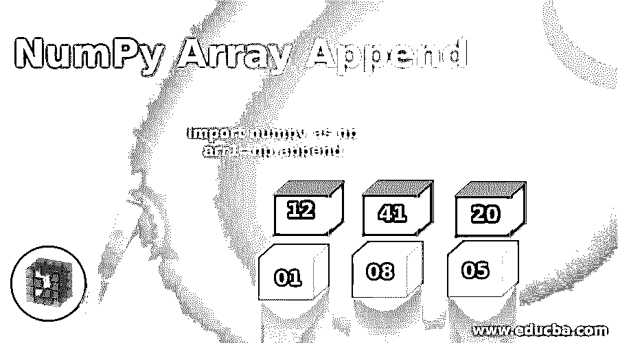
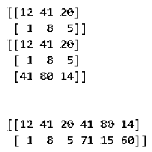
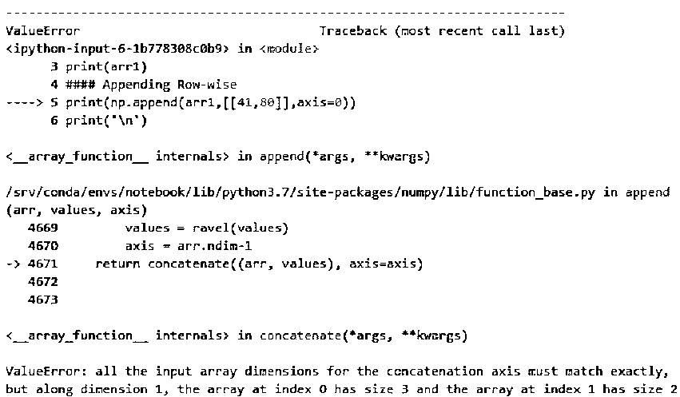

# NumPy 数组追加

> 原文：<https://www.educba.com/numpy-array-append/>




## NumPy 数组追加的定义

NumPy append 是一个函数，主要用于将一个值数组添加或附加到给定数组的末尾，通常，它是通过提及我们想要附加新值集的轴来附加的。axis=0 表示行方式附加，axis=1 表示列方式附加，可以使用 NumPy 中的 append 函数将任意数量的序列或数组附加到给定数组。

**语法:**

<small>网页开发、编程语言、软件测试&其他</small>

Numpy 数组追加函数的基本语法是:

```
numpy.append(ar, values, axis=None)
```

*   numpy 表示数字 python 包。
*   append 是表示追加功能的关键字。
*   ar 表示我们想要向其追加值的现有数组。
*   值是我们想要添加/附加到给定数组的数组。
*   轴表示我们希望追加新值集的位置。
*   axis=0 表示按行追加，axis=1 表示按列追加。

### NumPy 数组追加示例

下面是一些例子:

#### 示例#1

让我们看一个使用 append 函数创建数组的简单例子。

**代码:**

```
import numpy as np
arr1=np.append ([12, 41, 20], [[1, 8, 5], [30, 17, 18]])
arr1
```

**输出:**


在上面的示例中，arr1 是通过将 3 个不同的阵列连接成一个阵列而创建的。np.append()函数用于执行上述操作。我们还看到，我们没有给 append 函数指定轴，所以默认情况下，如果我们不指定轴，它会将轴取为 1。

#### 实施例 2

**代码:**

```
import numpy as np
arr1=np.append ([[12, 41, 20], [1, 8, 5]], [[30, 17, 18]],axis=0)
arr1
```

**输出:**


在本例中，我们执行了与例 1 类似的操作，但是我们必须将数组添加到一个行顺序中。轴=1 表示按行顺序连接三个不同的阵列。

#### 实施例 3

在本例中，让我们创建一个数组，并使用具有相同相似维度的两个轴追加该数组。

**代码:**

```
import numpy as np
arr1=np.array([[12, 41, 20], [1, 8, 5]])
print(arr1)
#### Appending Row-wise
print(np.append(arr1,[[41,80,14]],axis=0))
print('\n')
#### Appending column-wise
print(np.append(arr1,[[41,80,14],[71,15,60]],axis=1))
print('\n')
```

**输出:**




在本例中，我们创建了一个 numpy 数组 arr1，并尝试在两个轴上向它添加一个新数组。在这里，当追加现有数组时，我们必须遵循原始数组的维度，否则编译器会抛出一个错误，因为当数组超出维度的边界时，它无法连接数组。所以在追加数组时，我们必须记住维度，并且在声明数组时应该使用方括号，否则数据类型会变得不同。

#### 实施例 4

**代码:**

```
import numpy as np
arr1 = np.arange(10)
print("one dimensional arr1 : ", arr1)
print("Shape of the array : ", arr1.shape)
arr2 = np.arange(5, 15)
print("one dimensional arr2 : ", arr2)
print("Shape of the array : ", arr2.shape)
# Array appending
arr3 = np.append(arr1, arr2)
print("Appended arr3 : ", arr3)
```

**输出:**


在本例中，我们使用 numpy 函数创建了两个数组，从 0 到 10 和从 5 到 15 排列为数组 1 和数组 2，为了更好地理解，我们打印了它们的尺寸和形状，以便在我们想要执行任何切片操作时使用。数组 3 是数组 1 和 2 的合并，在前面的方法中，我们直接提到了数组值并执行了追加操作。在这个例子中，我们分别创建了两个数组，然后将它们合并成一个最终的数组，因为这种技术非常容易执行和理解。在执行追加操作时，它的复杂性较低。

#### 实施例 5

**代码:**

```
import numpy as np
arr1 = np.arange(10).reshape(2, 5)
print("one dimensional arr1 : ", arr1)
print("Shape of the array : ", arr1.shape)
arr2 = np.arange(5, 15).reshape(2, 5)
print("one dimensional arr2 : ", arr2)
print("Shape of the array : ", arr2.shape)
# Array appending
arr3 = np.append(arr1, arr2)
print("Appended arr3 : ", arr3)
```

**输出:**


在这个例子中，我们使用了一个不同于 numpy 包的函数，称为 reshape，它允许我们修改我们声明的数组的形状或维度。数组 1 具有从 0 到 10 的值，我们使用 shape (2，5)的 reshape 函数将它们拆分为 5×2 结构，类似地，我们将数组 2 声明为 5 到 15 之间的值，并将其重新整形为 5×2 结构(2，5)，因为每个数组中有 10 个值，我们使用了(2，5)，也可以使用(5，2)。因此，根据数组中值的数量，我们可以应用相应的形状。因此，两个数组 1 和 2 的附加结果是一个维数为 1、形状为 20 的数组 3。因为我们没有标注轴，所以 append 函数已经按列执行了它的操作。

让我们看另一个例子，如果我们错过了维度，并试图追加两个不同维度的数组，我们将看到编译器如何抛出错误。

#### 实施例 6

**代码:**

```
import numpy as np
arr1=np.array([[12, 41, 20], [1, 8, 5]])
print(arr1)
#### Appending Row-wise
print(np.append(arr1,[[41,80]],axis=0))
print('\n')
```

**输出:**




在这里我们可以看到，我们已经将一个 2×3 的数组声明为数组 1，并且在轴 0 中使用一个 1×2 的数组执行了一个追加操作，因此不可能将一个 2×3 的数组与 1×2 的数组合并，因此输出会抛出一个错误，告诉“除串联轴之外的所有输入数组维数必须完全匹配”。

### 结论

在本文中，我们使用各种示例详细讨论了 numpy 数组追加。我们还讨论了如何使用不同的技术创建数组，并学习了如何使用数组中的值的数量来改变数组的形状。我们还讨论了使用 numpy 库添加多维数组的不同技术，这对于涉及大量数组生成的各种项目非常有帮助。

### 推荐文章

这是一个 NumPy 数组追加的指南。在这里，我们还讨论了 numpy 数组追加的定义和语法，以及不同的例子和它的代码实现。您也可以看看以下文章，了解更多信息–

1.  [NumPy 数组函数](https://www.educba.com/numpy-array-functions/)
2.  [Python 中的字符串数组](https://www.educba.com/string-array-in-python/)
3.  [NumPy Ndarray](https://www.educba.com/numpy-ndarray/)
4.  [NumPy 中的矩阵](https://www.educba.com/matrix-in-numpy/)


