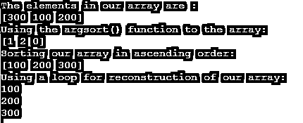

# Numpy.argsort()

> 原文：<https://www.educba.com/numpy-argsort/>


## Numpy.argsort()简介

argsort 函数是 Numpy 中的一个预建函数，它返回负责对数组排序的索引。返回的数组按指定的顺序排列。NumPy argsort()函数也用于使用一组算法沿着指定的轴进行间接排序(当没有指定轴时，默认执行)。该算法由关键字规定，即“种类”。这有助于结果数组保持与输入数组完全相同的形状，并保持沿轴排序的数据。

### Numpy.argsort()的语法和参数

以下是表示法，其中代码必须用 Python 语言编写，以应用 numpy argsort 函数:

<small>网页开发、编程语言、软件测试&其他</small>

```
numpy.argsort(a, axis=-1, kind=None, order=None)
```

**参数**

下面列出了 numpy.argsort()中使用的参数:

| 【Argsort 的参数 | **arg sort 参数的应用** |
| 变量 a: array_like | 参数“a”用于定义用户想要排序的数组 |
| axis: int (integer) or None (not defined) (this parameter is optional) | 参数“轴”用于定义必须沿其进行排列的轴。当没有为 axis 参数指定任何内容时，默认轴为-1。如果轴设置为 None，则处理展平的数组以执行排序。 |
| kind: {'quicksort '，' stable '，' heapsort '，' merge ***** sort'}(此参数可选) | 参数“kind”非常重要。它用于定义要排序的算法。除非用户定义了另一种类，否则种类的默认参数被设置为“快速排序”。后台的 **stable** I 和 **mergesort** 都使用时间排序，但是输入数组使用的数据类型的差异和多样性定义了它们的实现。 |
| order: str (string) or*list of str (this parameter is optional) | 对于定义了字段的数组“a ”,顺序参数的作用是定义首先比较哪个字段，以此类推。由于不必指定所有字段，所以单个字段本身以字符串的形式指定。但在这种情况下，存在的未指定字段仍将由 d &#124;类型使用的函数使用，并有助于打破订单相关功能的联系 |

执行 argsort()函数时返回的参数:

```
index_array:(ndarray, int)
```

argsort 函数用于返回代表数组的索引，其中数组“a”沿用户指定的轴排序。

### NumPy 的算法排序

以下是与 argsort()的参数相关的三个变量的属性:

| **种论证** | **配速** | **最坏的计算情况** | **入住率** | **稳定性** |
| 快速分类 | One | O(n^2) | Zero | 易变的 |
| 合并分类 | Two | O (n*log(n)) | ~n/2 | 稳定的 |
| 堆排序 | Three | O (n*log(n)) | Zero | 易变的 |

**例子**

让我们举一些例子来理解各种面向维度的数组上的 n1.argsort()，以理解所使用的排序机制:

**代码:**

```
import numpy as n1
num=n1.array([564, 11, 321])
n1
b1=n1.argsort(num)
b1
```

**解释**

使用函数 n1 *创建了数组“num”。* array()包含整数值 564、11 和 321，然后使用函数对这些值进行排序。在输出中，我们可以看到一个 nd_array 已被可视化，它显示为包含指示数组中每个元素的实际顺序位置的索引，这些元素已经与 dtype 一起排序。

观察到以下输出:


**注释:**索引 1、2、0 的顺序代表数组中数字的升序。

### Numpy.argsort()的示例

下面是一些例子

#### 示例 1–对二维数组进行排序

**代码:**

```
import numpy as n1
ar1 = n1.array([[0, 2], [5, 4]])
i1 = n1.argsort(ar1, axis=0)
i1
```

**解释**

在上述代码中，变量“ar1”用于分配和存储 2D 数组的值，定义其轴用于在数组被分配存储 ar1.argsort 函数沿其第一个轴执行排序的函数执行值后分配和排序值。

对 2 *–* D 数组使用 arg * sort()后的输出:


#### 示例 2–对于一个 n 维数组

**代码:**

```
import numpy as AP
OA=AP.array([300, 100, 200])
print('The elements in our array are :')
print (OA)
print('Using the argsort() function to the array:')
NA = AP.argsort(OA)
print (NA)
print('Sorting our array in ascending order:')
print (OA[NA])
print('Using a loop for reconstruction of our array:')
for x in NA:
    print (OA[x]),
```

**输出:**




### 结论

argsort 提供了一个专用函数，对于大多数数据密集型代码工作来说，这是一个非常重要且经常使用的功能。因此，在某种程度上，减少代码的冗长性提高了计算速度，尤其是当被处理的数据集非常大并且可能是大的维度时。它为外部使用它的其他查看者节省了时间和复杂性。

### 推荐文章

这是 Numpy.argsort()的指南。这里我们讨论 Numpy.argsort()如何工作，以及相应的示例和参数。您也可以阅读以下文章，了解更多信息——

1.  [NumPy 中的矩阵](https://www.educba.com/matrix-in-numpy/)
2.  [NumPy 函数](https://www.educba.com/numpy-functions/)
3.  [NumPy Ndarray](https://www.educba.com/numpy-ndarray/)
4.  [numpy.pad()](https://www.educba.com/numpy-pad/)


