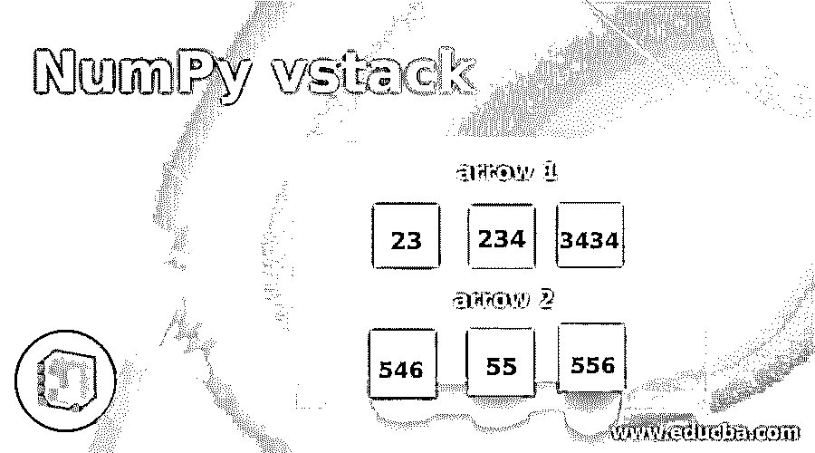
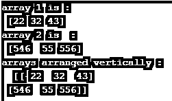
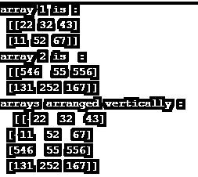
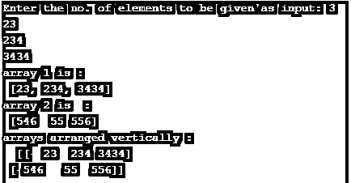
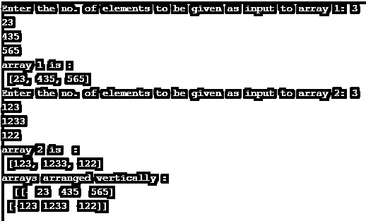
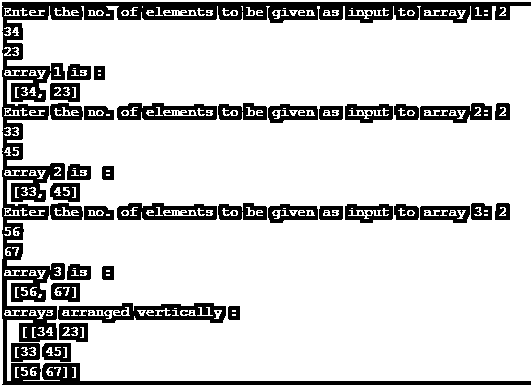

# 数字 vstack

> 原文：<https://www.educba.com/numpy-vstack/>




## 数字 vstack 的定义

在 python 中，numpy.vstack() 是一个帮助垂直堆叠输入数组序列以创建单个数组的函数。排列将按行进行。这类似于将(N)形的一维数组重新调整为(1，N)格式后沿轴 1 的串联。这个函数可以用来创建多达 3 维的数组。让我们在接下来的课程中更多地了解这一功能。

**语法:**

<small>网页开发、编程语言、软件测试&其他</small>

下面是 numpyvstack 函数的语法。

```
numpy.vstack(tup)
```

**参数:**

*   **tup:** 是 n 个数组的序列。这个元组由必须堆叠的数组组成。除了轴 1 之外，数组应该具有相同的形状。
*   **该函数的返回值:**返回值将被堆叠成一个数组。这是一个由输入数组堆叠而成的数组。

### vstack 函数在 NumPy 中是如何工作的？

使用 vstack()函数，数组的元素被垂直排列。假设数组 1 有元素[22，32，43]，数组 2 有元素[546，55，556]。可以使用函数 vstack(( arr1，arr2))垂直排列这两个数组，其中 arr1 和 arr2 分别是数组 1 和数组 2。

### NumPy vstack 的示例

让我们看一些使用 python 的 vstack()函数的示例程序。

#### 示例#1

使用 vstack 垂直排列两个数组的 Python 程序。

**代码:**

```
import numpy as np
arr1 = np.array( [ 22 , 32 , 43 ] )
print ("array 1 is : \n", arr1)
arr2 = np.array( [ 546 , 55 , 556 ] )
print ("array 2 is  : \n", arr2)
arrout = np.vstack( ( arr1 , arr2 ) )
print ( "arrays arranged vertically :\n ", arrout)
```

**输出:**




在这个程序中，创建了两个数组，并使用 vstack 函数将它们垂直排列。

#### 实施例 2

使用 vstack 垂直排列两个包含多个元素的数组的 Python 程序。

**代码:**

```
import numpy as np
arr1 = np.array( [ [ 22 , 32 , 43 ] , [11 , 52 , 67 ] ] )
print ("array 1 is : \n", arr1)
arr2 = np.array( [ [ 546 , 55 , 556 ] , [131 , 252 , 167 ] ] )
print ("array 2 is  : \n", arr2)
arrout = np.vstack( ( arr1 , arr2 ) )
print ( "arrays arranged vertically :\n ", arrout)
```

**输出:**




与程序 1 不同，在这个程序中，用不同的元素创建了两个数组，并使用 vstack 函数将它们垂直排列。

#### 实施例 3

Python 程序，用于排列用户作为输入给出的两个数组，其中数组 1 是输入，数组 2 已经在程序中。

**代码:**

```
import numpy as np
# create an empty list
li = []
n = int(input("Enter the no. of elements to be given as input: "))
for it in range(0, n):
    items = int(input())
    li.append(items)
print ("array 1 is : \n", li)
arr2 = np.array( [ 546 , 55 , 556 ] )
print ("array 2 is  : \n", arr2)
# arranging two arrays vertically
arrout = np.vstack( ( li , arr2 ) )
print ( "arrays arranged vertically :\n ", arrout)
```

**输出:**




在这个程序中，第一个数组由用户作为输入给出，第二个数组在程序中已经可用。然后，使用函数 vstack()垂直排列。

#### 实施例 4

Python 程序，用于排列用户输入的两个数组。

**代码:**

```
import numpy as np
# array 1 creation
li = []
n = int(input("Enter the no. of elements to be given as input to array 1: "))
for it in range(0, n):
    items = int(input())
    li.append(items)
print ("array 1 is : \n", li)
li2 = []
# no: of elements to be given as input
nn = int(input("Enter the no. of elements to be given as input to array 2: "))
# iterate the loop till the given range
for itr in range(0, nn):
    itemss = int(input())
    li2.append(itemss)
print ("array 2 is  : \n", li2)
# arranging two arrays vertically
arrout = np.vstack( ( li , li2 ) )
print ( "arrays arranged vertically :\n ", arrout)
```

**输出:**




在这个程序中，第一个数组和第二个数组都是由用户输入的。然后，使用函数 vstack()垂直排列。

#### 实施例 5

Python 程序，用于排列用户输入的多个数组。

**代码:**

```
import numpy as np
# array 1 creation
# create an empty list
li = []
# no: of elements to be given as input
n = int(input("Enter the no. of elements to be given as input to array 1: "))
# iterate the loop till the given range
for it in range(0, n):
    items = int(input())
    li.append(items)
print ("array 1 is : \n", li)
# create an empty list
li2 = []
# no: of elements to be given as input
nn = int(input("Enter the no. of elements to be given as input to array 2: "))
# iterate the loop till the given range
for itr in range(0, nn):
    itemss = int(input())
    li2.append(itemss)
print ("array 2 is  : \n", li2)
# create an empty list
li3 = []
# no: of elements to be given as input
no = int(input("Enter the no. of elements to be given as input to array 3: "))
# iterate the loop till the given range
for itrt in range(0, no):
    itemms = int(input())
    li3.append(itemms)
print ("array 3 is  : \n", li3)
# arranging two arrays vertically
arrout = np.vstack( ( li , li2, li3 ) )
print ( "arrays arranged vertically :\n ", arrout)
```

**输出:**




在这个程序中，用户输入多个数组。然后，使用函数 vstack()垂直排列。

### 结论

numpy.vstack() 是一个帮助垂直堆叠输入数组序列以创建单个数组的函数。在这篇文章中，不同的方面，如语法，工作，和 vstack 函数的例子进行了详细的解释。

### 推荐文章

这是 NumPy vstack 的指南。在这里，我们还讨论了 vstack 函数的定义和如何在 numpy 中工作，以及不同的例子和它的代码实现。您也可以看看以下文章，了解更多信息–

1.  [NumPy 数组](https://www.educba.com/numpy-arrays/)
2.  [NumPy Ndarray](https://www.educba.com/numpy-ndarray/)
3.  [Python 中的字符串数组](https://www.educba.com/string-array-in-python/)
4.  [NumPy 中的矩阵](https://www.educba.com/matrix-in-numpy/)


